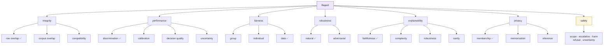

# Roadmap — from one skin-lesion model to a Responsible-AI evaluation service

!!! question "The reasoning lives next door"
    Why this framework is not just a wrapper around Quantus, where the line between measuring
    and judging sits, and how deep the reporting should go: [Direction](direction.md).
    What the destination looks like as screens: [A worked example](case-view.md).

!!! abstract "This page is the plan"
    Everything below the "What has been built" table is **planned, not built**. For what runs
    today, read [The pillars → Running today](pillars.md#running-today-nine-metrics) — nine
    metrics — or [Current results](results.md) for the numbers they produced. How the parts
    already built work in detail: the [architecture decisions](adr/index.md).

Written 2026-09-07 after the leakage audit below; restructured 2026-09-16 around a
larger target. The history that motivates all of it is compressed into
[What has been built](#what-has-been-built) and lives in full in
[Current results](results.md).

---

## Where this is going

Today VERIFAI evaluates **one problem** (skin lesions), with **one model adapter**
(a torchvision `state_dict`), against **one modality** (images). Fifteen models in
twenty-four configurations, all dermatology — one of them a checkpoint this project did not
train, loaded from the Hugging Face Hub.

The target is a **model-agnostic, domain-agnostic evaluation service for medical AI**:

> Point it at a model — a local checkpoint or a Hugging Face link — and it fetches
> what it needs, checks what it can, evaluates it against a test set for that
> domain, and publishes an artifact that explains every number and its impact.

Four things have to become true for that:

1. **Any model.** A declared adapter contract, not one hardcoded loader. Third-party
   checkpoints arrive in formats this repo has never seen. *The contract and the access gate
   are built (M4), and so is what can be verified about a model someone else trained (M5,
   Phase B); resolving a Hub link into an adapter is next (Phase C).*
2. **Any medical domain.** Images, text, later speech and generated text — with the
   metric catalogue expanded far beyond the six metrics that exist today.
3. **Two honest entry states.** *The model is trained and ready to load*, or *the
   model must be trained first and the data is here.* Both end in the same report.
4. **An interface a reader can follow.** Built on `dev` (2026-09-24) — projects, models
   and their configurations in place of twenty-four tiles that expected a reader to know
   what a lineage was — public since [v0.1.0](https://github.com/sabrinahartung/verifai-medical/releases/tag/v0.1.0)
   at [verifai-medical.streamlit.app](https://verifai-medical.streamlit.app/), and reworked
   from a reader's point of view in M3.

What does **not** change: the engine runs offline and writes static artifacts, the
Streamlit app reads them, the public deploy stays free and always-on, and no number
is ever scored against a threshold. See [What does not move](#what-does-not-move).

---

## Where things stand (2026-09-25)

**24 artifact folders — 15 models in 24 configurations, 3 of them active — 151 contract
tests, three evaluation sets, nine metrics.** [Current results](results.md) has the
measurements; this is what they add up to. Released: [v0.2.0](https://github.com/sabrinahartung/verifai-medical/releases/tag/v0.2.0)
(M2). On `dev`, awaiting release 0.3.0: M3 and M4. In review: M5 Phase B. The four findings
below have not moved since 2026-09-16; the fifth is new with Phase B. What else changed is
recorded in [What has been built](#what-has-been-built).

### The four things that have been learned

**1. The decision rule is where the leverage is, not the model.** Focal loss,
balanced oversampling, a 2.2× bigger backbone and 3.1× more training data each moved
melanoma sensitivity by an amount indistinguishable from noise. A free change to how
the probabilities are *read* moved it from 0.638 to 0.976. Nothing else has come close.

**2. Distribution beats volume, and the two nearly cancelled.** Within one corpus,
7,031 → 21,770 images is worth +10.5 points of top-1 (separated intervals). At equal
volume, in-distribution images are worth +9.5 points over out-of-distribution ones
(separated). Experiment 3 compared an in-distribution corpus against 3× as much
out-of-distribution data, which is why it read as "no change".

**3. Internal ranking does not survive a new clinic.** On Derm7pt the single-archive
model collapses (ΔJ −0.244) while the mixed-corpus one holds (−0.047) — a benefit
invisible internally, where they differed by 1.0 point with overlapping intervals.
The linear probe, weakest internally, is the only configuration that does not degrade
at all (+0.009): frozen features never specialised, so there is nothing to unlearn.

**4. A tuned threshold does not transfer.** `melanoma ×30` reports 0.964 external
sensitivity and that number is worthless on its own — see below.

**5. A model you did not train can only be bounded.** The original Hub checkpoint scores 0.867
on the HAM10000 test set, where the ISIC model with a verified split scores 0.806 — and nothing
in the evaluation can say how much of that gap is skill and how much is memory, because its
training images are only inferred and cannot be compared row by row. Its report says so, and
reads as an upper bound ([Experiment 8](results.md#experiment-8-a-model-this-project-did-not-train)).

### The trap in this project's own numbers

`external-derm7pt-isic-highsens` shows **0.964 melanoma sensitivity on unseen data**,
which reads as a triumph. In cases:

| | flagged as melanoma | of 1,003 | sensitivity | PPV |
|---|---:|---:|---:|---:|
| "say melanoma every time" | 1,003 | 100% | 1.000 | 0.251 |
| **this configuration** | **821** | **82%** | 0.964 | 0.296 |

It flags 82% of every lesion it sees and does not reach the sensitivity of answering
"melanoma" unconditionally. Specificity fell 0.657 → 0.230; Youden's J fell
0.633 → 0.195, where 0 is guessing.

**The rule of thumb worth keeping:** when sensitivity holds while overall accuracy
collapses (0.657 → 0.385 here), the model has not preserved its skill — it has moved
its operating point. A metric improving against the trend of every other metric is
almost always an artefact. Read sensitivity next to specificity or PPV, never alone.

---

## Milestones

The order the work is done in. The [platform plan](#the-platform-plan) describes *what* each
phase is; this says *when*, and why in that order. Set 2026-09-24.

| | Milestone | Delivers | Why in this position |
|---|---|---|---|
| ✅ | **Interface** · 2026-09-19 → 24 | Projects → models → a configuration's report; the report laid out for a first-time reader; the comparison turned around; the model registry. [UI/UX design](ui-ux-design.md) has the detail | Phase E ahead of Phase A, deliberately: every later phase ends on screen, and the screen could not yet say what a model was |
| ✅ | **Reproducible tooling** · 2026-09-24 | uv, a lock reproducing the environment every artifact came from, CI on every pull request into `dev` | results meant to be recomputable were produced in the least reproducible part of the repository — see [Tooling](#tooling-moved-to-uv-done-2026-09-24) |
| ✅ | **M1 — Release 1** · 2026-09-24 | [v0.1.0](https://github.com/sabrinahartung/verifai-medical/releases/tag/v0.1.0): both of the above, public at [verifai-medical.streamlit.app](https://verifai-medical.streamlit.app/) and on the docs site | the public demo still showed the old twenty-four-tile gallery and the sample fixture. Streamlit Cloud's Python version was confirmed ≥ 3.12 before the merge, as the pinned `showcase/requirements.txt` needs |
| ✅ | **M2 — The findings strip** · 2026-09-25 | Every finding carries `details["baseline"]` — an ideal, chance, or a control measured in the same run — and the report opens with what cleared it, in pillar order. Grad-CAM scores every test image against a random-region control. Scenarios are **active** (re-run when a metric changes, `scripts/run_active.py`) or **archived** (the record, frozen); metrics carry versions and reports record them and their checkpoint, so a report left behind says so | a backfill of all 23 reports was planned; archiving made it unnecessary — only the two active configurations were re-run, and they reproduced every other published value exactly |
| ✅ | **M3 — A usability pass** · 2026-09-25 | The report's two pillar lists became one card per pillar: status, result, and what it was compared with — **established** where the interval clears the reference, otherwise why nothing is claimed. Metrics are headed by name, classes and datasets read as words, counts say what they count, and charts no longer overlap their own labels. Metric summaries were rewritten for a reader (version 3; fairness 4) and a test now holds every active one to an image count and an interval; robustness gained the interval it lacked | the walkthrough found eleven problems and all were fixed; re-running the two active configurations reproduced every value exactly, so only wording changed. Left as is: Streamlit prints `None` for a missing value in the comparison table |
| ✅ | **M4 — Phase A**, the two contracts and capability gating · 2026-09-25 | `verifai/models/base.py`: the model contract and the access ladder. Every registry entry is a `MetricSpec` declaring its pillar, tasks, modalities and the access it needs; the runner never calls a metric the model cannot support and writes an `unavailable` finding with the reason instead. Scenarios declare `task:`. Each report records its task, access and a coverage row per registered metric, and the showcase reads it: a coverage map at the top of the report, *not applicable* and *not requested* told apart from *not evaluated*, and an access column and statement in the comparison | every published model is a local checkpoint, so the gate is proven by tests with a model that returns only class scores, not by a published report. Two items of the Phase A text moved: the adapter's `metadata` (provenance, preprocessing fingerprint) belongs with Phase B, which consumes it, and the per-metric `cost` with Phase D's `preflight` |
| ⏳ | **Release 0.3.0** | M3 and M4 on `main` and the public app: one card per pillar, text written for a reader, the coverage map, capability gating ([#11](https://github.com/sabrinahartung/verifai-medical/pull/11), after the version bump [#10](https://github.com/sabrinahartung/verifai-medical/pull/10)) | the public app still shows 0.2.0. Phase B joins this release if #12 is merged before #11 |
| **M5** | **Someone else's model** — Phases B, C, D | **B ✅ 2026-09-25** (in review, #12): provenance, corpus ancestry and label space as integrity findings, a preprocessing fingerprint in every report, and the original Hub checkpoint evaluated as the first model this project did not train — [ADR 0002](adr/0002-verifying-a-foreign-model.md). **C**: the Hub resolver and the adapter catalogue; the fingerprint compared against a checkpoint's own `preprocessor_config.json`. **D**: `verifai resolve / preflight / run`, and the per-metric `cost` moved here from M4 | the integrity-gate placeholder is filled; the studio and preflight placeholders wait for C and D. The first model this repository did not train is evaluated; the first one it did not even pick is what C makes possible |
| M6+ | **F → G → H → I** | the metric catalogue as data; the policy layer; chest X-ray, then text; generative models and the safety pillar | in the order the phases already describe |

**Alongside, blocking nothing:** [the open scientific work](#the-open-scientific-work). The item
that sat right after M2 — Grad-CAM's sample — is done; none of the rest is scheduled yet.
Experiment 8 adds one worth doing: score the original checkpoint on **Derm7pt**, which it cannot
have seen. Beside the ISIC model's Derm7pt result it separates at least part of the 0.867 against
0.806 gap into skill and memory — the one comparison on these data that no leakage can inflate.

**Under consideration, not scheduled (raised 2026-09-25):** an additional pillar from the
earlier VERIFAI paper, still being worked out, with **human-in-the-loop** functionality as part
of it: a clinician or other medical reviewer looks at the results and gives feedback, and that
feedback informs retraining. Whether it is useful enough to build is itself open. Questions to
settle before it gets a milestone:

- **Where the feedback lives.** The showcase has no server and no database on purpose, so
  collecting reviews needs either a separate write path or an offline step whose output is a
  file the engine reads.
- **Which cases a reviewer sees.** Reviewed cases that go back into training must never come
  from the test manifest. If they did, the split-integrity check would reject the next run,
  because it compares by `image_id` and `lesion_id`.
- **What the feedback is.** Corrected labels, a verdict on an explanation, or a judgement of
  whether a finding matters clinically: each feeds a different place, and only the first feeds
  retraining directly.
- **Framing.** This is an educational proof of concept, so a clinician's review is feedback on
  an evaluation. It is not a clinical sign-off.

**Due with the paper's metrics (Phase F, raised 2026-09-25): sources for the metric wording.**
Every metric's `summary` and `explain` text is a template written into the metric itself, not
generated, so it says only what its author put there — and today none of it cites where a
method or a reading of it comes from. When the paper's metrics are added, each metric's
wording gets its source, the metrics already shipped included. Two forms, to be chosen then:
cite `[n]` from [the references](references.md) inside the texts, or link each metric to its
entry in [the catalogue](pillars.md), which already carries the citations. Either way it is a
change to what a metric reports, so it bumps the metric's version.

---

## Why this exists

The showcase originally evaluated on **7 images**, and the obvious fix — "use the
whole test set" — did not work, because the model had already seen almost all of it.
The `skin-lesion-resnet18` checkpoint was trained on the Hugging Face dataset
`marmal88/skin_cancer`; querying that dataset's parquet metadata directly:

| Check | Result |
|---|---|
| Its `test` split | 1,285 images |
| Test images whose **image_id also appears in `train`** | **1,025 (80%)** |
| Test images whose **lesion** was seen in training | 1,132 (88%) |
| …after excluding train **and** validation lesions | **28** |
| HAM10000 images covered by `train` + `validation` | **9,964 of 10,015 (99.5%)** |
| HAM10000 lesions covered by `train` + `validation` | **7,442 of 7,470 (99.6%)** |

**The images were never the problem. The split was.** The fix was to re-split
HAM10000 grouped by `lesion_id`, which is what every clean number in this repo now
rests on. Full story: [Split integrity](integrity.md).

That audit is also why the platform plan below leads with provenance. Evaluating
*someone else's* model means you cannot run this check at all — and saying so is the
product, not a gap in it.

---

## What has been built

| Step | Done | What it established | Evidence |
|---|---|---|---|
| **1** Model-agnostic engine | 2026-09-07 | classes, architecture, Grad-CAM layer and device all come from the scenario; the dataset no longer imports its classes from the model | 82 tests in `tests/` |
| **2** Training as a contract | 2026-09-07 | lesion-grouped split (train 7,014 / val 1,508 / **test 1,493**, 163 melanomas), zero shared lesions; `train_model.py` never opens the test manifest | `scripts/build_splits.py` |
| **3** Leakage as a finding | 2026-09-07 | `integrity.split_leakage` + a runner precondition that raises rather than report a flattering number; one implementation shared by guard and metric | [Split integrity](integrity.md) |
| **4** First trustworthy result | 2026-09-08 | 79.6% top-1, 72.8% balanced, MIA-AUC 0.558, 71.7% corruption stability, a 21.3-point skin-tone gap — and melanoma recall 0.638, the second worst of seven classes | [Results](results.md) |
| **4b** Uncertainty | 2026-09-08 | Wilson / Hanley–McNeil intervals, per-class sensitivity·specificity·PPV, top-3 accuracy; verdicts taken on the *interval* where a claim is at stake | `verifai/metrics/_stats.py` |
| **4c** Cost-sensitive decisions | 2026-09-09 | `model.decide()/rank()` — four metrics had each reimplemented `argmax`; sensitivity 0.638 → 0.945 with no retraining | [Experiment 1](results.md#experiment-1-a-cost-sensitive-decision-rule) |
| **4d** Focal loss, oversampling | 2026-09-09 | **negative**: neither moved melanoma sensitivity beyond noise | [Experiment 2](results.md#experiment-2-focal-loss-and-oversampling-a-negative-result) |
| **5** A larger corpus | 2026-09-12 | ISIC 2019 with every val/test lesion held back: 21,770 images, melanoma 774 → 4,183. Bought **robustness** (+8.4 noise, +4.6 brightness), cost **fairness** (gap 0.213 → 0.326) | [Experiment 3](results.md#experiment-3-a-3x-larger-more-diverse-training-set) · [4](results.md#experiment-4-tuning-the-new-model-and-where-experiment-3-was-wrong) |
| **5b** Architecture, probing, curve | 2026-09-15 | ResNet50 **negative** (0.806 → 0.801); linear probing loses at every size; the learning curve resolved experiment 3 | [5](results.md#experiment-5-resnet50-capacity-is-not-the-ceiling-either) · [6](results.md#experiment-6-a-learning-curve-and-what-it-says-about-experiment-3) |
| **6** Snapshots + comparison | 2026-09-10 | every run recorded with the evaluation manifest's **content hash**; the view *refuses* to plot runs scored on different rows or on a contaminated split | `verifai/export/artifacts.py` |
| **7** Grouped gallery | 2026-09-10 | `card.group` / `card.lineage`; seven tiles became three cards. Presentation never widens comparability — asserted in tests | `showcase/app.py` |
| **8** External validation | 2026-09-16 | Derm7pt, 1,003 cases, no retraining: **the internal ranking inverts** | [Experiment 7](results.md#experiment-7-the-first-numbers-not-measured-on-ham10000) |
| **9** A model registry | 2026-09-24 | a model is its **checkpoint, identified by content hash** — `model.id` named three checkpoints in one direction and one checkpoint answered to five ids in the other. 15 models, 23 configurations; status derived from which reports exist, never stored | `verifai/export/model_registry.py` |
| **10** The interface | 2026-09-24 | project → model → configuration's report in place of twenty-four tiles; each finding's explanation open, in a fixed order; an unverified split holding the whole report; the comparison with runs as rows; one name per configuration on every page | [UI/UX design](ui-ux-design.md) · PR #1 |
| **11** Reproducible tooling | 2026-09-24 | uv with a lock reproducing the artifacts' environment version for version; three undeclared imports declared; CI on pull requests into `dev`, with twenty showcase tests that had always been skipped now run | [Tooling](#tooling-moved-to-uv-done-2026-09-24) · PR #2 |
| **12** First release | 2026-09-24 | [v0.1.0](https://github.com/sabrinahartung/verifai-medical/releases/tag/v0.1.0): the interface and the tooling, public — the app at [verifai-medical.streamlit.app](https://verifai-medical.streamlit.app/), the docs on GitHub Pages | PR #4 |
| **13** The findings strip | 2026-09-25 | every finding compared with a stated reference; the report opens with what cleared it, in pillar order. Scenarios are active or archived, metrics versioned, and re-running the two active ones reproduced all 274 other published values exactly | `verifai/metrics/_baseline.py` · `verifai/core/suite.py` |
| **14** A usability pass | 2026-09-25 | one card per pillar instead of two lists; metric summaries written for a first-time reader and tested for n, interval and no identifiers | `showcase/views/report.py` · `verifai/core/glossary.py::METRIC_NAMES` |
| **15** The two contracts | 2026-09-25 | models declare how much of themselves they expose, metrics what they need; a metric that cannot run says why, and every report records its coverage | `verifai/models/base.py` · `verifai/core/run.py::MetricSpec` |
| **16** What can be verified about someone else's model | 2026-09-25 | provenance, corpus ancestry and label space as integrity findings; a preprocessing fingerprint in every report; the original Hub checkpoint evaluated on the full test set as the first model this project did not train — its split cannot be checked, leakage cannot be ruled out, and its report says so | `verifai/metrics/integrity/` · `data/corpora.yaml` · [ADR 0002](adr/0002-verifying-a-foreign-model.md) |

**Top-3 accuracy sits at 0.975–0.977 across all eight internal configurations** — two
corpora, two architectures, two loss functions, a sampling scheme, three decision
rules. Nothing tried has changed what the model *knows*. That is a statement about
the information in the inputs, not about the models.

---

## The open scientific work

Unfinished, and still ranked by what it would establish:

- [ ] **Re-tune the decision rule on external validation data.** Experiment 7 showed
      the HAM10000-tuned weight is not portable. A weight tuned on a held-out part of
      Derm7pt would say how much of the collapse is the rule rather than the model —
      but it costs the clean one-shot external measurement, so split the external set
      first and decide explicitly which half pays for it.
- [ ] **Finish the context prior.** The machinery is built and tested
      (`scripts/build_context_prior.py`, `model.decide(probs, meta)`);
      `prior_strength` still needs tuning on validation and no scenario uses it yet.
      Derm7pt has no `age` column, so only the site half would apply there.
- [ ] **A second external set.** One archive supports "more robust against *this*
      archive", not a law.
- [ ] **Repeat the learning curve with several seeds per point.** Each point is one
      run today, which supports the large effects but not the small wiggles.
- [ ] **Use the metadata as model input.** `age`, `sex` and `localization` sit on
      every manifest row and feed no model. The one untested lever that adds *signal*
      rather than parameters — and it makes subgroup behaviour a design choice rather
      than an artefact, which is worth stating up front.
- [x] **Give Grad-CAM a sample worth averaging** — done 2026-09-25 (metric version 2). It scored
      the first seven filenames of a sorted manifest, six of them nevi. It now scores every test
      image against a random-region control [[42]](references.md#ref-42): on the ISIC model the
      highlight costs 0.192 [0.178–0.205] more confidence than a random region of the same size.
- [ ] **Score the original checkpoint on Derm7pt.** Experiment 8 cannot say how much of its
      0.867 on HAM10000 is memory. On Derm7pt, which it cannot have seen, it can be set beside the
      ISIC model's external result with no leakage in either number.
- [ ] Upload the clean checkpoints to the HF Hub (`.pt` is gitignored).

**The test set is the binding constraint.** With 163 melanomas, sensitivity near 0.97
carries an interval of about ±0.03, so differences under ~5 points cannot be resolved
on this data at all. Establishing the remaining gain is a sample-size problem, not a
modelling one.

---

## The platform plan

Nine phases, A to I. Phase A is the seam Phases B–D plug into; the order they are built in is
set by [Milestones](#milestones) — which put Phase E first, for the reason given there.

### Phase A — the two contracts, and capability gating

!!! success "Built 2026-09-25 (M4)"
    Everything below except the adapter's `metadata`, which moved to Phase B where the
    provenance and preprocessing checks consume it, and the per-metric `cost`, which waits for
    Phase D's `preflight`. The two refusals are split as the text intends: a metric that does not
    *apply* to the task is refused before anything runs; one the model cannot *support* runs as
    an `unavailable` finding with its reason.

The model contract is *already* domain-neutral; nobody wrote it down. Read off the
metrics: four of six need only `dataset.load(sample)` → payload and
`model.predict_probs(payload)` / `.decide()` / `.rank()`. Only Grad-CAM needs
`.torch_module` + `.cam_layer`; only the ITA metric needs pixels.

- `verifai/models/base.py` — a `ModelAdapter` Protocol: `classes`, `predict_probs`,
  `decide`, `rank`, plus `metadata: dict` (provenance, preprocessing fingerprint) and two
  declarations that decide what may run against it:
    - **`access`** — one rung of the ladder in [The pillars](pillars.md#how-much-of-the-model-do-you-have):
      `labels` → `probs` → `logits` → `gradients` → `weights` → `training_data`. A total order,
      so gating is a comparison rather than a set intersection, and each level includes the ones
      below it. `ImageClassifier` declares `weights`, or `training_data` when the scenario has a
      `training:` block.
    - **`modality`** — what `dataset.load()` hands back: `pixels` · `tokens` · `audio` · `rows`.
  Half the catalogue cannot run against a hosted API, and this is what lets the runner say so
  instead of silently producing a shorter report.
- `METRIC_REGISTRY` entries become a small frozen dataclass — `target`, `tasks`,
  `modalities`, `requires` — with a plain string still accepted, so nothing breaks.
- The runner checks requirements **before** calling a metric and emits
  `Finding(verdict="unavailable", summary="… requires gradients; this model is reachable only
  through an API, so gradients do not exist for it")` rather than crashing. That is the existing
  idiom from `privacy/mia.py`, applied to a new reason — and the reason is the finding, because
  a metric that silently did not run is indistinguishable from a model with nothing to report.
- Separate the two axes the code conflates: `domain:` is the *payload type*, `task:`
  (default `classification`) is what decides which metrics apply. The `Domain`
  literal already lists `llm`, which is a task, not a domain — retire it the way
  `kind: "gauge"` and the pass/warn/fail verdicts were retired, by going on reading it.

### Phase B — what you can, and cannot, verify about someone else's model

!!! success "Built 2026-09-25 (M5, first part)"
    `integrity.provenance`, `integrity.corpus_ancestry` and `integrity.label_space` ship, with
    the ancestry table in `data/corpora.yaml` and a preprocessing fingerprint in every report.
    Two items stay open: comparing the fingerprint against a Hub checkpoint's own
    `preprocessor_config.json` needs the resolver (Phase C), and `privacy.mia_shadow` waits for
    the privacy metrics in Phase F — until then the access gate already reports any membership
    attack as unavailable for a model without known training data. How it works:
    [ADR 0002](adr/0002-verifying-a-foreign-model.md).

For a third-party checkpoint there is no training manifest, so the split check —
this project's strongest claim — cannot run. The honest answer is a finding, not silence.

- **`integrity.provenance`** — `measured` when training manifests are declared and
  checkable (the `<name>_training.json` `train_model.py` already writes),
  `unavailable` for an undeclared third-party checkpoint, saying plainly that no
  split check is possible. Never "clean".
- **Corpus-level leakage.** A curated ancestry table (HAM10000 ⊂ ISIC 2019, Derm7pt
  independent, …) lets a model's *declared* training datasets be checked against the
  evaluation set's corpus even with no row ids. It is the only leakage check
  available for a Hub model, and it is this project's origin story generalised.
- **Label-space compatibility**, before any metric runs: identical · dataset ⊂ model
  (report which classes go unscored — the Derm7pt case, handled ad hoc today) ·
  model ⊂ dataset · disjoint, which requires an explicit `label_map:` and is never
  guessed.
- **Preprocessing fingerprint** recorded in `report.json`. For a third-party model
  `preprocessor_config.json` is the only record of training-time preprocessing, and
  a mismatch means every metric silently measures a different model.
- **The strongest privacy attack is permanently out of reach here, and says so.** A
  shadow-model membership attack needs the training *distribution* to build shadows from;
  for a third-party checkpoint there is none, so `privacy.mia_shadow` reports
  `unavailable` for reasons that will never change, rather than appearing as a number
  somebody might later fill in. It belongs in this phase rather than with the other
  privacy metrics because it is the same argument as `integrity.provenance`: **what
  cannot be measured about someone else's model is itself a result**, and reporting it is
  the difference between an evaluation and an advertisement.

This is also what the external-validation literature prescribes for "trained model,
new dataset" (TRIPOD+AI [[14]](references.md#ref-14)): freeze the model, map label spaces explicitly, expect
prevalence shift, report discrimination **and calibration**, and never reuse an
operating point tuned elsewhere — split the external set and pay for the re-tune out
of one half. Which is exactly the open item at the top of this page.

### Phase C — resolving a model, and the adapter catalogue

- `verifai/models/resolve.py` — `hf:owner/repo[@rev]` or a local path → a **draft**
  `model:` block for review, never an auto-run. Reads `HfApi().model_info` without
  downloading: `pipeline_tag`, `library_name`, `config.json` (`id2label`,
  `architectures`), card metadata (`datasets`, `license`), and the commit sha, which
  becomes a pinned `revision`.
- Adapters, in order, each roughly 80 lines:
    1. **torchvision / timm `state_dict`** — exists. Carries no metadata at all, so
       `arch` and `classes` must be declared; the resolver says so rather than guessing.
    2. **`hf_image`** — `AutoModelForImageClassification` + `AutoImageProcessor`.
       Self-describing: `id2label` gives the class order, the processor gives the exact
       preprocessing. This is where "paste a link and it works" is genuinely true.
    3. **`hf_text`** — `AutoModelForSequenceClassification` + `AutoTokenizer`;
       `dataset.load()` returns a string and `predict_probs` is unchanged.
- `transformers` goes in the `engine` dependency group only, never in the `showcase` group.
- Deliberately **not** first: ONNX, sklearn/joblib, generative checkpoints. Each is a
  different loading story and none of them is on the path to the next result.

### Phase D — the two entry tracks, one command

| The model is… | What runs |
|---|---|
| trained and ready (local `.pt`, or a Hub link) | resolve → preflight → evaluate → export |
| not trained yet, but the data is here | resolve data → train (`training:` block) → preflight → evaluate → export |

One dispatcher over scripts that already exist:
`verifai resolve <link>` → a draft scenario ·
`verifai preflight <scenario>` → provenance, label space and integrity with **no**
metric run, which is the thing to run before a long evaluation ·
`verifai run <scenario>` → trains first when `training:` is present and the
checkpoint is missing, then evaluates and exports.

### Phase E — the interface

!!! success "Largely done, 2026-09-24 — status per item below"
    Released in v0.1.0 ([M1](#milestones)). The detailed record, and the steps still open,
    are in [UI/UX design → Build order](ui-ux-design.md#build-order).

*As planned:* the app was one 915-line file routed through `st.session_state` and
`st.rerun()`, and its front page was twenty-four runs deep.

- ✅ **Navigation that matches the mental model:** use case → model → run, on
  `st.navigation` / `st.Page` (Streamlit 1.63 is installed), which also gives URLs
  and a working back button.
- ✅ Split `showcase/app.py` into `catalog.py`, `render.py` and
  `views/{gallery,report,compare}.py`, keeping the public names importable from
  `showcase.app` so the existing tests keep passing.
- ↪ *Replaced by the model registry and supersession.* **Archive.** `card.status: active | archived`, default `active`. Today that leaves
  the ISIC model and its decision-rule siblings on the front page and files the eight
  learning-curve runs, focal, oversample and the ResNet50 probe behind an expander.
  Archiving is **presentation**: the comparison view still sees them, and an archived
  run scored on the same manifest must be *disclosed*, exactly as the lineage filter
  already must. New metrics get tested against the archived runs without
  recomputing the active one.
- ✅ *except `explain.impact`, which no metric ships yet.* **A real explanation component, not an expander.** Every finding needs one consistent,
  visible info box answering five questions in the same order every time: **what was measured**,
  **what came out**, **why it matters**, **how to read the chart**, and **what this does not
  tell you**. Those map to `explain.what`, the finding's own `summary`, `explain.impact`,
  `explain.how` and `explain.limits` — so the wording keeps shipping from the engine and the app
  stays a renderer. Today the first two are inline and the rest are behind "How to read this
  chart", which buries the two that a non-specialist most needs. The reader this is aimed at has
  never seen a Responsible-AI report; a number with no box is a number they cannot use.
- ◐ *Holds for the six original metrics; the three integrity checks added in Phase B render text
  only, which a check with no number to plot may. Not yet enforced for the next one.* **Every metric renders something.** A single scalar gets the `scale` band chart by default, so
  a reader sees whether it is a *good* number rather than only what it is. A metric that returns
  a bare number with no chart spec is incomplete, the same way one without an `explain` block is.
- ◐ *Placeholder pages only; filled by [M5](#milestones).* **Run mode, gated to local.** A "New evaluation" page — source → resolved metadata
  for review → pick a test set → preflight → run → link to the new report — that
  appears only when `torch` and `verifai` are importable and `VERIFAI_STUDIO != 0`,
  imported lazily so the public path never touches it. `showcase/requirements.txt`
  stays torch-free, which makes Streamlit Community Cloud the self-enforcing gate.

### Phase F — the metric catalogue: the taxonomy becomes data

Phase A is the *mechanism*. This is the *content* it exists to carry — the
aspect → sub-aspect → per-modality tree, extended to generative AI and to a seventh
pillar, and kept in the medical domain.

**The full catalogue — fifty-one metrics, each with what it establishes and what it needs —
is [The pillars](pillars.md).** Six are shipped; the rest are scheduled below. That page is the reference; this one is the plan,
and says only what order to build in and why.

Four of these pillars are the standard Responsible-AI taxonomy (XAI · ethical · secure ·
privacy-preserving). Three are this project's own, and each earns its place by asking
something the other four cannot:

- **integrity** — a fairness gap measured on a contaminated split is not a fairness
  result. Everything else is conditional on it.
- **calibrated performance** — a sensitivity figure without its operating point is not a
  performance result, as this repo's own `melanoma ×30` demonstrates.
- **safety** — see [Phase I](#phase-i-generative-ai-in-the-medical-domain). It asks what
  happens if someone *acts* on the output, which no accuracy number answers.

Two schema changes, both small:

- `Finding.subaspect: str | None`, so the dashboard groups pillar → sub-aspect → metric
  instead of one flat list per pillar. At six metrics a flat list was fine; at fifty it
  is a wall.
- the Phase-A registry entry grows `modalities` beside `tasks` and `requires` — which
  *is* the taxonomy's third row: one sub-aspect, a different implementation per modality.

#### Build order

Tiers, not a queue: everything in a tier is independent of everything else in it.

| Tier | Needs | Metrics |
|---|---|---|
| **1** | nothing new — can land before Phase A | calibration · ROC/PR discrimination · operating points & net benefit · selective prediction · PPV at a stated prevalence · group fairness · data representation · provenance · label space · preprocessing fingerprint |
| **2** | Phase A capability gating | adversarial (FGSM · PGD · DeepFool) · corruption severity sweep · XAI complexity · XAI randomisation · XAI stability · insertion+deletion faithfulness · calibration by group · corpus ancestry · near-duplicates |
| **3** | more data, masks, or a model we trained | individual fairness · intersectional gaps · acquisition shift · per-group MIA · shadow MIA · memorisation · attribute inference · localisation · explanation agreement |
| **4** | the text domain (Phase G) | text perturbation · token occlusion |
| **5** | the generative task (Phase H) | everything under `task: generation`, including the whole safety pillar |

**Start with `performance.calibration`.** It would have exposed `melanoma ×30` without
needing the specificity column beside it; calibration is the first thing to break under
the distribution shift Experiment 7 measured; it is pure maths that fits `_stats.py` with
no new dependency; and it ports to every probability-emitting domain. Nothing else in the
catalogue has that combination.

**Then `fairness.group`**, over the real manifest columns (`sex`, `age`, site) the loader
has carried since step 1 and nothing has ever read. More general than the ITA pixel proxy,
which becomes the dermatology-specific extra rather than the only fairness metric.

#### Three things fifty metrics break

Each is cheap to fix now and expensive later, so all three are prerequisites rather than
polish:

- **Per-metric tests do not scale.** One **conformance test over the registry** replaces
  fifty: every registered metric declares `tasks` / `modalities` / `requires` / `version`,
  returns `better` directions for its numeric leaves, resolves to a glossary entry, and
  carries an `explain` block with all four keys. A second test asserts that no glossary
  pattern is fully shadowed by an earlier one — the ordered `fnmatch` list gets fragile
  fast once there are dozens of patterns.
- **No scenario can run everything.** Declare a per-metric **cost** (forward passes per
  sample) and ship **presets** — `quick` · `standard` · `full` — so `verifai preflight`
  can estimate a run's length beforehand instead of after. The robustness metric alone
  already costs ~7 passes per sample.
- **A metric's definition can drift and silently invalidate the history.** Give each
  registry entry a `version`, record it in the snapshot, and have the comparison view
  refuse to plot two runs whose metric versions differ — the same rule as the evaluation
  manifest's content hash, one level down. **This is the most important item on this
  page.** Without it, fifty metrics across a growing history quietly produce false deltas,
  which is the precise failure this project exists to prevent.

#### Two rules the expansion forces

**A threat model is part of the number.** An attack success rate is meaningless without
white-box vs black-box, the norm, the perturbation budget and the iteration count, so an
adversarial metric carries all four **in `value`**, not only in prose. And adversarial
robustness must never be merged into one "robustness" figure with corruption stability:
they answer different questions — whether a clinically irrelevant perturbation flips the
call, versus whether a deliberate one can be constructed — and a reader shown one number
will assume the wrong one.

**Its wording is sourced.** A metric added from the literature arrives with the citation behind
its method and its reading, and the shipped six get theirs in the same pass — see
[the note under Milestones](#milestones).

**Write it when it is short.** FGSM, PGD, additive noise and occlusion are tens of lines each
in numpy/torch, and the wording has to be ours anyway. Take a dependency only where
re-implementing is genuinely error-prone, and only in the `engine` dependency group.

**And check that the dependency still exists.** A toolkit named in a plan is a claim with a
shelf life. The shortlist this catalogue was built from [[34]](references.md#ref-34) was sixteen months old when it was
audited, and by then **two of its nine installable toolkits had stopped working** — one pinned
`numpy<2` into a corner Python 3.13 cannot build, the other had not been released since 2021 —
while a third had moved repository and left a dead link behind. Nothing in that document said
so, because a name on a list carries no expiry date. The toolkit table in
[The pillars](pillars.md#what-would-implement-these) therefore records a verified date, the
version, months since the last commit, and whether it actually resolves against this stack.

#### Quantus is the exception, and it is taken

XAI evaluation is the case the lean-dependency rule carves out: MPRT, ROAD and the relative
stability estimators are subtle enough that re-implementing them means re-deriving a JMLR paper.
**Quantus [[27]](references.md#ref-27) is adopted** — verified to resolve against this stack (Python 3.13, numpy 2.5,
torch 2.14), adding `quantus[captum]` plus eleven transitive packages, engine group only, never
in the `showcase` group. It covers five of the eight explainability rows and brings a sixth
sub-aspect, `axiomatic`, that the catalogue did not have.

It arrives behind **one adapter module**. No metric imports `quantus` directly, so the library
can be swapped or dropped without touching the catalogue. Five conditions on that adapter:

1. **`return_aggregate=False`.** Quantus returns per-instance scores by default; the earlier
   prototype set this to `True` and threw the distribution away. Every number here needs an
   interval, and the per-sample scores are what `_stats.py` needs to build one.
2. **Declare directions, never invert.** The prototype computed `1 - avg_sensitivity` so that
   lower-is-better metrics would feed a composite score. Keep the native value and declare
   `better: {"avg_sensitivity": "lower"}`; inverting bakes a presentation choice into the
   measurement.
3. **The configuration is part of the number.** `abs`, `normalise`, `perturb_baseline`,
   `nr_samples` all change the result, so they belong in `value` — the same rule as an
   adversarial threat model.
4. **The attribution method is part of the comparability key.** A Quantus score is a property of
   *(model, explanation method, metric config)*, not of the model. Two runs scored with
   Integrated Gradients and with Saliency are not comparable, and nothing in today's snapshot
   would notice.
5. **Batching comes first.** Quantus is batch-first (numpy arrays, `batch_size=64`) while
   `to_tensor` still does `.unsqueeze(0)` per image. The known scaling gap stops being optional
   here — which is a reason to fix it, not a blocker.
6. **Wrap it, never fork it.** Quantus is **LGPL-3.0-or-later**, alone among the toolkits here.
   Importing it unmodified imposes nothing on this repository; patching it would put those
   patches under the LGPL. The adapter module was already the design; the licence makes it a
   requirement rather than a preference.

One unverified risk: Quantus 0.6.0 declares `requires_python >=3.8` with no 3.13 classifier, so
3.13 is untested upstream. It resolves; smoke-test one metric on the 7-image scenario before
committing the pin.

**One idea ports across every modality.** Deletion faithfulness — mask the evidence, watch
the probability fall — is already implemented for pixels in `gradcam.py`. Generalise it
into a single metric with a per-domain masking function (pixels, tokens, audio frames)
rather than writing a third explainability metric. Add insertion alongside deletion:
deletion on its own is gameable.

### Phase G — the findings layer: measurement, judgement, and the line between them

Adopted from the 2.0 backend [[34]](references.md#ref-34), which solved this better than the current repository does.
Today verifai-medical refuses thresholds outright, on the grounds that a threshold would have
to be justified and nothing here can justify one. That is half right. The better answer is not
to ban the judgement but to **make the justification a required field, and keep it out of the
metric**:

| Layer | Owns | Lives in |
|---|---|---|
| **Indicator** | what was **measured** | the metric |
| **Criterion** | whether that is **acceptable** | a versioned policy file |
| **Finding** | the two, joined | the engine |

> **The findings layer never computes a statistic. It applies a pre-registered threshold to a
> statistic the metric already published.**

Everything else follows from that one sentence, and it decides the hard cases: a metric that
publishes no aggregate is reported as *not summarised* rather than having one manufactured for
it in the engine, and the fix is ten lines inside the metric, written by whoever understands
that statistic.

**Intended use becomes a profile, not a refusal.** The same metric carries a different
criterion and a different materiality under `medical_decision_support` than under
`research_prototype`. "What counts as robust enough depends on where the model runs" stops
being a reason to report nothing and becomes a selectable, named, documented thing.

**Every criterion is attributable.** A policy rule requires `rationale` (why this threshold),
`source` (where it comes from, including "convention, owner: X, treat as provisional") and
`references`. The existing policy file already says of its own robustness threshold: *"NOT
taken from a published standard: no reference corpus of dermoscopy model flip rates exists."*
That is the `Verified` / `Compiled` discipline of [references.md](references.md), applied to
judgements instead of citations.

**Criteria are gated on the interval.** `ci_gate: true` means a criterion decides only when
the confidence interval does not straddle it; otherwise the finding is `inconclusive` — *"this
cannot be decided at n=163"*, which is a result, not a gap.

**Three kinds of baseline, with deliberately different weight**, because a reader needs to
know what a number *should* be and not every "should" is equally arguable:

| Kind | Example | Weight |
|---|---|---|
| `control` — measured in this run | Grad-CAM faithfulness 0.500 against a **random attribution control** measured under identical conditions [[42]](references.md#ref-42) | **strongest** — data, not opinion |
| `chance` / `ideal` — definitional | MIA AUC against 0.5; flip rate against 0% | strong — follows from what the statistic is |
| `criterion` — from the policy | flip rate ≤ 5% for medical use | **weakest** — authored, versioned, arguable, and labelled as a judgement |

A fourth kind is **refused**: external norms. "Good dermoscopy models achieve ≤3% flip rate"
would need a reference corpus that does not exist, and inventing one is worse than having no
baseline at all.

**Every gap is expressed in the indicator's own unit.** "9.5 percentage points above the 5%
criterion" is a fact; "68% of the way to ideal" is a score. Normalising onto a shared scale is
how a rating creeps back in, and it is precisely what the 2023 prototype did.

**A richer status vocabulary.** Today everything that is not `measured` or `insufficient`
collapses into `unavailable`, which conflates four different situations:

| Status | Means |
|---|---|
| `within_criterion` / `outside_criterion` | measured, and the interval clears the criterion |
| `inconclusive` | measured, but the interval spans the criterion — undecidable at this n |
| `not_assessed` | the metric ran and **declined** to estimate |
| `not_summarised` | the metric ran but published **no aggregate** to judge |
| `not_evaluated` | the metric was selected and **crashed** |
| `no_criterion` | measured, but no rule exists in the active profile |

These live in **one array, not one per status** — "areas not assessed" are findings too, and
two arrays would let the not-assessed list quietly get dropped in a refactor. Silence reads as
approval.

**An abstention without a reason is a bug.** The 2.0 schema enforces it at construction: an
indicator whose status is not `measured` and which carries no `status_reason` raises. This
repository has the same rule as a convention; making it an invariant is a few lines.

#### Comparing models that were not evaluated under the same suite

The access ladder creates a problem the manifest hash does not cover: two runs can be scored on
identical images and still not be comparable, because one model could be opened and the other
could only be queried. Three distinct failure modes hide in that, and only the first is obvious.

1. **A gap read as a verdict.** The API-only model has no adversarial row, and a reader concludes
   it is untested and therefore riskier — or that the local model "scored worse on robustness",
   when the local model is simply the only one that could be attacked at all.
2. **The same row meaning two things.** `explainability.complexity` over Integrated Gradients
   and over occlusion attributions both populate the row. Neither is wrong; they are not the
   same measurement. This is worse than a gap, because a gap is visible.
3. **The one that makes the tool unfair.** White-box attacks are *stronger*. A model you can
   inspect is attacked harder and therefore scores worse on robustness — not because it is less
   robust, but because you were able to try harder. Left alone, **the framework would
   systematically reward opacity**, which for a Responsible-AI tool is close to the worst
   failure available.

Three rules, all extensions of machinery already planned:

- **Level down when comparing.** A comparison group runs at the *weakest* access level present
  in it. A black-box attack against a local checkpoint is perfectly valid, so levelling down is
  always possible; the reverse never is. White-box findings are still reported on their own run
  — they are real results — but they sit outside the cross-run table, labelled *"measured for
  this model only; not used in the comparison."*
- **Conditions go in the comparability key.** Today that key is the evaluation manifest's content
  hash. It has to carry, per metric row, the access level and the method and configuration —
  attribution method, attack, epsilon, metric version. Two runs share a row only when all of
  those match. This is what catches failure mode 2.
- **Say it at the top of the group, not in a footnote.** *"These runs were evaluated at
  different access levels. 18 metrics are compared at the black-box level; 9 further metrics
  were measured for `skin-cancer-isic` only, because it is a local checkpoint."* Plus an
  access-level badge on every run.

This also keeps two axes apart that are easy to confuse, and neither is a property of the
model's quality:

| Axis | Decides | Declared by |
|---|---|---|
| **intended-use profile** (`medical_decision_support` / `research_prototype`) | which *criteria* apply to a number | the policy file |
| **access level** (`labels` … `training_data`) | which *numbers can exist at all* | the model adapter |

The honest framing, and it belongs in the app's own copy: this makes the tool **more** fair, not
less. The asymmetry exists the moment an API model is evaluated. The only choice is whether it
is stated or silent.

Two things to reconcile when porting, rather than copying blind:

- The existing four-word vocabulary (`measured` · `insufficient` · `unavailable` · `invalid`)
  is what every published artifact carries, and `showcase/app.py::normalise_verdict` already
  maps a retired vocabulary once. The new statuses are strictly finer, so the mapping is
  downward and the old artifacts keep rendering.
- `invalid` has no equivalent above, and it should keep its own place: a contaminated split is
  not a failed criterion, it is a measurement that means nothing. Integrity stays a gate in
  front of the policy layer, not a rule inside it.

### Phase H — domains: chest X-ray, then text

- **Chest X-ray first**, because it is nearly free: same `ImageClassifier`, same
  manifest format, Grad-CAM is standard in that literature, and the one swap is
  `fairness.skin_tone` → the `fairness.subgroup` metric from Phase F. It turns the
  README's domain-agnostic claim into a demonstration, which a tenth skin model
  cannot. The dataset needs a licence check and a [references](references.md) entry,
  and the scenario must state the label noise the public chest corpora are known for.
- **Text second**, and it is the real port: `hf_text`, a manifest loader with a
  `text` column, `robustness.text_perturbation` (typos, casing, whitespace,
  word substitution) and token occlusion for explainability. **No library helps here, and that is now measured rather than assumed.** Quantus supports
  images, tabular and time series and lists NLP as "next up", i.e. not yet; `ferret`, the text
  XAI toolkit the older shortlist named [[34]](references.md#ref-34), pins `numpy<2` and no longer installs on a current
  Python, with no commits for 23 months. Two independent dead ends, so the five explainability
  rows Quantus covers for images are written by hand for text. The catalogue must not imply
  otherwise. Performance, fairness,
  privacy and integrity carry over unchanged — which is itself the interesting result.
- **Speech**, scoped honestly: audio *classification* fits the contract as it stands.
  ASR does not — no fixed class list, WER/CER instead of accuracy — and it is the
  first task where `classes` stops existing.

### Phase I — generative AI, in the medical domain

`task: generation` is where the classification assumptions end: no confusion matrix,
no PPV, no fixed label set. What each pillar becomes:

- **integrity → benchmark contamination.** The direct analogue of split leakage: was
  the evaluation benchmark inside the training corpus? Same argument, same refusal,
  one level up — and the single most important check on any published LLM number.
  n-gram or canary overlap when the corpus is known; a membership-style probe
  (benchmark versus paraphrased benchmark) when it is not.
- **performance → no single ground truth.** Reference-based scores are weak here;
  reference-free judging is strong and is itself a model. Medical framing:
  groundedness against a cited source, hallucination rate, clinical-claim support.
- **explainability →** source attribution for retrieved answers, chain-of-thought
  faithfulness (does the stated reasoning *cause* the answer — testable by
  intervention), and calibration of verbalised confidence.
- **fairness →** matched clinical vignettes differing only in a demographic;
  differences in advice quality, hedging, and refusal rate.
- **robustness →** prompt perturbation, option-order and format sensitivity,
  sycophancy under pushback, jailbreak resistance.
- **privacy →** training-data extraction, PII regurgitation, canary exposure.
#### Safety — the seventh pillar

Agreed, with a boundary that has to be written down or it collapses back into performance:

> **Performance asks whether the output is correct. Safety asks what happens if someone
> acts on it.**

For a classifier the output is a label, and "acting on it" is the operating-point
question — which discrimination, calibration and net benefit already answer in full.
That is why six pillars sufficed for everything in this repo so far. For a generative
medical system the output is *advice*, and no accuracy number tells you whether it told
someone to stay home. That gap is the pillar. Five metrics, all `task: generation`:

| Metric | What it establishes |
|---|---|
| `scope_compliance` | stays inside its stated indication; does not claim diagnostic authority it lacks |
| `escalation` | defers to a clinician on red-flag vignettes |
| `harm_rate` | actively harmful advice, graded against a published rubric |
| `refusal_appropriateness` | **both directions** — refusing an answerable, safe question is a failure too, and over-refusal is a real cost to real users |
| `uncertainty_communication` | hedges when it should, and does not hedge when it should not |

Three consequences:

- Safety is **`unavailable` for `task: classification` by declaration, not by omission** —
  no metric is registered for that task, which the Phase-A capability gate already handles.
- The dashboard must then distinguish **"not applicable to this task"** from **"not
  evaluated in this run"**. Today `showcase/app.py` renders both as `–` with the help text
  *"Not evaluated in this run."*, which would be false for every artifact now published.
- Colour is free: Streamlit supports `:yellow[...]`, so `PILLAR_COLOR["safety"]` needs no
  reshuffle of the six already assigned. Order stays integrity first, safety last.

**Wiring it: document now, wire with the first safety metric.** Adding `"safety"` to the
`Pillar` literal and to `PILLARS` today would put a permanently empty seventh column on
all 24 published dashboards, which teaches a reader to ignore a pillar before it has ever
said anything. The literal, the question text, the colour and the not-applicable state all
land together, as one coherent change, when there is something to put in the column.

**The rule that keeps judge-based metrics honest.** A judge is a model evaluating a
model. Any judge-based finding must record the judge's identity and version, the exact
prompt, and its agreement with human labels on a sample — without that agreement
number the verdict stays `insufficient`. Otherwise the framework would be doing
precisely what it exists to catch: reporting a confident number whose provenance
nobody checked.

---

## No composite score

The standard taxonomy this catalogue is drawn from ends in a single aggregate — a
Responsibility Score. The prototype [[33]](references.md#ref-33) implemented it: a 0–10 value per pillar, rendered as
`danger` / `warning` / `success`, mapped to sentences like *"The model is not robust at all
according to this test."* **This project will not produce one.**

- A weighted sum is a **value judgement smuggled in as arithmetic**. The weights are exactly
  the question the reader came to decide.
- The components are **not commensurable**. An AUC, a calibration error and an attack success
  rate under some perturbation budget are different units answering to different threat
  models.
- It is **unfalsifiable**. Nothing about a deployment can make a composite score wrong, which
  means nothing about it can make it right either.
- Measured here: the accuracy threshold this project already removed marked the configuration
  catching 159 of 163 melanomas a *warning* and the one missing 82 of them a *pass*. A single
  score does the same thing and hides more of it.
- And the prototype's own version proves the point at the presentation layer: *"the model is
  not robust at all"* was rendered without the threat model, the perturbation budget or the
  sample size anywhere near it. The measurement underneath was fine. The sentence was not.

**This is not the same as refusing to judge.** [Phase G](#phase-g-the-findings-layer-measurement-judgement-and-the-line-between-them)
brings criteria back deliberately — attributable to a named owner, justified in prose,
versioned, gated on the confidence interval, and different under a medical profile than under
a research one. What stays forbidden is **arithmetic across metrics**: no mean, no weighted
index, no "3 of 8 pillars passed". A fraction is a rating wearing different clothes.

### What takes its place

Four things, all of them presentational rather than evaluative:

1. **A coverage map**, and the distinction it rests on is worth stating precisely, because it
   is one word away from the thing just forbidden. Counting what was **measured** is
   completeness: "13 of 19 applicable metrics measured; 4 inconclusive at this n; 2 not
   assessed because this adapter exposes no gradients." Counting what **passed** is a rating.
   The first says how much of the picture you are looking at; the second pretends to say how
   good the picture is.
2. **`explain.impact`** — a fourth key beside `what` / `how` / `limits`: who is
   affected by this number being what it is, in this clinical context. It lives in the
   engine with the rest of the wording, so a new metric still needs no app change.
3. **Declared tensions.** `verifai/core/glossary.py` already carries a `tension`
   field; extend it to cross-metric impossibility statements — calibration and
   equalised odds cannot both hold when base rates differ between groups; sensitivity
   trades against PPV; privacy against utility; accuracy against adversarial
   robustness. Saying what *cannot* be simultaneously optimised is the scientific
   replacement for a score that implies everything can be.
4. **An evaluation card export** — the report as a readable Markdown/PDF document:
   coverage map, every metric with its interval and its impact statement, and a
   closing "what this evaluation does not tell you". No composite number in it anywhere.

---

## Known scaling gaps

Harmless at n=7, real at n>1000, and **worse** the moment an adapter loads something
bigger than a ResNet18:

- Everything runs at **batch size 1** (`to_tensor` does `.unsqueeze(0)` per image).
  A robustness metric costs ~7 forward passes per sample; on a ViT or a text
  transformer that stops being a rounding error. Measured here, batching would win
  ~3.5× on MPS on top of the device fix.
- `fairness/skin_tone_ita.py` recomputes the clean prediction that
  `performance/classification.py` already made — 2 redundant passes of 7.
- `details["per_example"]` is written for every sample **by every metric**, so a fifty-metric
  report multiplies a file that already grows linearly in `n`. It needs a cap, or to become
  opt-in per metric, before the catalogue lands.

## Tooling — moved to uv (done 2026-09-24)

**Done, on `chore/uv`.** Planned here on 2026-09-24 after the global-`streamlit` trap below cost
a debugging session; the plan is kept below the line as it was written, with what actually
landed recorded first. Day-to-day use is in [Development](development.md#environment).

**What landed.**

- **One `pyproject.toml`**, four dependency groups — `engine`, `data`, `showcase`, `dev` — and
  `[project] dependencies` left empty, because nothing is needed by every use of the repository.
- **`uv.lock`, written to reproduce the environment every published artifact came from**, version
  for version: all 78 packages match the `.venv` they were produced in. A fresh lock would have
  upgraded 22 of them — Streamlit 1.63 → 1.64, and two major versions — so each was pinned back.
  A migration that is also an upgrade makes any later difference in a number unattributable.
  `uv sync --dry-run` against that `.venv` reports *"Would make no changes"*.
- **`.python-version` = 3.13**, the interpreter the artifacts were produced with. CI ran 3.12
  until now.
- **Three undeclared imports declared.** `duckdb` (the dataset scripts), `certifi`
  (`train_model.py`'s macOS CA fix) and `pandas` (the comparison table) were each imported
  directly and installed only by accident — the first by hand, the other two as someone else's
  dependency. A strict `uv sync` would have removed `duckdb` and broken both dataset scripts.
- **CI on uv** (`astral-sh/setup-uv`, pinned to v10.2.0 and uv 0.12.1): `uv sync --locked`, all
  107 tests, `mkdocs build --strict` on every pull request, and a check that
  `showcase/requirements.txt` still matches the lock. torch's CPU wheels now come from the lock on
  Linux, replacing the separate `pip install torch --index-url …` step.
- **`requirements-dev.txt` is gone**; the `dev` group replaces it.

**Where it departs from the plan.**

- **`requirements-engine.txt` stays, unpinned.** The plan assumed it could go. It cannot: the GPU
  notebook installs it on Colab and Kaggle, where uv is absent and torch comes preinstalled as the
  platform's CUDA build — a pinned `torch==…` there would make pip replace it. It is now
  documented as the notebook's list, and a test keeps its package names equal to the `engine`
  group's while versions float.
- **"A test asserts the showcase is torch-free" was not true.** `CLAUDE.md` said so; the two tests
  it pointed at check the showcase's *imports*, not `showcase/requirements.txt`. One now reads the
  file and the group both.

**Checked before the first release.** `showcase/requirements.txt` became pinned — Streamlit
1.63.0, pandas 3.0.5, numpy 2.5.2 among them — where it used to let pip choose, and those
pins were resolved for Python ≥ 3.12. Streamlit Community Cloud's Python version, set in the
app's settings rather than the repository, was confirmed before v0.1.0 was merged.

??? note "The plan as written"
    **Why.** The dependencies were declared in four places — `pyproject.toml`,
    `requirements-engine.txt`, `requirements-dev.txt`, `showcase/requirements.txt` — and **none of
    them pinned a version**. `pyproject.toml` had drifted (it still said "four RAI pillars" and
    listed neither Streamlit nor Plotly). The local venv ran Python 3.13.5 while CI ran 3.12, and CI
    installed whatever torch was newest on the day. For a project whose results are meant to be
    recomputable, the environment was the least reproducible part of it.

    **Shape of the change.** Dependency groups rather than four files; the showcase deploy kept
    torch-free by exporting `showcase/requirements.txt` from the lock; a `.python-version`; torch's
    CPU index on CI via `[[tool.uv.index]]`; CI on `setup-uv`, `uv sync --locked`, `uv run pytest`,
    `uv run mkdocs build --strict`; and `docs/development.md`, `CLAUDE.md` and the README moved to
    `uv run …`.

---

## Operational notes that have cost time

- **Streamlit strips `<style>`** (`FORBID_TAGS: ['style']`), so CSS-class styling in
  `st.markdown` renders as unstyled text. Use `:colour[...]` and
  `st.container(border=True)`. `st.info(icon=...)` validates its icon and raises on
  anything that is not a real emoji — `◐` and `∅` are not.
- **`torch.hub` cannot fetch pretrained weights** on this python.org macOS build
  without a CA bundle; `train_model.py` sets `SSL_CERT_FILE` from certifi on import.
- **A branch rename silently switches CI off.** `.github/workflows/ci.yml` named
  `master` in three places after the default moved to `main`; nothing errored, the
  workflow simply stopped matching. It happened again with the *feat → dev → main* flow:
  only `main` was listed, so no feature PR into `dev` was tested (fixed 2026-09-24). And CI
  never installed `showcase/requirements.txt`, so the twenty showcase tests guarded by
  `importorskip("streamlit")` were skipped on every run while passing locally. Check both
  whenever a branch is added to the flow or a test file gains a new optional import.
- The `.venv` console scripts carry absolute shebangs, so moving or renaming the repo
  directory breaks `streamlit`, `pytest` and `mkdocs` while `.venv/bin/python` keeps working.
- **Bare `streamlit` is not the repo's.** Without an activated venv it resolves to the global
  python.org install (`/Library/Frameworks/Python.framework/.../bin/streamlit`), which has
  Streamlit 1.63 and nothing else, so the app dies on `ModuleNotFoundError: No module named
  'plotly'`. Since the move to uv, `uv run streamlit run showcase/app.py` cannot hit this. Installing
  plotly globally only moves the failure to the next missing package.
- **A running Streamlit server did not pick up edits to `showcase/views/*.py`**, even on a fresh
  page load; the old module stayed in memory. Restart the server after editing anything below
  `showcase/app.py` rather than trusting the reload.
- Results are bit-identical **per device**, not across devices: expect third-decimal
  drift between CPU and MPS, which is why `report.json` records `meta.device`.

---

## What does not move

A platform plan is exactly when invariants get quietly dropped. These do not:

- **A measurement and a judgement are never the same object.** A metric publishes what it
  measured and nothing else; any criterion applied to it is owned by a versioned policy,
  attributable to a person, and carries its rationale with it. No composite score, ever, and
  no arithmetic across metrics.
- **A metric that cannot be computed returns `None` and says why.** It never invents
  a placeholder and never quietly skips.
- **Every metric reports uncertainty**, and a verdict is taken on the interval
  wherever a claim rests on it.
- **Comparability is evidence, not presentation.** The evaluation manifest's content
  hash decides it. Group, lineage, archive and any future filter narrow what is
  *shown* and never widen what may be *compared* — and must disclose comparable runs
  they hide.
- **Offline engine → static artifacts → a reader that recomputes nothing.**
  The run mode is local-only and `showcase/requirements.txt` stays torch-free.
- **No server, no database.** Results are files, and committing them is the deploy.
- **English throughout**, in the code and in every user-facing string.
- **Not a medical device.** No copy that implies diagnostic use.
