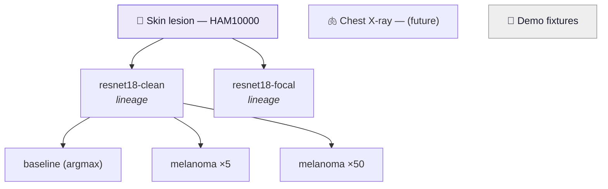

# Roadmap — towards a trustworthy, fully evaluated model

Status of this document: written 2026-09-07, after the leakage audit below.
Tick the boxes as you go; each step leaves the repo in a working state.

---

## Why this exists

The showcase currently evaluates on **7 images**. The obvious fix — "use the whole
test set" — does not work, because the model has already seen almost all of it.

The `skin-lesion-resnet18` checkpoint was trained on the Hugging Face dataset
`marmal88/skin_cancer`. Querying that dataset's parquet metadata directly:

| Check | Result |
|---|---|
| Its `test` split | 1,285 images |
| Test images whose **image_id also appears in `train`** | **1,025 (80%)** |
| Test images whose **lesion** was seen in training | 1,132 (88%) |
| Test images left after excluding train lesions | 153 |
| …after excluding train **and** validation lesions | **28** |
| HAM10000 images covered by `train` + `validation` | **9,964 of 10,015 (99.5%)** |
| HAM10000 lesions covered by `train` + `validation` | **7,442 of 7,470 (99.6%)** |

So evaluating on all 1,285 images would produce a high accuracy that means nothing —
it is mostly a memorisation check. `n=7` labelled "not a benchmark" is *more* honest
than a leaked `n=1285` carrying a green `pass` badge.

**The images were never the problem. The split was.** HAM10000 is a standard
dermatoscopic benchmark; its real limitations are class imbalance (67% nevi) and a
skew towards light skin — both of which the fairness pillar already reports.

### The fix

Re-split HAM10000 **grouped by `lesion_id`**, so no lesion appears on both sides.
That yields roughly **1,100 held-out lesions / ~1,500 test images** the model
provably never saw, and activates every verdict gate in the engine
(`n>=30` for accuracy, `n>=20` for robustness, `>=10` per bin for fairness).

Not every pillar is blocked by leakage, which is worth knowing:

| Pillar | Needs unseen data? |
|---|---|
| Performance, subgroup accuracy | **Yes** — this is what leakage corrupts |
| Robustness (corruption stability) | No — it measures whether predictions *flip*, a property of the model |
| Fairness (ITA coverage) | No — it describes the dataset, not generalisation |
| Explainability (Grad-CAM) | No — illustrative either way |
| Privacy (membership inference) | **Yes**, and worst hit: with 99.5% of the data in training there is almost no non-member set |

---

## Step 1 — Make the engine model-agnostic ✅ done 2026-09-07

*Goal: a second model can be added without editing engine code.*

- [x] `models/image.py` — move `CLASSES` out of the module constant and into the
      scenario spec (`model.classes`), keeping today's list as the default
- [x] `models/image.py` — make the architecture configurable (`model.arch`,
      default `resnet18`) instead of hardcoding `resnet18()`
- [x] `models/image.py` — **fix device handling**: it loads with
      `map_location="cpu"` and never moves the model, so the "free GPU" notebook
      silently runs on CPU and the Mac's MPS is unused. Add `model.device`
      (`auto` → cuda → mps → cpu) and record the resolved device in `Report.meta`
- [x] `datasets/loaders.py` — **break the backwards dependency**: the dataset
      loader currently does `from verifai.models.image import CLASSES`. Dataset
      classes must come from the data (sorted unique manifest labels) or from the
      dataset spec, never from the model
- [x] `explainability/gradcam.py` — `layer4[-1]` is ResNet-specific. Let the
      model adapter expose its own `cam_layer`, configurable per scenario

**Acceptance: met.** Re-running `scenarios/skin_cancer.yaml` with no scenario edits
produced findings identical to the pre-refactor baseline (top-1 100%, faithfulness
0.669, stability 75%). 64 contract tests in `tests/` cover the seams; run them with
`.venv/bin/python -m pytest tests/ -q`.

Measured while doing this: MPS is **slower** than CPU here (5.5s vs 3.2s at n=7),
because everything still runs at batch size 1 and per-image transfer dominates.
The scenario is therefore pinned to `device: cpu`, and the device is now recorded
in `report.json` under `meta.device`. Batching (see gaps below) is what makes a
GPU pay off — the device fix is its prerequisite, not a speedup on its own.

## Step 2 — Training, with the split as a contract ✅ code done 2026-09-07

*Goal: training and evaluation can never disagree about what was held out.*

- [x] `scripts/build_splits.py` — stratified split **on `lesion_id`**. Better than
      `GroupShuffleSplit`: every lesion carries exactly one diagnosis (verified), so
      the split is stratified *and* grouped. Reads only metadata columns over HTTP
      range requests — a few MB, not the 3.6 GB the images would cost
- [x] Manifests written and committed: `data/manifests/ham10000_{train,val,test}.csv`,
      carrying `filename, image_id, lesion_id, label, dx_type, age, sex, localization`
- [x] `scripts/materialize_images.py` — fetches the JPEGs the manifests name into
      the gitignored `data/raw/ham10000/`, deduplicated by image_id. `--max-size 320`
      re-encodes on the way in: **~140 MB instead of 2.7 GB** (measured, 19x), which
      costs training nothing because the first transform resizes to 224 anyway.
      Keep one resolution for a whole comparison — a blur radius or JPEG quality
      means something different at a different size, so the robustness numbers
      shift. The choice is recorded in `_materialize.json` and the script refuses
      to mix resolutions in one directory
- [x] `scripts/train_model.py` — reads the `training:` block, trains on train,
      selects on val by **balanced** accuracy, never opens the test manifest, and
      writes `<name>_training.json` recording exactly which manifests were used
- [x] `scenarios/skin_cancer_clean.yaml` — the retrained model's scenario
- [ ] Upload the checkpoint to the HF Hub (`.pt` is gitignored)

**The resulting split:**

| Split | Images | Lesions |
|---|---|---|
| train | 7,014 | 5,230 |
| val | 1,508 | 1,120 |
| **test** | **1,493** | **1,120** |

Zero shared lesions and zero shared images between any pair of splits, checked by
the script itself, which exits non-zero rather than emit a leaking split. Class
stratification holds at 11–16% per class in test, including **163 melanomas** —
against 1 in the best clean subset the old split could offer.

**Verified end to end** on a 42-image miniature of the real split (build → fetch →
train 2 epochs on MPS → evaluate → artifacts), so the pipeline is known to work
before committing to the full download and training run.

### Compute: this runs locally, and it is fast

Measured on this machine (Apple M1 Max, 10 cores, 64 GB) rather than estimated —
an earlier guess of "1–2 h on MPS" was wrong by about 15x:

| Stage | Throughput | Time |
|---|---|---|
| ResNet18 fwd+bwd on MPS, bs=32 | 348 img/s | ~20 s/epoch |
| JPEG decode + augment, 8 workers, 320px | 1,259 img/s | ~6 s/epoch |
| **Realistic full epoch (7,014 images)** | **286 img/s** | **24.5 s** |
| **Full 12-epoch training run** | | **~5 min** |
| Evaluation of the 1,493-image test split | | ~2 min on CPU |

Inference, measured the same way — MPS is worth it for anything but a toy run:

| Device / batch | img/s | 1,493 images x 7 passes |
|---|---|---|
| cpu, batch 1 (today) | 99 | 105 s |
| **mps, batch 1 (today)** | **365** | **29 s** |
| mps, batch 32 (needs batching) | 1,266 | 8 s |

MPS costs ~206 ms of one-time setup and then runs at 2.8 ms/img against CPU's 9.8,
so it pays for itself after **~30 forward passes** — which a scenario reaches at
about 5 images, since each one costs ~7 passes. That is why `skin_cancer.yaml` (n=7)
is pinned to cpu while `skin_cancer_clean.yaml` (n=1,493) uses `auto`. Batching the
forward passes would win another ~3.5x on top, but 29 s is not worth the refactor yet.

One reproducibility caveat: results are bit-identical *per device*, not across
devices. CPU and MPS agreed exactly on every metric at n=7, but at n=14 deletion
faithfulness came out 0.066 on CPU and 0.065 on MPS — float ordering differs
between backends, and that metric stacks quantile, masking and two forward passes.
Expect third-decimal drift when comparing runs made on different devices; this is
why `report.json` records `meta.device`.

Data loading is not the bottleneck once `workers: 8` is set — decoding runs about
3.5x faster than the GPU consumes, which is the right shape. Two settings matter
on macOS: `persistent_workers` (spawning 8 loader processes costs ~10 s, and
without it they respawn every epoch) and `--max-size 320` when materialising.

**No cloud is required for any of this.** The pipeline is local end to end. Because
`device: auto` resolves cuda → mps → cpu, the same scenario runs unchanged on a
CUDA machine later — the local option is not a fallback, it is the default path.

## Step 3 — Make leakage a first-class finding ✅ done 2026-09-07

*Goal: the framework catches the mistake that invalidated the last run.*

- [x] New pillar `integrity` with metric `split_leakage`, reporting shared lesion
      IDs, duplicate image IDs and the contamination percentage
- [x] `run_scenario.py` raises `SplitLeakageError` **before any metric runs**
      rather than quietly producing a flattering number. `integrity.enforce: false`
      downgrades it to a reported finding
- [x] `verifai/core/integrity.py` is the single implementation, used by both the
      guard and the metric, so they cannot drift apart
- [x] Renders as a normal tile finding with its own `explain` block; `integrity`
      sits first in the dashboard because every other pillar is conditional on it

Two honesty bugs were found and fixed while building this:

- A manifest without `image_id`/`lesion_id` columns compared as *zero* overlap and
  scored a green "clean split" — publishing an unverified split as a verified one.
  `audit_split` now separates `verifiable` from `clean`, and unverifiable reports
  `info` with an explicit "this is not a clean bill of health".
- `scenarios/skin_cancer.yaml` now runs the check and states plainly that its
  integrity is unverified — which is the truthful status for a checkpoint trained
  on ~99.5% of HAM10000.

This is the step that turns the original flaw into the product's strongest claim:
*this tool catches the error behind most published accuracy numbers.*

## Step 4 — Retrain, evaluate, deploy

Fully local. The whole sequence is roughly 15 minutes of wall time:

```bash
python scripts/build_splits.py                              # done; manifests committed
python scripts/materialize_images.py --max-size 320         # ~140 MB, a few minutes
python scripts/train_model.py scenarios/skin_cancer_clean.yaml   # ~5 min on MPS
python scripts/run_scenario.py scenarios/skin_cancer_clean.yaml  # ~2 min, integrity-checked
git add showcase/artifacts && git commit && git push        # push == deploy
```

- [x] Retrained on the clean lesion-grouped split — 12 epochs in **4.6 min** on MPS,
      best val balanced accuracy 0.724
- [x] Full evaluation over the real holdout: **1,493 images, 1:49**, every verdict
      gate active for the first time
- [x] Membership inference computed for real: members = train manifest,
      non-members = test manifest, rank-based AUC with no new dependency
- [x] Per-example bar chart replaced above 50 images by a confusion matrix plus
      per-class recall
- [ ] Push. **Streamlit Community Cloud redeploys on push, so committing the
      artifacts *is* the deploy.**

### The first trustworthy result

| Pillar | Verdict | Result |
|---|---|---|
| Integrity | ✅ pass | 0 shared lesions, 0 shared images across 1,493 test images |
| Performance | ✅ pass | 79.6% top-1, **72.8% balanced** |
| Privacy | ✅ pass | membership-inference AUC 0.558 (0.5 = ideal) |
| Robustness | ⚠️ warn | 71.7% of predictions survive corruption |
| Fairness | ❌ **fail** | **21.3-point** accuracy gap across ITA skin-tone bins |

What the headline number hides, and why the confusion matrix earns its place:

| Class | Recall | Support |
|---|---|---|
| melanocytic_Nevi | 0.862 | 1,009 |
| basal_cell_carcinoma | 0.855 | 76 |
| vascular_lesions | 0.818 | 22 |
| dermatofibroma | 0.769 | 13 |
| **melanoma** | **0.638** | 163 |
| benign_keratosis-like_lesions | 0.586 | 157 |
| actinic_keratoses | 0.566 | 53 |

**80% accuracy, and it misses one melanoma in three.** The class that matters most
clinically is the second worst. That is the whole argument for this project in one
table — and note that none of these numbers could have been believed before the
integrity check passed.

On fairness: light 78.5% (n=1,325), medium 96.3% (n=108), dark 75.0% (n=60). The
gap is real and fails the threshold, but read the supports before drawing a
conclusion — it is driven as much by the small medium-skin bin scoring unusually
high as by dark skin scoring low.

## Step 4b — Clinical metrics and uncertainty ✅ done 2026-09-08

*Goal: measure the thing you are about to improve, before improving it.*

- [x] `verifai/metrics/_stats.py` — Wilson score intervals (correct at the extremes,
      where the normal approximation is not), Hanley–McNeil for AUC, Bayes PPV at a
      stated prevalence. Pure `math`, no scipy
- [x] Per-class **sensitivity, specificity and PPV**, each with a 95% interval
- [x] **Top-3 differential accuracy** — how a dermatologist actually consumes a
      suggestion, and the metric that shows this model is better than top-1 implies
- [x] Intervals on robustness stability, fairness subgroup accuracy, and the MIA AUC
- [x] Verdicts taken on the *interval* where it matters: privacy passes on the upper
      bound, and a fairness gap is only claimed when the two groups' intervals separate
- [x] Asymmetric error bars in the bar renderer (Wilson intervals are not symmetric)

Why this had to come before any model variant: the old metric measured top-1 argmax
accuracy only. Improving melanoma detection can *lower* top-1 accuracy while making
the model clinically better — optimising against that metric would have punished the
intended change.

## Step 4c — First loop iteration: cost-sensitive decision ✅ done 2026-09-09

- [x] `ImageClassifier.decide()` / `.rank()` — the decision rule lives on the model
      adapter, configured per scenario. Four metrics were each hardcoding `argmax`
      independently; they now route through one place
- [x] `scripts/tune_decision.py` — sweeps the weight on **validation**, never test,
      and prints the sensitivity/PPV/accuracy trade-off with intervals
- [x] Two variants evaluated on the frozen test set (`melanoma ×5`, `melanoma ×50`)
- [x] Snapshot flattening deepened to reach `per_class.<class>.<metric>` — at the old
      depth the very number the experiment was about was missing from the comparison

**Result: melanoma sensitivity 0.638 → 0.945 with no retraining**, at the cost of PPV
(0.495 → 0.264) and nevi sensitivity (0.862 → 0.640). Top-1 accuracy fell 0.796 → 0.656
and the verdict went `pass` → `warn`, so an accuracy-only evaluation would have rejected
a clinically much better configuration. See [Current results](results.md).

## Step 4d — Focal loss and oversampling ✅ done 2026-09-09

- [x] `FocalLoss` in `scripts/train_model.py` (γ configurable; γ=0 recovers CE exactly,
      asserted in tests) and `training.loss: focal`
- [x] `training.sampling: balanced` via `WeightedRandomSampler`, with a warning when
      class weighting is left on as well, since that double-corrects
- [x] Two variants trained and evaluated on the frozen test set

**Negative result, and the most useful one so far.** Neither intervention produced a
demonstrated change in melanoma sensitivity: focal −14.1 points, oversampling +1.8, both
with intervals overlapping the baseline. Meanwhile the free decision-rule change from
step 4c moved it +30.7. Top-3 accuracy is 0.974–0.979 across *all five* configurations —
these interventions do not change what the model knows, only where it commits. The next
real gain therefore has to come from information, not from reshaping the same loss.

That argues for promoting step 5 (more real minority images) ahead of further loss
engineering.

## Step 5 — A larger image set

*Goal: more data, and a test set the model has no relationship to at all.*

HAM10000 is 10,015 images and the model will have seen 70% of them. The next
honest gain comes from data drawn from somewhere else entirely.

- [x] `scripts/build_isic_train.py` — builds an ISIC 2019 training manifest with
      every val and test lesion held back. Excludes by `image_id` **and**
      `lesion_id`, re-reads the written file to prove the anti-join held, and
      refuses to leave a leaking manifest on disk. 7 contract tests, no network
- [x] **The overlap, measured.** Holding back val+test costs **3,001 images —
      11.8% of ISIC 2019 and only 7.5% of its melanoma**. The remaining 22,330
      are fair training data, HAM10000's own training portion included. The join
      is exact, not approximate: HAM10000's `image_id` *is* an ISIC id
      (`ISIC_0024342`), so this is a string anti-join and needs no image hashing
- [x] Class vocabularies mapped. `SCC` is **dropped** by default: the frozen test
      set has seven classes, so an eighth head could never be scored on it and
      would make the run incomparable for no measurable gain. `--keep-scc` opts
      in. `UNK` is never a label — it is "none of the above", not a diagnosis
- [x] `scenarios/skin_cancer_isic.yaml`, warm-started from **ImageNet** rather
      than `skin-lesion-resnet18`. That checkpoint's training data covered 9,964
      of 10,015 HAM10000 images including this test set, so initialising from it
      would re-contaminate the new model — and the integrity check cannot catch
      it, because it inspects manifests, not checkpoint provenance
- [x] **Manifests built, and the numbers are now measured rather than projected.**
      The two ISIC 2019 metadata CSVs are 2.4 MB together, so this step needs no
      images and runs locally in seconds:

      | | |
      |---|---|
      | ISIC 2019 rows | 25,331 |
      | dropped: `SCC` (no HAM10000 equivalent) | 628 |
      | held back: in our val/test | 2,933 |
      | **`isic_train.csv`** | **21,770 images / 11,477 lesions** |
      | melanoma | **774 → 4,183 (5.4×)** |
      | basal cell carcinoma | 364 → 3,173 (8.7×) |
      | actinic keratoses | 228 → 836 (3.7×) |
      | nevi | 4,698 → 10,868 (2.3×) |

      Leakage check: 0 shared images and 0 shared lesions against both
      `ham10000_val.csv` and `ham10000_test.csv`.

      Two things the run surfaced, both benign but worth recording:

      - **All 10,015 HAM10000 images are in ISIC 2019, and ISIC keeps their
        `HAM_` lesion ids** — so lesion-level matching genuinely works here, and
        the exclusion is not resting on image ids alone.
      - **ISIC splits what HAM10000 lumped.** 197 images HAM calls
        `actinic_keratoses` are `SCC` to ISIC (68 in our val/test, 129 in train).
        Dropping SCC therefore drops those 129 from training, and explains why
        2,933 rather than 3,001 rows were excluded by image id: the other 68 had
        already been dropped as SCC. They are absent from training either way,
        which is the only property that matters. They remain in the test
        manifest under their HAM label, so evaluation is unchanged — but it does
        mean 68 test/val images are, by a more granular vocabulary, carcinomas
        scored as keratoses. That is HAM10000's `akiec` label noise, not ours.
      - **Label agreement is exact.** Of the 6,885 HAM training images kept,
        ISIC's diagnosis matches HAM's for **6,885 and disagrees for 0**, so the
        new model trains on the same labels for the same images. Had they
        disagreed, the comparison would have confounded a label change with a
        data change.

- [x] `scripts/materialize_isic.py` — reads the 9.1 GB zip **in place** rather
      than extracting it (every member is read once, so extracting would cost
      another 9.1 GB for nothing). Of the 23,278 images the corpus needs, 8,393
      are HAM10000 images we already hold at 320px and are **copied
      byte-for-byte** instead of re-encoded; only 14,885 are encoded from the
      zip. The copy is not just a time saving: `train_model.py` selects a
      checkpoint on validation read from `training.images_dir` while
      `tune_decision.py` tunes the decision weight on validation read from
      `dataset.images_dir`, so re-encoding the shared rows would leave the
      threshold tuned on different pixels than the checkpoint was selected on.
      `_materialize.json` records both provenances, since that is the only place
      the distinction survives
- [x] Downloaded, materialized, trained and evaluated. 23,278 images at 320px
      came to 360 MB (8,393 copied byte-identical, 14,885 encoded from the zip);
      training took 13.5 min on MPS, close to the 15 min projected from
      pipeline.md. **Integrity passed on real data**: none of the 1,493 test
      images shares a lesion or an image with the 23,278 trained on, and the run
      landed in the same comparability group as the existing five

**Result: a second negative result, with one real gain.** See
[Experiment 3](results.md#experiment-3-a-3x-larger-more-diverse-training-set).

3.1x the training images and 5.4x the melanoma produced **no established change**
in top-1 accuracy, top-3, melanoma sensitivity, or membership-inference AUC —
every interval overlaps the baseline's. Melanoma sensitivity moved -1.8 points.

What it did buy is **robustness**, the only demonstrated gain in the project so
far: +8.4 points under Gaussian noise and +4.6 under brightness, both with
separated intervals. ISIC aggregates several archives, so the corpus spans more
cameras and lighting than HAM10000 — the model got harder to perturb without
getting more accurate.

What it cost is **fairness**: the skin-tone gap widened from 0.213 to 0.326, with
accuracy on the darkest bin falling 0.750 -> 0.600 (n=60) while the lightest bin
rose. The aggregate improved by concentrating its gains where the data already
was.

Top-3 accuracy is 0.974-0.979 across all six configurations. Three interventions
have now been measured against this test set and the free decision-rule change
remains the only one that moved melanoma sensitivity at all (+30.7 points). The
bottleneck was never the number of images, and it is not the loss function
either.

- [ ] **Next, and now the interesting one:** a genuinely external test set (PH2,
      Derm7pt, PAD-UFES-20). The training corpus is now a mixture of archives
      while the test set is pure HAM10000, so part of the missing accuracy gain
      is probably distribution mismatch — and that is only measurable against
      data from somewhere else entirely
- [x] Re-tuned the decision rule on the new model's validation split, and it
      **corrected experiment 3's conclusion**. Below `w=5` the two models'
      frontiers are identical; at matched validation PPV 0.26 the ISIC model
      reaches 0.949 sensitivity against the old model's 0.852, intervals
      separated. The extra data did move the frontier — in the screening regime
      only, which is where `argmax` cannot see it. `w=30` evaluated once on test:
      **0.976 sensitivity, 4 of 163 melanomas missed**, the best of any
      configuration. The +9.7 validation advantage came out as +3.1 on test with
      overlapping intervals, which is what selecting a weight on validation does
      and why test is seen once. See
      [Experiment 4](results.md#experiment-4-tuning-the-new-model-and-where-experiment-3-was-wrong)

**The test set is now the binding constraint.** With 163 melanomas, sensitivity
near 0.97 carries an interval of about ±0.03, so differences under ~5 points
cannot be resolved on this data at all. Establishing the remaining gain is a
sample-size problem, not a modelling one.

- [ ] An external test set (PH2, Derm7pt, PAD-UFES-20) — now the highest-value
      step for two independent reasons: the training corpus is a mixture of
      archives while the test set is pure HAM10000, and 163 melanomas is too few
      to resolve the differences the tuning sweep suggests are real
- [x] Architecture tested and **negative**. ResNet50, 2.2x the parameters
      (25.6M vs 11.7M), every other setting fixed: validation balanced accuracy
      rose 0.724 -> 0.744 but none of it survived to test — top-1 0.806 -> 0.801,
      top-3 0.9766 -> 0.9752, intervals overlapping. See
      [Experiment 5](results.md#experiment-5-resnet50-capacity-is-not-the-ceiling-either)
- [x] Resolution ruled out as a lever, not merely untried. The frozen test images
      are 320x240, so training above ~240 on the short side only interpolates,
      and re-materializing them higher would change the pixels seven published
      runs were scored on. The 320px storage choice, made for disk, quietly
      became a measurement commitment — worth knowing before the next such
      decision

**Top-3 accuracy is 0.975-0.977 across all eight configurations** — two corpora,
two architectures, two loss functions, a sampling scheme, three decision rules.
Nothing has changed what the model knows. That is a statement about the
information in the inputs, not about the models.

- [ ] **Use the metadata.** `age`, `sex` and `localization` sit on every manifest
      row (98% / 98% / 90% populated in training, 100% in test) and feed no model
      at all — they exist only as fairness grouping keys. A dermatologist uses
      site and age; an image-only classifier cannot. This is the one untested
      lever that adds *signal* rather than parameters, and it needs no new data.
      Note it also raises a fairness question worth stating up front: conditioning
      on sex or age makes the model's subgroup behaviour a design choice rather
      than an artefact
- [ ] An external test set remains the other half. 163 melanomas cannot resolve
      differences under ~5 points, so several of these negative results are
      "not demonstrated" rather than "demonstrated absent"

### Two experiments that need no new data

Both are standard practice worth having done once, and both attack the finding
that has survived everything else: top-3 accuracy sits at 0.975-0.977 across all
eight configurations, so nothing tried so far has changed what the model *knows*.

- [ ] **Linear probing vs full fine-tuning.** Freeze the backbone, train only the
      classification head, same corpus and same frozen test set — one variable,
      nothing else. It tests the standing hypothesis head-on: if frozen ImageNet
      features land close to a fully fine-tuned model, backbone adaptation was
      contributing little, which is exactly what a flat top-3 implies. Cheap,
      too, since there is no backward pass through the backbone. Implementation
      is a `training.freeze_backbone: true` flag in `train_model.py`, set
      `requires_grad = False` before replacing `net.fc`
- [ ] **A learning curve.** Train on 100 / 500 / 2,000 / 7,014 / 21,770 images
      drawn from `isic_train.csv` with a fixed seed, evaluate every one on the
      same frozen test set. This answers a question none of the experiments so
      far can: **where does it saturate?** If the curve is already flat by a few
      thousand images, that retrospectively explains experiment 3 — tripling the
      corpus bought no accuracy because the corpus was never the binding
      constraint. Subsample by lesion, not by row, or the smaller sets leak
      against themselves

Neither needs another dataset, and Derm7pt is specifically *not* a candidate for
either: once it is the external test set, training on it in any form destroys the
only independent measurement available.

Its 7-point concept annotations are tempting for a Concept Bottleneck Model,
which would sit close to the explainability pillar. That needs the concepts at
training time, so it is a separate project with its own data, not a variation
on this one.

**Image directories are per-corpus, not merged.** ISIC images go to
`data/raw/isic2019/`, self-contained, including re-materialized copies of the
6,885 HAM10000 images that `isic_train.csv` shares — about 108 MB of duplication.

`data/raw/ham10000/` stays frozen, because it is the pixel source for five
published artifacts: merging into it would retroactively change what those
numbers mean, one layer below the manifest. `materialize_images.py` already
enforces this — its `_materialize.json` stamp records `source`, `max_size` and
`quality`, and it exits rather than mixing settings in one directory, so a merge
would also make the existing stamp (`source: marmal88/skin_cancer`) false.

The directory name carries the edition. `isic2019`, not `isic`, so adding ISIC
2020 later does not make an existing path ambiguous.

**One deliberate departure from the original plan above.** It said to "re-run
`build_splits.py` over the union", i.e. re-split everything once ISIC was mixed
in. That is wrong, and the comparison view is what makes it wrong: re-splitting
moves the test set, which changes the evaluation manifest's content hash, which
puts the new run in a different comparability group from the five existing
configurations — so the one thing the larger training set was *for*, showing
where it performs better, would have been impossible to display.

So the test manifest is frozen instead, and only training grows. Validation is
the existing `ham10000_val.csv` copied under the new prefix rather than
resampled, because `tune_decision.py` tunes the decision rule on val and a
different val would silently change what a tuned weight means.

A larger training set does not license a new test set. Same rows, same bytes,
same hash — that is the price of being able to compare at all.
- [ ] Consider a genuinely **external** test set (PH2, Derm7pt, PAD-UFES-20) as a
      separate scenario. Different camera, different clinic, different population:
      the gap between the internal and external number *is* the generalisation
      result, and is worth publishing as its own tile

Note that a larger training set does not by itself justify a bigger *test* set —
what makes the test number trustworthy is that no lesion in it was ever trained on.

## Step 6 — Snapshots and a comparison view

*Goal: show improvement over time, without inviting a dishonest comparison.*

- [x] Keep every evaluation instead of overwriting: every run writes
      `showcase/artifacts/<id>/history/<created_at>.json` alongside `report.json`
      (which stays "latest", so the dashboard is unchanged). ~2.7 KB per snapshot
- [x] Each snapshot records what makes it comparable: the evaluation manifest's
      **content hash** (not its path — a manifest can be regenerated with a
      different seed and keep its name), the row count, and the integrity verdict
- [x] Metrics are flattened generically (`<pillar>.<path>`, numeric leaves only,
      booleans excluded), so a new metric becomes comparable without the exporter
      learning anything about it
- [x] Comparison view: runs grouped by evaluation set, metric table with a delta
      column, and a per-metric chart
- [x] **Refusal**, which is the point: runs scored on different rows are never
      plotted together, and a run whose split was contaminated or unverified is
      excluded with the reason shown
- [ ] `lineage:` on the card, to group retrains of one model family across folders

**The trap this must avoid.** Two numbers are only comparable if they come from
the same test manifest *and* both snapshots were clean. Comparing the original
checkpoint against the retrained one is not a fair fight in either direction:

- Evaluated on its own contaminated split, the old model scores inflated numbers.
- Evaluated on the new clean manifest, it *still* scores inflated numbers, because
  it trained on ~99.5% of HAM10000 — the new test set is unseen for the new model,
  not for the old one.

So the comparison view must refuse to plot snapshots with mismatched test
manifests, and must render the integrity verdict beside every bar. A green
"+12 points" against a leaked baseline would be exactly the kind of claim this
project exists to catch. Where no fair comparison is possible, say so instead of
drawing the chart.

## Step 7 — Group the gallery ✅ done 2026-09-10

*Goal: one tile per scenario stops working once one model has ten configurations.*

Today every scenario produces a folder, and every folder produces a tile. The three
cost-sensitive runs are already three tiles for **one** model; focal loss, oversampling and a
backbone comparison would add several more, and a second use case would sit undifferentiated
among them.

Two grouping axes, deliberately separate:



- [x] `card.group` — a section heading in the gallery ("Skin lesion — HAM10000").
      Ungrouped cards fall into a default section, so nothing breaks
- [x] Moved `_sample_skin_resnet` into a **Demo fixtures** group, so placeholder data is
      visually separated from real results rather than sitting beside them
- [x] `card.lineage` — configurations of the same underlying model collapse into **one**
      card showing "3 runs", which opens the comparison view already filtered to that lineage
- [x] The comparison view keeps grouping by evaluation-set hash regardless: `group` and
      `lineage` are presentation, **comparability is evidence**, and the two must not be
      confused. Two runs in one lineage that were scored on different manifests still must
      not be plotted together

**Result: seven tiles became three cards.** One section per problem, and the five clean-split
configurations collapsed into a single card that opens straight into their comparison — which
is the useful view of a set that exists to be read against itself.

A test now asserts the constraint that was easy to violate: two configurations of one lineage
scored on *different* manifests still land in different comparability groups. Lineage narrows
what is displayed; it never widens what may be compared.

---

## Known scaling gaps (bite at n>1000, not at n=7)

- Everything runs at **batch size 1** (`to_tensor` does `.unsqueeze(0)` per image)
- `fairness/skin_tone_ita.py` recomputes the clean prediction that
  `performance/classification.py` already made — 7 forward passes per image, 2 redundant
- `details["per_example"]` is written for every image, so `report.json` grows linearly
- ~~`ImageSample` carries only `id/path/label`~~ — **closed.** Every extra manifest
  column lands on `ImageSample.meta` (`image_id`, `lesion_id`, `dx_type`, `age`, `sex`,
  `localization`), so real demographic subgroups are available today and would beat the
  ITA pixel proxy. Nothing currently reads them except the integrity check


---

## Where this goes next: domains, and what each step demonstrates

The README calls this framework domain-agnostic. That is currently a *claim* — all nine
scenarios are skin lesions. Measured against the code, here is how true it actually is:

| Module | Image-bound? |
|---|---|
| `export/artifacts.py` | not at all — zero image references |
| `core/findings.py` | only the `Domain` literal, which already lists `image` / `text` / `tabular` / `llm` |
| `core/run.py`, `core/integrity.py` | comments, plus an `id_key` that is already configurable |
| `metrics/performance`, `robustness`, `privacy`, `integrity` | essentially domain-free |
| `metrics/explainability/gradcam.py` | **genuinely image-bound** |
| `metrics/fairness/skin_tone_ita.py` | **genuinely image-bound** (ITA is computed from pixels) |

### A second imaging domain is nearly free

Chest X-ray is still image classification: same `ImageClassifier`, same manifest format,
same metrics, and Grad-CAM is standard in that literature. The work is a scenario plus one
metric swap — `fairness.skin_tone` is meaningless on radiographs, so subgroup fairness
would run on `sex`/`age`, which the loader already carries.

**That is the cheapest way to turn the central architectural claim into a demonstration.**
A tenth skin-lesion model adds nothing a reader cannot already see; one radiograph scenario
proves the thing the README asserts.

### Text is a real project, not a variation

New loader, new model adapter, and the metrics need rethinking rather than porting:
Grad-CAM becomes attention or SHAP, and "add noise" becomes typos and paraphrase. The
core — findings, runner, exporter, comparison view — would not have to change, which is
itself the interesting result.

### More metrics per pillar

The snapshot format makes this cheap: register the metric, re-run the scenarios, and the
comparison view picks it up with no change to `app.py`. Worth doing not for the count but
because every added metric makes the project's own argument concrete — that one number per
pillar hides more than it shows, which is exactly what accuracy did to melanoma sensitivity.

### Techniques this repo can currently show

Done and evidenced by artifacts: leak-free grouped splitting, a guard that refuses to
evaluate a contaminated split, cost-sensitive decision rules tuned on validation, focal
loss, class weighting, balanced oversampling, transfer learning across two architectures,
corpus scaling to 21,770 images, Wilson / Hanley-McNeil intervals, membership-inference
attack, Grad-CAM with a deletion-faithfulness check, and — rarest of the list — three
negative results reported as negative.

Open, and each demonstrating a technique not yet covered: linear probing, a learning curve,
metadata as model input, an external test set, and a second domain.