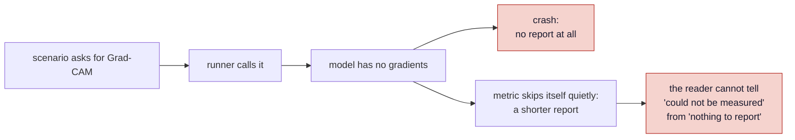
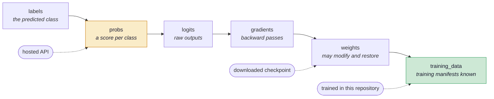
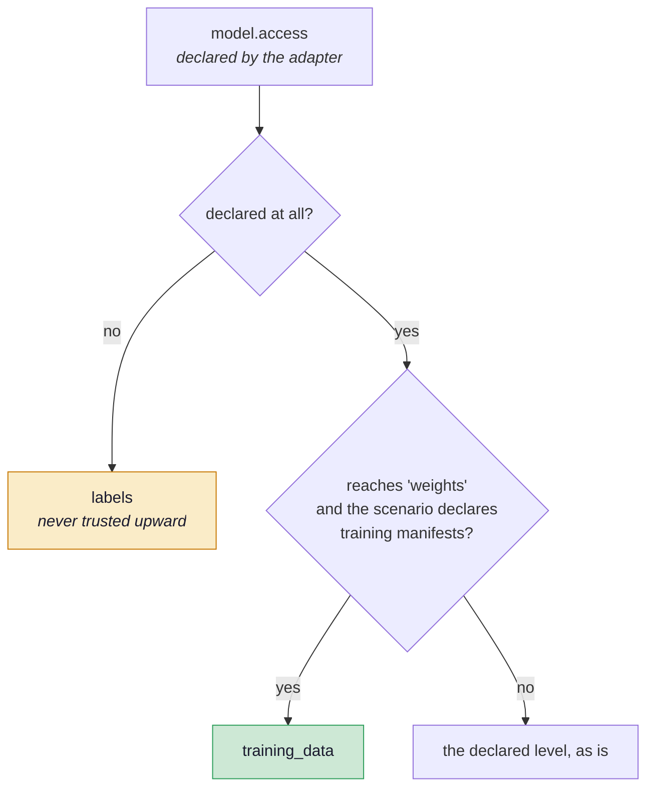
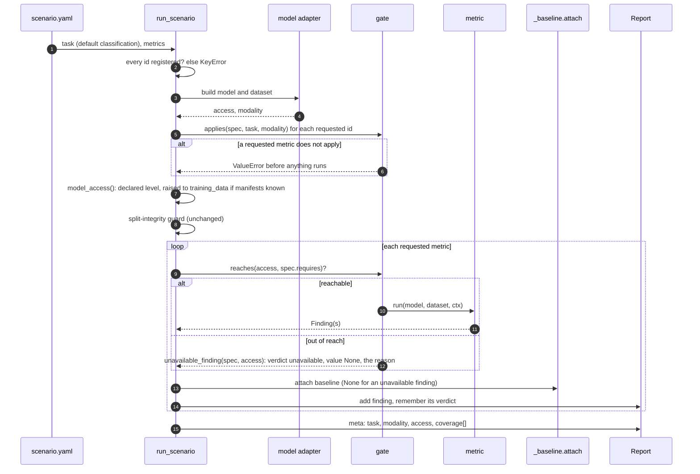
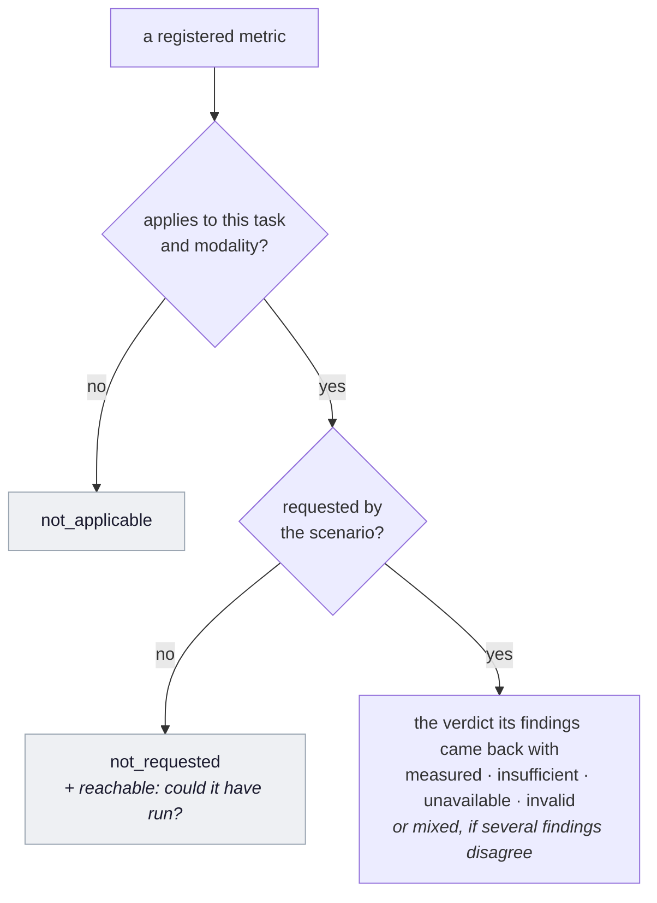
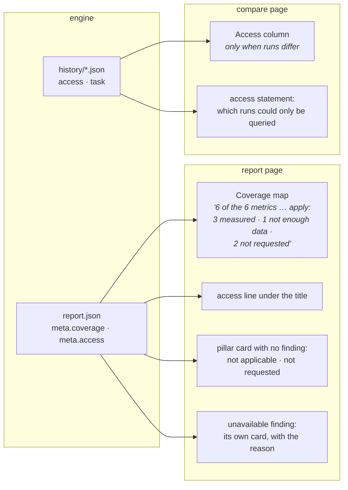

# ADR 0001 — Capability gating: what a model exposes, what a metric needs

| | |
|---|---|
| **Status** | Accepted · built 2026-09-25 (milestone M4, [Phase A](../ROADMAP.md#phase-a-the-two-contracts-and-capability-gating)) |
| **Code** | `verifai/models/base.py` · `verifai/core/run.py` (`MetricSpec`, `run_scenario`, `coverage`) · `verifai/export/artifacts.py` · `showcase/views/report.py` · `showcase/views/compare.py` |
| **Tests** | `tests/test_engine_contracts.py`, section *Phase A: the model contract and capability gating* |
| **Supersedes** | the bare `"module:function"` registry, where every metric was assumed to run on every model |

## Context

Until M4 every metric was a string in `METRIC_REGISTRY`, and the runner called every metric a
scenario listed. That worked because every model in this repository is a local PyTorch
checkpoint: it can be opened, differentiated, modified, and its training manifests are known.
Nothing ever had to ask *how much of the model do we actually have?*

The roadmap takes the project to models it did not train — a checkpoint from the Hugging Face
Hub, and eventually a model reachable only through an API. Against those, half the
[catalogue](../pillars.md) cannot run: gradients do not exist on the other side of an HTTP
endpoint, and a membership attack needs to know who the training members were. Without a
contract, one of two things happens, and both are dishonest:



A second, smaller symptom was already on screen. The Derm7pt report said *"Not evaluated in this
run"* for Explainability and Privacy, when the truth was that nobody had asked for them. The
report could not tell *not asked* from *could not* from *does not apply*, because nothing
recorded the difference.

## Decision

Two contracts, and a gate between them.

1. **A model declares how much of itself it exposes** — its *access level* — and what kind of
   payload it takes (its *modality*).
2. **A metric declares what it needs** — the tasks it belongs to, the modalities it can read, and
   the lowest access level it requires — in a `MetricSpec`.
3. **The runner compares the two before calling anything.** A metric that does not *apply* to the
   evaluation is refused before the run starts. A metric that applies but that the model cannot
   *support* is never called; the report gets an `unavailable` finding under that metric's name,
   saying why.
4. **Every report records its coverage**: one row per registered metric with where it stands.
   The showcase reads that record, so *not applicable*, *not requested* and *unavailable* are
   three different things on screen.

The governing rule is the one `privacy/mia.py` already followed for a missing members manifest:
**a metric that cannot run is a row with a reason, never a gap.**

## How it works

### 1 · The access ladder

Access is a **total order**, not a set of capabilities. Each level includes every level before it:
whoever can take gradients can read probabilities, and whoever can read probabilities can read
the predicted label. Gating is therefore one comparison, `reaches(has, needs)`, rather than a set
intersection that every metric would have to spell out.



`ACCESS_LEVELS`, `reaches()` and `access_rank()` live in `verifai/models/base.py`, which imports
nothing heavier than `typing`. That is deliberate: the showcase orders access levels in the
comparison view, and the showcase must never need torch. A test parses the module's imports to
keep it that way.

`WHY_UNREACHABLE` in the same module holds, per level, the sentence a reader sees when a metric
needs that level and the model falls short — *"it needs gradients, and this model can only be
queried, not opened, so gradients do not exist for it"*. The wording is in the engine, next to
the ladder, so every metric that needs gradients explains itself the same way.

### 2 · Where a model's access level comes from



`ImageClassifier` declares `access = "weights"` and `modality = "pixels"` as class attributes: a
local module can be opened, differentiated and modified. Whether its **training data is known** is
not a property of the module but of the scenario, so `run.model_access()` raises the level to
`training_data` only when `train_manifests_from_scenario()` finds manifests — the same function
the split-integrity guard uses, so the two cannot disagree about what "known training data" means.

Two edges are decided on purpose:

- **A model that declares nothing is taken at `labels`.** An adapter written before the contract
  keeps working, but it is not trusted with anything it has not claimed.
- **Declared training data does not lift a model past `weights` it does not have.** A hosted model
  whose training manifests are known is still `probs`: knowing the members does not give it
  gradients. The ladder conflates two axes at its top rung, and this rule is what keeps the
  conflation from granting capabilities that do not exist. See *Consequences*.

### 3 · What a metric declares

```python
@dataclass(frozen=True)
class MetricSpec:
    target: str                          # "module:function"
    pillar: str                          # where its row goes, even when it cannot run
    finding: str                         # the Finding.metric name it returns
    tasks: tuple[str, ...] = ("classification",)
    modalities: tuple[str, ...] | None = None   # None = any payload
    requires: str = "labels"             # the lowest access level it needs
```

The six registered metrics, as declared today:

| Registry id | Finding | Modalities | Requires | Why that level |
|---|---|---|---|---|
| `integrity.split_leakage` | `split_leakage` | any | `labels` | reads manifests, never the model |
| `performance.classification` | `top1_accuracy` | any | `probs` | ranks and decides on class scores |
| `robustness.corruption` | `corruption_stability` | `pixels` | `probs` | corrupts images, compares decisions |
| `fairness.skin_tone` | `skin_tone_ita` | `pixels` | `probs` | estimates skin tone from pixels |
| `explainability.gradcam` | `gradcam_faithfulness` | `pixels` | `gradients` | backpropagates into a conv layer |
| `privacy.mia` | `membership_inference_auc` | any | `training_data` | needs to know who the members were |

`pillar` and `finding` exist so that a metric that is never called still produces a row **in its
own pillar, under its own name** — the reader looks for Grad-CAM under Explainability and finds it
there, saying why it did not run.

A bare `"module:function"` string is still accepted. `spec_of()` turns it into a `MetricSpec` at
its most permissive — any task, any modality, `labels` — which is exactly how every metric ran
before the contract existed. A test nonetheless fails if any *registered* entry is still a string,
so the permissive path is for old code and experiments, not for the shipped registry.

### 4 · The run, step by step



Two refusals, deliberately different in kind:

| | Does not **apply** | Cannot be **supported** |
|---|---|---|
| Example | a classification metric in a `task: generation` scenario | Grad-CAM on a model reachable only as `probs` |
| What it is | a mistake in the scenario | a fact about the model |
| When | once the model is built (its modality is needed), before any metric runs | at the metric's turn in the loop |
| Outcome | `ValueError`, the run stops | an `unavailable` finding with the reason; the run goes on |
| In `coverage` | `not_applicable` for every run of that task | the verdict `unavailable` |

The first is an error because the metric was never part of what the evaluation could mean. The
second is a finding because *what cannot be measured about a model is itself a result* — the same
argument the roadmap makes for `integrity.provenance` on a third-party checkpoint.

The unavailable finding carries `details["requires"]` and `details["access"]`, and a summary that
ends *"This says what could be measured, not how the model behaves."* It has no `value`, so
`_baseline.attach()` gives it no reference and it can establish nothing — which is correct.

### 5 · Coverage: one row per registered metric

After the loop the runner writes `report.meta["coverage"]`, one row for **every** registered
metric, not only the requested ones — the denominator the roadmap's coverage map needed and that
could not exist before the contracts, because nothing knew which metrics were *applicable*.



Each row: `metric`, `pillar`, `finding`, `requires`, `status`, and `reachable` — whether the model's
access would have supported it. `reachable` matters for `not_requested`: *not asked, and could not
have run anyway* is a different sentence from *not asked*.

Coverage is a **completeness statement, never a quality one.** It counts what was measured and
what was not, and why; it never counts what passed. A test asserts that no coverage status is a
pass/fail word. This is the one aggregation the project allows — see
[No composite score](../ROADMAP.md#no-composite-score).

The report also records `task`, `modality` and `access` beside `metric_versions` and
`checkpoint`, and every snapshot in `history/` now carries `access` and `task`, so the comparison
view can see them without opening reports.

### 6 · What the showcase does with it



- **Coverage map** (`report.py::_coverage_map`), right after the report's identity: how many of
  the registered metrics apply, then counts per status, then one line per metric that was not
  measured, with why. Replaces the `coverage_map` placeholder.
- **Pillar cards** (`_empty_pillar`): a pillar with no finding now reads *Not applicable to this
  task*, or *Not requested in this run, though Grad-CAM faithfulness would apply*. A report
  written before coverage existed keeps the old *Not evaluated in this run.* — it says only what
  its record supports.
- **Access line** under the title: *the evaluation could reach the model's full weights and
  training data*, with a hover explaining why that decides which metrics can run.
- **Compare** (`compare.py::_access_statement`): when runs in one group reached different
  levels, an Access column appears and a statement names the runs that could only be queried and
  says an empty cell in a gradient-based column means *could not be measured*, not a low value.
  When every run has the same level, neither appears — a column repeating one value is noise.
  Replaces the `access_statement` placeholder.

The vocabulary for the two non-verdict states lives in `showcase/catalog.py::COVERAGE`, apart from
`VERDICT`: they describe the evaluation's scope, not a number, and a reader must never read *not
requested* as a kind of result.

## Consequences

**Gained**

- A model that cannot support a metric produces a longer report, not a shorter one. The first
  Hub model (M5) and the first API model will be reported honestly without any metric changing.
- The report can finally tell *does not apply*, *not asked* and *could not* apart.
- The roadmap's coverage map has its denominator, computed rather than invented.
- Adding a metric now means declaring what it needs, and `docs/extending.md`'s first two
  checklist rows are enforced by a test instead of by convention.

**Accepted costs**

- **No published report shows the gate closing.** Every model here is a local checkpoint at
  `training_data`, so the gate is proven by tests with a model that returns only class scores. A
  demonstration configuration (*"the ISIC model as an API"*) was considered and declined: the
  showcase lists real configurations only. The first real proof arrives with a Hub or API model.
- **The ladder's top rung mixes two axes.** `training_data` is knowledge about the model, the
  lower rungs are capabilities of it. The rule in §2 stops the mix from granting capabilities, but
  a model whose training data is known *and* that is only reachable as `probs` cannot express the
  first fact today. If that case appears — an API model with a published training set — split
  `training_data` into its own flag rather than stretching the ladder.
- **`logits` has no consumer yet.** It is on the ladder because calibration and temperature
  scaling need it; no registered metric requires it.
- **Old reports have no coverage.** They were not re-run (archived is frozen), so they keep the
  old wording on empty pillars. The two active reports were re-run and changed no value.

**Moved out of this decision**

- The adapter's `metadata` (provenance, preprocessing fingerprint) moves to Phase B, where the
  checks that consume it are built.
- A per-metric `cost` (forward passes per sample) moves to Phase D, where `preflight` reads it.

## Alternatives considered

| Alternative | Why not |
|---|---|
| **Each metric checks for itself**, as `mia.py` does for its members manifest | Six copies of the same check today, fifty tomorrow, each free to word the reason differently or forget it. The gate in the runner writes one sentence per missing level, for every metric at once. `mia.py`'s own check stays: a missing *members manifest* is a configuration fact the ladder does not model. |
| **Capabilities as a set** (`{"probs", "gradients"}`) | Every metric would have to list everything it transitively needs, and every adapter everything it transitively offers. The capabilities involved really are nested — gradients imply scores — so a total order says the same with one comparison. |
| **Skip unreachable metrics silently** | The failure this ADR exists to prevent: a shorter report is indistinguishable from a model with less to report. |
| **Raise an error for unreachable metrics** | Turns a fact about the model into a failed run, and loses every other finding with it. |
| **Record `not_applicable` metrics as findings** | Would put rows in every report for metrics that were never part of the question — a safety pillar full of *not applicable* on every classifier teaches the reader to skip rows. Coverage records them once; findings stay for what was asked. |
| **Trust an adapter's silence as full access** | A model that declares nothing would then run gradient metrics and crash, or be credited with capabilities it may not have. `labels` is the only safe default. |

## Where to change what

| To … | Change |
|---|---|
| add an access level | `ACCESS_LEVELS` and `WHY_UNREACHABLE` in `models/base.py`, `ACCESS_LABEL` in `showcase/catalog.py`, the ladder in [The pillars](../pillars.md#how-much-of-the-model-do-you-have) |
| let a model declare its level | set `access` and `modality` on the adapter; see `ImageClassifier` |
| register a metric | a `MetricSpec` in `METRIC_REGISTRY` — see [Extending](../extending.md) |
| add a task | `Task` in `models/base.py`, and `tasks=` on the metrics that belong to it |
| change what the reader sees | `_coverage_map`, `_empty_pillar`, `reference_line` in `showcase/views/report.py`; `_access_statement` in `showcase/views/compare.py` |
