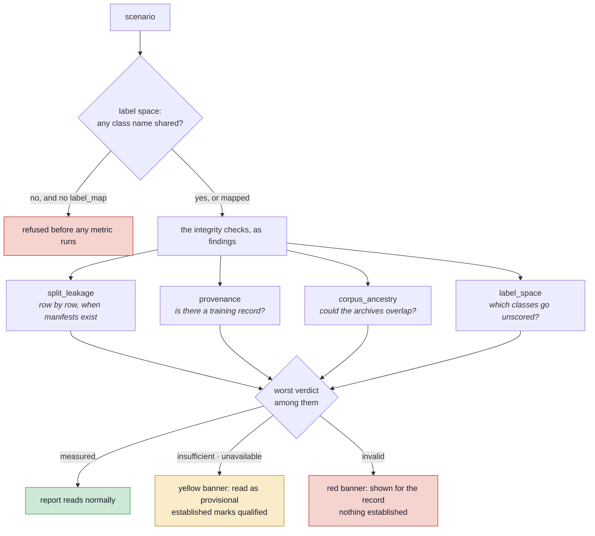
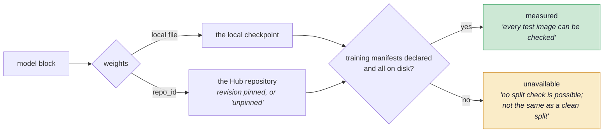
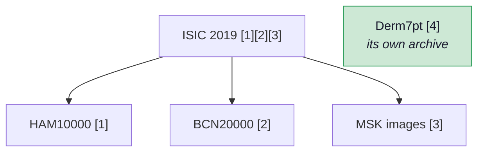
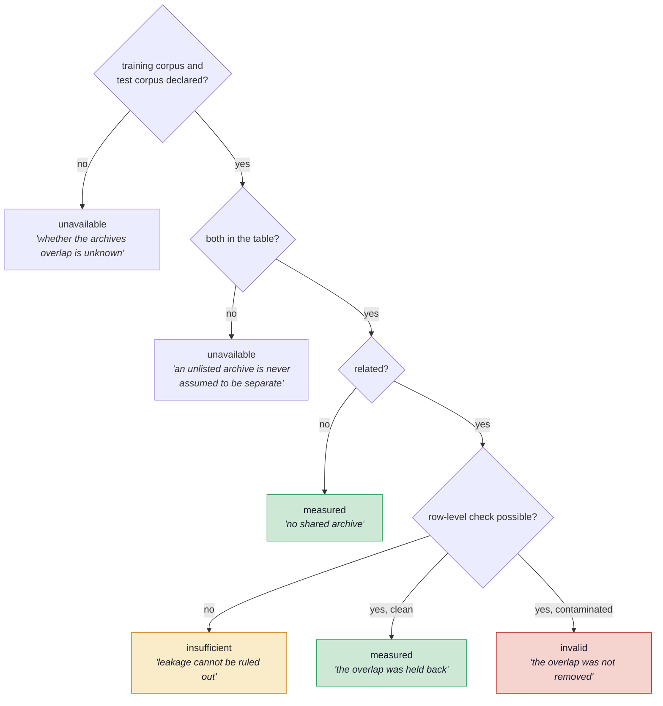
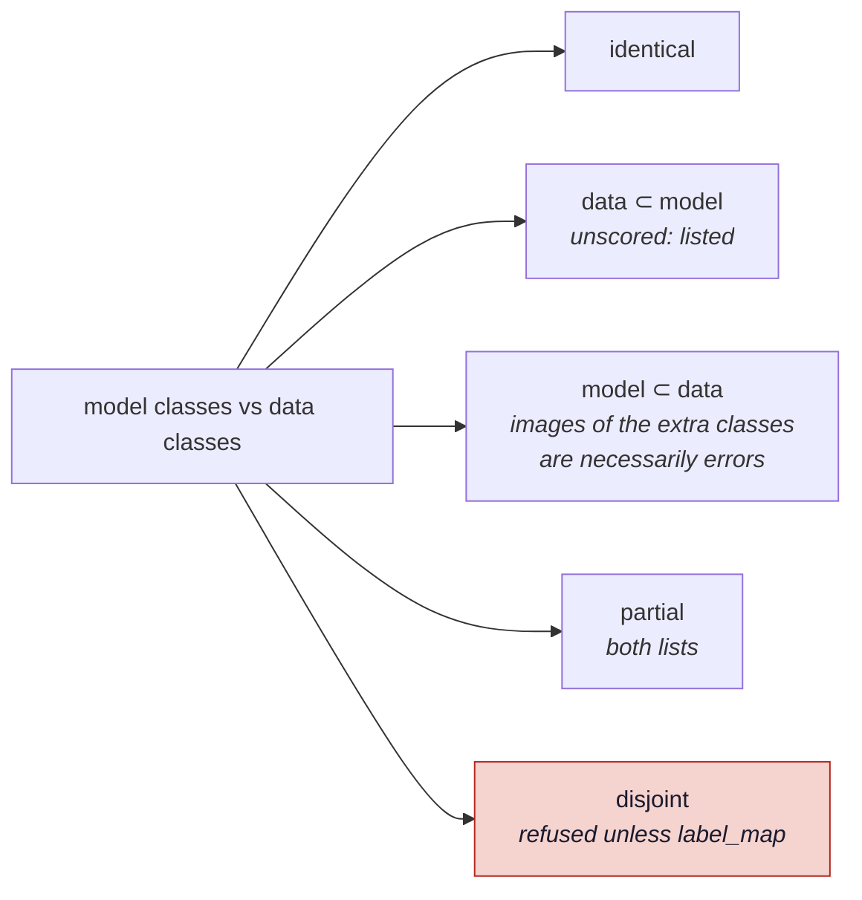
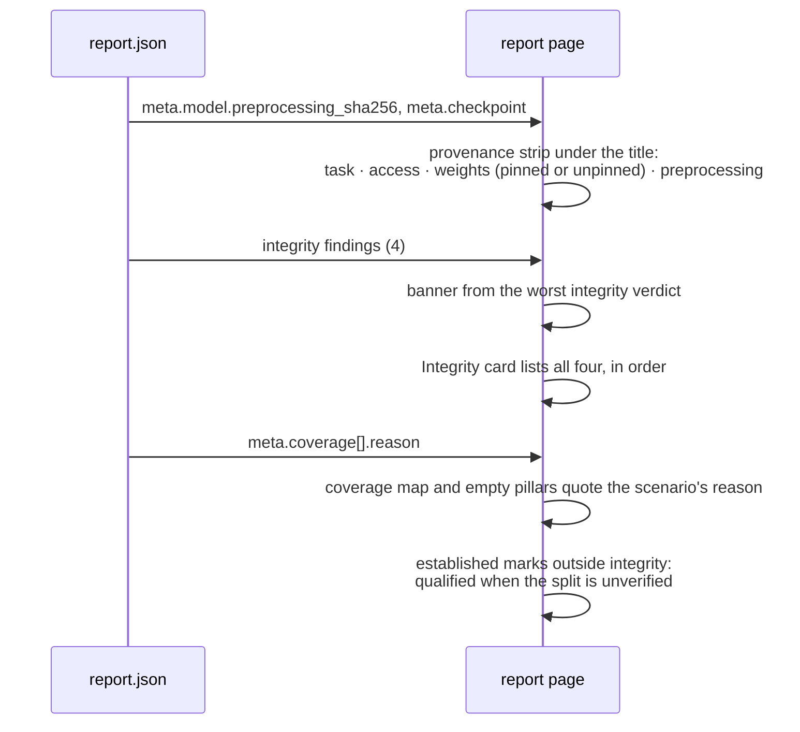

# ADR 0002 — What can, and cannot, be verified about someone else's model

| | |
|---|---|
| **Status** | Accepted · built 2026-09-25 (milestone M5, [Phase B](../ROADMAP.md#phase-b-what-you-can-and-cannot-verify-about-someone-elses-model)) |
| **Code** | `verifai/core/integrity.py` · `verifai/metrics/integrity/{provenance,corpus_ancestry,label_space}.py` · `data/corpora.yaml` · `verifai/models/image.py::metadata` · `verifai/core/run.py` · `showcase/views/report.py` |
| **Tests** | `tests/test_engine_contracts.py`, section *Phase B: what can and cannot be verified about someone else's model* |
| **Builds on** | [ADR 0001](0001-capability-gating.md) — capability gating |
| **Real case** | `scenarios/original_checkpoint_ham10000.yaml` — the original Hub checkpoint on the full HAM10000 test set |

## Context

The project's strongest claim is the split check: every test image is compared, by `image_id`
and by `lesion_id`, against every image the model trained on. It is what caught the dataset this
project started from, where 80% of the test images were also in training.

That check needs the training manifests. Every model this project trained has them. **A model
anyone else trained does not**: a checkpoint on the Hugging Face Hub comes with weights and, at
best, a model card that names a dataset. Before Phase B, the split finding for such a model said
*"could not be verified"* — correct, and the only thing the report said about where the model came
from. Three further questions went unasked:

- Where did the weights come from, and is the revision pinned?
- Could the model's training data contain these test images **at all**, even without row ids?
- Do the model and the data even name the same classes?

And one question went unrecorded: *how were the images prepared for the model?* A model scored
with a different resize or normalisation than it was trained with is a different model, and
nothing in a report said which preprocessing it was scored under.

The first real case already existed. The original checkpoint the project started from sits on the
Hub; its model card names `marmal88/skin_cancer`, a repackaging of HAM10000, and the leakage audit
found that data covers 9,964 of HAM10000's 10,015 images. Until Phase B it had only been scored on
7 example images.

## Decision

Integrity becomes four checks, each a finding of its own, and none of them may call an
unverifiable split clean.

1. **`integrity.provenance`** — where the weights came from, and whether a training record
   exists. `measured` when the training manifests are declared and on disk; `unavailable`
   otherwise, with the sentence *"No split check is possible; that is not the same as a clean
   split."*
2. **`integrity.corpus_ancestry`** — whether the model's declared training archive and the test
   images' archive overlap, from a table of documented containment. Where the split check cannot
   run, this is the only leakage check left, and it can say leakage is **possible**, never that
   it did not happen.
3. **`integrity.label_space`** — how the model's classes relate to the data's. The runner checks
   the same relation before any metric runs and refuses a disjoint pair unless the scenario
   declares a `label_map`.
4. **A preprocessing fingerprint** in every report: the resize, normalisation and a hash of them.

Two rules govern the verdicts:

- **A shared archive with no row-level check is `insufficient`, not `invalid`.** Leakage is
  plausible but was not found; `invalid` stays reserved for contamination that was measured.
- **On a report whose split is unverified, every *established* claim is qualified.** The mark
  reads *"✓ Established against chance, on a split that could not be checked"* — the claim and its
  caveat are one phrase, so they cannot be read apart.

## How it works

### 1 · Four checks, one gate



All four are registered as `MetricSpec`s at access `labels` (ADR 0001): they read manifests, the
scenario and the model's class list, never the model's outputs, so they run against any model.
The report's integrity state is the worst of them, exactly as it was with one check, so the
banner logic did not change — it gained inputs.

### 2 · What the scenario declares

```yaml
model:
  trained_on:                       # archive ids from data/corpora.yaml
    corpora: [ham10000]
    basis: "inferred from the model card, which names `marmal88/skin_cancer`, …"
dataset:
  corpus: ham10000                  # the archive these test images come from
  label_map: {}                     # only when the class names differ; never inferred
not_requested:                      # optional: why an applicable metric is left out
  explainability.gradcam: "Derm7pt's licence forbids redistributing its images, …"
```

`trained_on` is either a plain list — for a model trained here, where the fact is known — or
`{corpora, basis}`, where `basis` says *why* it is believed. For the Hub checkpoint the basis is an
inference from a model card, and that inference is quoted in the report, not hidden.

### 3 · Provenance



The training record (`<name>_training.json`, written by `train_model.py` beside the weights) names
the scenario that trained the model, which the finding quotes. The manifests are found by the same
`train_manifests_from_scenario()` the split check and the access gate use, so the three can never
disagree about whether training data is known.

### 4 · Corpus ancestry

`data/corpora.yaml` lists which archives are distributed as part of which, each with the entries
in [the references](../references.md) that document it:



Two archives are **related** when one contains the other, in either direction: a model trained on
ISIC 2019 has seen HAM10000 images, and a model trained on HAM10000 has seen part of an ISIC 2019
test set. `shared_corpora()` walks the containment transitively.



On the three active configurations this produces all three kinds of answer:

| Configuration | Trained on → tested on | Row check | Verdict |
|---|---|---|---|
| ISIC corpus | ISIC 2019 → HAM10000 (contained) | clean | **measured** — the overlap was held back |
| ISIC corpus — as deployed | ISIC 2019 → Derm7pt | clean | **measured** — no shared archive |
| Original checkpoint — HAM10000 test | HAM10000 (inferred) → HAM10000 | not possible | **insufficient** — cannot be ruled out |

The first row is the project's origin story, now stated by the engine: ISIC 2019 contains HAM10000,
so the ISIC model *could* have seen its test images; the lesion-level split check is what shows
they were held back.

### 5 · Label space



`label_space()` in `core/integrity.py` is the one implementation; the runner uses it as a
precondition and the metric publishes it, the same pattern as the split check. The runner applies
`dataset.label_map` to the samples' labels *before* checking, so a declared map is what makes a
disjoint pair evaluable. Derm7pt is `dataset_subset` — actinic keratoses never occur there — which
the classification summary already stated ad hoc and which is now a finding of its own.

### 6 · The preprocessing fingerprint

`ImageClassifier.metadata` returns the class list, the preprocessing (`resize`, `to_tensor`, `mean`,
`std`) and `preprocessing_sha256`, the first 16 hex digits of a hash over it. The runner stores it
as `report.meta["model"]`, and the report's identity line shows it beside the task, the access level
and the weights — the *provenance strip* the roadmap planned, less the intended-use profile, which
waits for Phase G.

Phase B **records** the fingerprint. **Comparing** it against what a Hub checkpoint declares in its
own `preprocessor_config.json` needs the resolver of Phase C, which is where that file is read.

### 7 · What the reader sees



The planned *"rest of the integrity gate"* slot is retired: the gate is the Integrity card itself,
four findings deep, in the fixed order split · provenance · corpus · label space.

## Consequences

**Gained**

- A model the project did not train now gets an honest report. On the original checkpoint: no
  split check possible, leakage not ruled out, membership attack unavailable, every claim
  qualified — and its accuracy of **0.867** sits beside the verified ISIC model's **0.806** on the
  same images with a stated reason not to read it as skill. See
  [Experiment 8](../results.md#experiment-8-a-model-this-project-did-not-train).
- The corpus overlap that was the project's founding discovery is checked by the engine on every
  run, not remembered by the people running it.
- The ad hoc Derm7pt class handling is a finding, and a disjoint label space can no longer be
  scored by accident.
- A scenario can say *why* it leaves an applicable metric out; the Derm7pt report now gives the
  licence as the reason Grad-CAM is absent.

**Accepted costs**

- **Ancestry is only as good as the table.** Archives that share images without documenting it
  are not caught, and near-duplicate detection across archives stays a separate, planned metric
  (`integrity.near_duplicates`). The table's rule — unlisted means unknown, never independent —
  keeps the gap visible rather than silently favourable.
- **`trained_on` for a foreign model is a claim someone makes.** The `basis` field records how it
  is known, and the report quotes it; nothing verifies it.
- **The qualified mark is a wording rule, not a statistical adjustment.** Nothing estimates how
  much of a number is memory; the report only refuses to present it without the caveat.
- **Only active configurations carry the new checks.** The 21 archived reports keep their single
  split finding, by the same rule that froze them.

**Moved out of this decision**

- Comparing the fingerprint against `preprocessor_config.json` → Phase C.
- `privacy.mia_shadow` → Phase F. The access gate (ADR 0001) already reports any membership
  attack as unavailable for a model without known training data.

## Alternatives considered

| Alternative | Why not |
|---|---|
| **`invalid` for a shared archive without a row check** | Claims contamination that was not measured. `invalid` is the project's one hard signal, and spending it on a possibility would teach readers to discount it. |
| **Suppress every established mark on an unverified split** | Also removes marks that do not depend on the split — the label-space result is exactly as true either way. Qualifying keeps each claim and binds the caveat to it. |
| **Leave the marks unqualified; the banner is enough** | The banner is at the top; the mark is read on its own, often screens later. A claim should carry its condition where it is made. |
| **Infer `trained_on` from manifest file names** | `isic_train.csv` names a file, not an archive's ancestry, and for a Hub model there are no files. An explicit declaration with a stated basis is checkable; a guess from a filename is not. |
| **Guess a label map from similar class names** | *Nevus* and *melanocytic nevi*, *BKL* and *seborrhoeic keratosis* — whether two labels mean the same diagnosis is a clinical judgement. A map is declared by a person or the run is refused. |
| **Fold the four checks into `split_leakage`** | One finding with four sub-answers would hide which question failed. Four findings keep each answer, each reason and each verdict visible on the card. |

## Where to change what

| To … | Change |
|---|---|
| add an archive or a containment | `data/corpora.yaml`, with its reference in [the references](../references.md) |
| declare a model's training data | `model.trained_on` in the scenario; `{corpora, basis}` when inferred |
| score a model on data with other class names | `dataset.label_map` in the scenario |
| explain a metric left out | `not_requested:` in the scenario |
| record more about how a model reads input | `metadata` on the adapter (`ImageClassifier.metadata`) |
| change the verdict rules | `verifai/metrics/integrity/*.py`; the qualified mark in `showcase/views/report.py::reference_line` |
