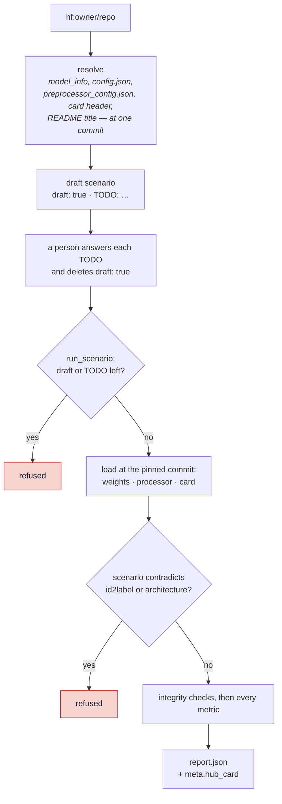

# ADR 0003 — A model that describes itself: drafted from the Hub, never run from a guess

| | |
|---|---|
| **Status** | Accepted · built 2026-09-29 to 2026-10-02 (milestone M5, [Phase C](../ROADMAP.md#phase-c-resolving-a-model-and-the-adapter-catalogue), steps C1–C5) |
| **Code** | `verifai/models/resolve.py` · `scripts/resolve_model.py` · `verifai/models/hf_image.py` · `verifai/models/preprocessing.py` · `verifai/metrics/integrity/preprocessing.py` · `verifai/models/hub_card.py` · `verifai/core/run.py::_refuse_draft` · `verifai/export/model_registry.py` · `showcase/model_card.py` |
| **Tests** | `tests/test_engine_contracts.py`: the resolver, `hf_image`, C4 and model card sections; every Hub call is mocked |
| **Builds on** | [ADR 0001](0001-capability-gating.md) — capability gating · [ADR 0002](0002-verifying-a-foreign-model.md) — what can be verified about someone else's model |
| **Real case** | `scenarios/vit_large_skin_cancer_ham10000.yaml` — a ViT-Large from the Hub that this project neither trained nor picked ([Experiment 9](../results.md#experiment-9-a-model-this-project-neither-trained-nor-picked)) |

## Context

Phase B made a report say what cannot be verified about a model someone else trained. It still
took a person to *write that model's scenario*, and the scenario holds the facts that decide
whether any number in the report means anything: the class order of the output layer, the
architecture, the resize and normalisation the model was trained with, what it was trained on.
Get the class order wrong and the model gives confident, plausible, wrong answers; get the
preprocessing wrong and every metric measures a model that exists nowhere but in this
evaluation. Neither raises an error.

Some of those facts travel with a model and some do not:

| A Hub repository may hold | It says | It does not say |
|---|---|---|
| `config.json` (a `transformers` model) | the architecture, the class order (`id2label`) | what it was trained on |
| `preprocessor_config.json` | resize, crop, interpolation, rescaling, normalisation | whether that matches training |
| the model card's header | licence, training datasets, tags | anything about the rows |
| a bare `state_dict` (`.pt`) | the weights | architecture, class order, preprocessing — nothing |

And one fact was recorded but not acted on. A scenario could pin a Hub `revision`, the report
said *pinned*, and the loader downloaded whatever the repository held that day.

## Decision

1. **A model is identified by the commit it was loaded from.** The pinned `revision` is passed to
   every download — weights, config, processor, card — and a Hub model's identity in the registry
   is `hub:{repo}@{commit sha}` (C1).
2. **The resolver drafts; it never runs.** `scripts/resolve_model.py hf:owner/repo` reads what the
   repository says about itself at one pinned commit, without downloading the weights, and writes a
   scenario marked `draft: true`. Anything the repository cannot say becomes a `TODO: …` that names
   what must be declared and why. `run_scenario` refuses a draft and any scenario with a TODO left;
   the registry and `run_active.py` skip drafts (C2).
3. **A self-describing model is the authority on itself.** The `hf_image` adapter takes the class
   order from `id2label` and the preprocessing from the model's own processor. A scenario that
   contradicts either is refused, never reconciled (C3).
4. **Preprocessing is compared, not trusted.** What the evaluation used and what the model's side
   states are written in one vocabulary and compared field by field. A differing field is
   `invalid`; nothing to compare against is `unavailable`, never a match (C4).
5. **The model card's header is read when the run starts**, at the pinned commit, into
   `report.meta.hub_card`. The showcase quotes it and never contacts the Hub. The card's prose is
   never parsed (model card view, between C4 and C5).
6. **A report keeps the model's own class names** (decided 2026-10-02). The only translation is
   the `dataset.label_map` a person declares, from the data's labels onto the model's.

## How it works

### 1 · From a Hub link to a report

### 2 · What the resolver fills in, and what it leaves open

| Field | From | When the repository is silent |
|---|---|---|
| `revision` | `model_info().sha` | — always known |
| `loader` | `config.json` present → `hf_image`, else the torchvision loader | — |
| `name` | the card's first `# ` heading | omitted; the page falls back to the repository name |
| `architecture`, `classes` | `config.json` | TODO for a bare `state_dict` |
| preprocessing | `preprocessor_config.json` | TODO |
| `trained_on` | the card's `datasets`, through `hub_aliases` in `data/corpora.yaml` | TODO; an unlisted dataset id stays *unknown* |
| `licence` | the card's `license` | TODO: find out whether evaluating and publishing is allowed |
| `dataset.label_map` | proposed only on an exact match after normalising case and punctuation | TODO per data label |
| `label`, `project`, `dataset.*` | — | TODO: these are the person's choices |

Every value read from the repository is listed in the draft's header with where it came from, and
the draft's TODOs and their answers stay in the scenario's comments when it is finished.

### 3 · The real case

The C5 model, `Kuldeepmishra3/vit-large-skin-cancer-ham10000`, resolved with **12 TODOs**: the
configuration's label and project, the evaluation set's id, image folder and corpus, and one label
mapping per data class. Its classes are HAM10000's own `dx` codes (`mel`, `nv`, `akiec`, …), which
its card spells out, so each long data label maps onto one code. Everything about the model itself
— commit, architecture, class order, preprocessing, training data, licence, name — came from the
repository. On Apple silicon the HAM10000 run took about five minutes after a one-time 1.2 GB
download.

### 4 · The preprocessing check

`verifai/models/preprocessing.py` writes a torchvision pipeline, a Hugging Face processor and a
training record in one vocabulary — `resize`, `center_crop`, `resample`, `rescale_factor`, `mean`,
`std`, plus `crop_pct` when stated — and compares them. The reference is the first that exists:

1. the model's own processor (an `hf_image` model uses it as is, so the check is *measured* by
   construction, and says so);
2. `preprocessor_config.json` in the repository at the pinned commit;
3. this project's training record beside the weights.

A failed Hub lookup is raised, not read as *no file*: reporting "nothing to compare against"
because the network was down would publish an unchecked preprocessing as uncheckable. A
mismatch makes the finding `invalid`, the report's banner names it, and the run's snapshot is kept
out of the comparison with that reason.

## Consequences

**Gained**

- A model from the Hub goes from a link to a report with the person answering only what the
  repository cannot know. For the C5 model, every question about the model itself was answered
  by the model.
- The class order and the preprocessing, the two silent failure modes, are now read from the
  model or refused — never typed in for a self-describing model.
- The preprocessing check produced its first *measured* verdict on a model from outside.
- Batching (`predict_probs_batch`, C3) cut the original checkpoint's HAM10000 run from 2 min 28 s
  to about 1 min 7 s, which is what made a ViT-Large practical on a laptop.

**Accepted costs**

- **Most of the Hub fails the bar.** Of 235 skin-lesion image classifiers surveyed on
  2026-10-02, 45 have no `config.json` and 82 no processor file. Of the 143 ungated ones with
  both, 111 state a licence, and only 8 of those name their training data as anything but a
  local `imagefolder`. None passed all six C5 criteria. The resolver does not lower the bar; it
  makes the gaps visible as TODOs.
- **A label map is still a person's claim.** `MEL` and `melanoma` look obviously equal, and the
  resolver still does not propose that pairing: whether two labels mean one diagnosis is a
  clinical judgement.
- **`trained_on` from a card is the author's claim.** The `basis` says so and the report quotes
  it; nothing verifies it, and without an image list leakage on an overlapping corpus cannot be
  ruled out ([ADR 0002](0002-verifying-a-foreign-model.md)).
- **A Vision Transformer has no Grad-CAM.** It reports *not computable*; `transformer_attribution`
  is planned for M10.
- **A run needs the network once per commit** for the card and the processor, as it already did
  for the weights; cached files serve later runs.
- **Per-class comparison splits across naming schemes.** Two models scored on one test set that
  name melanoma `mel` and `melanoma` appear in the comparison as two rows. Accepted with
  decision 6: the tool does not maintain name tables for the world's datasets.

## Alternatives considered

| Alternative | Why not |
|---|---|
| **Run straight from a Hub link with sensible defaults** | The defaults are exactly the silent failures: ImageNet normalisation and alphabetical classes would run, and score a model that does not exist. A draft that refuses to run until answered costs minutes; a wrong default costs the whole report. |
| **Reconcile a scenario that contradicts the repository** | Whichever side wins, the report describes something other than what one of them says. Refusing makes the person resolve it with the facts in hand. |
| **Propose label maps by fuzzy matching** | Covered in ADR 0002: a mapping between diagnoses is a clinical claim. The resolver proposes only exact matches after normalising case and punctuation. |
| **Parse the card's prose for training data, intended use and limits** | Prose is not machine-checkable, and a misread sentence would be published as a fact. The header is a fixed place an author declared something; the prose is linked to. |
| **Read the card in the showcase, or when the registry is built** | The showcase would need the network, and the registry build would stop being offline and deterministic. Read at run time, the card is the one at the commit that was evaluated. |
| **Translate a model's class names into the test set's** | Would line the comparison up, but means maintaining name tables per dataset and reporting names the model never uses. Rejected 2026-10-02 (decision 6). |

## Where to change what

| To … | Change |
|---|---|
| resolve a new kind of repository | `verifai/models/resolve.py` (`_resolve_hub`, `_resolve_local`) |
| map a card's dataset id to a corpus | `hub_aliases:` under the corpus in `data/corpora.yaml` |
| support another `transformers` family for Grad-CAM | `CAM_LAYERS` in `verifai/models/hf_image.py`, checked against a randomly initialised model |
| compare another preprocessing field | `FIELDS` and the `*_spec` functions in `verifai/models/preprocessing.py`; bump `integrity.preprocessing` |
| quote another card header field | `FIELDS` in `verifai/models/hub_card.py`, and a fact in `showcase/model_card.py` |
| name a model | `model.name` in its scenarios, the same in every configuration |
