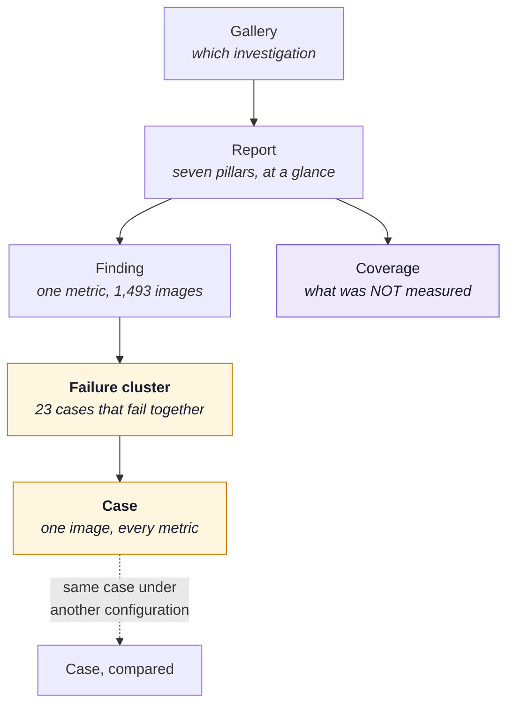

# A worked example — what a finished report could look like

!!! danger "Everything on this page is invented"
    No run produced these numbers. `melanoma-screen-v4`, case `ISIC_0031452` and every figure
    below are **fabricated for the purpose of designing the interface**, in the same spirit as
    the `sample: true` flag that makes the app put a warning banner on placeholder data. Nothing here
    may be quoted as a result. For measurements that are real, read
    [Current results](results.md); for the nine metrics that actually run, read
    [The pillars → Running today](pillars.md#running-today-nine-metrics).

    This page exists because "a Sonar-style case view" is easy to say and hard to picture. It
    is a sketch of the destination, not a commitment to it — the reasoning behind it is in
    [Direction](direction.md).

---

## The navigation this implies

Today a report is organised **by metric**: six findings, each aggregating over 1,493 images.
The case view inverts that — the same evidence, indexed **by case** — and adds one level
between them that does not exist at all yet: the **failure cluster**.

The two amber boxes are the new work. Everything else exists in some form.

---

## Screen 1 — the finding, with the info box

The reader has opened **Fairness → subgroup accuracy**. The chart is what the app draws today;
the box beneath it is the five-question shape from
[Extending](extending.md#planned-the-info-box-a-metric-must-be-able-to-fill).

=== "What was measured"

    Accuracy within each skin-tone group, estimated from the healthy skin around the lesion,
    with a 95% interval on each group. A gap is only claimed when two groups' intervals do not
    overlap.

=== "What came out"

    **21.3 points** between the lightest and darkest bins — light 0.785 (n=1,325), dark 0.572
    (n=60). The intervals do not overlap, so the difference is supported rather than noise.
    `measured`.

=== "Why it matters"

    Of the 60 darkest-skin cases in this test set, 26 were called wrong. Melanoma is rarer in
    darker skin and diagnosed later, so a screening tool that is weakest exactly there
    reproduces an existing gap in outcomes rather than closing it.

=== "How to read it"

    Read each bar against its own interval, not against the others. The middle bin is small
    (n=108) and its interval is wide — most of the visible spread there is sample size.

=== "What it does not tell you"

    Skin tone is **estimated from pixels**, not recorded. It is a proxy for Fitzpatrick type
    and it is wrong for some cases. And 60 images cannot establish how the model behaves on
    dark skin in general — only that on these 60 it was worse.

!!! tip "The new affordance"
    Under the chart sits one line that does not exist today:

    > **26 cases failed in the darkest bin.** → *Show them*

    That link is the whole idea. Every number in this report was computed from individual
    cases, and until now none of them were reachable.

---

## Screen 2 — the failure cluster

Clicking through does **not** open 26 unrelated images. It opens what they have in common,
because a single case has no explanation and a pattern does.

> ### 26 failures in the darkest ITA bin
>
> Of 60 cases in this bin, 26 were classified incorrectly (43.3%, 95% CI [31.6, 55.9]).
> Against 21.5% in the lightest bin.
>
> | What they share | How many | Against the rest of the test set |
> |---|---:|---|
> | true class `melanoma` | 17 of 26 | melanoma is 10.9% of the test set, 65% of this cluster |
> | predicted `melanocytic_Nevi` | 21 of 26 | the model's most common answer everywhere |
> | confidence above 0.70 | 19 of 26 | **confidently wrong, not uncertain** |
> | Grad-CAM mass outside the lesion | 14 of 26 | 22% baseline across the test set |
> | prediction flips under brightness | 11 of 26 | 28% baseline |
>
> **The shape of it.** This is not a model that hesitates on dark skin — it is a model that is
> *confident* on dark skin and wrong. 19 of 26 failures carry more than 0.70 confidence, so
> nothing in the output would warn a clinician to look again. Read the confidence column
> before anything else.
>
> *(Invented figures.)*

That last paragraph is the part worth arguing about. It is a claim, generated from a template
in the policy file rather than written by hand, and it is defensible only because it describes
a **counted pattern** and not a cause.

---

## Screen 3 — one case

> ### `ISIC_0031452` — melanoma, called `melanocytic_Nevi`
>
>  *(the 320px image the model was scored on)*
>
> | | |
> |---|---|
> | **Truth** | `melanoma` |
> | **Predicted** | `melanocytic_Nevi` at **0.71** |
> | **Rank of the true class** | 3rd (0.09) — inside top-3, outside top-1 |
> | **Metadata** | age 55, site `back`, ITA −12.4° → darkest bin |

=== "What each metric saw here"

    | Pillar | This case | The run |
    |---|---|---|
    | Performance | wrong at top-1, right at top-3 | top-1 0.801, top-3 0.977 |
    | Robustness | flipped under brightness ×1.4, held under noise, blur, JPEG | 71.7% stable overall |
    | Explainability | 61% of Grad-CAM mass fell **outside** the lesion boundary | 22% of cases exceed 50% |
    | Fairness | darkest ITA bin | 21.3-point gap |
    | Privacy | confidence in the 91st percentile of the membership signal | AUC 0.558, interval spans chance |
    | Integrity | not in any training manifest — verified by `lesion_id` | 0 shared lesions |

    Every row is already computed today and thrown away. `details["per_example"]` is written
    by every metric and read by nothing.

=== "What it shares with other failures"

    This case is one of the **26 in the darkest bin**, and one of the **17 melanomas** in that
    cluster. It carries four of the five cluster traits: high confidence, predicted nevus,
    attribution outside the lesion, true melanoma. It does *not* flip under noise.

    → *Open the cluster*

=== "What would change it"

    Six configurations were scored on **these exact images**, so this is a lookup, not a guess.

    | Configuration | This case | Melanoma sensitivity | Specificity |
    |---|---|---|---|
    | baseline (`argmax`) | ✗ missed | 0.638 | 0.920 |
    | `melanoma ×5` | ✗ missed | 0.802 | 0.771 |
    | **`melanoma ×30`** | **✓ caught** | 0.976 | 0.230 |
    | ISIC corpus, `argmax` | ✗ missed | 0.620 | 0.931 |
    | linear probe | ✗ missed | 0.511 | 0.949 |

    **The honest reading.** One configuration catches this case, and it catches it by calling
    melanoma on 82% of everything it sees. Choosing it to save this patient costs 690 false
    alarms elsewhere. That trade is the decision this tool exists to put in front of you — it
    is not one the tool can make.

=== "What is not claimed"

    Nothing here says **why** the model failed on this case. Attribution landing outside the
    lesion is a fact about the explanation, not a proven cause of the error; the two co-occur
    in 14 of 26 cluster members and in 22% of the test set generally, which is suggestive and
    is not a mechanism.

    A per-case causal story is exactly the kind of confident, unprovenanced claim this project
    was built to catch. The cluster is the smallest unit at which a claim survives.

---

## What this page is asking for

Three things, in increasing cost:

| | Work | Blocked by |
|---|---|---|
| **1** | Read `per_example` instead of discarding it, and index the artifact by case | report size — the [scaling gap](ROADMAP.md#known-scaling-gaps) becomes binding |
| **2** | Cluster failures by manifest metadata and count shared traits | nothing; the metadata is already on `ImageSample.meta` |
| **3** | Generate the claim and the remedy text from rule templates | the [findings layer](ROADMAP.md#phase-g-the-findings-layer-measurement-judgement-and-the-line-between-them) — these are the same feature |

And one thing it cannot have: **Derm7pt's licence forbids redistributing its images** [4], so
this view is structurally impossible for the only external validation set in the project. The
external results are the most interesting ones and they are the ones that cannot be
illustrated. Worth knowing before building rather than after.
