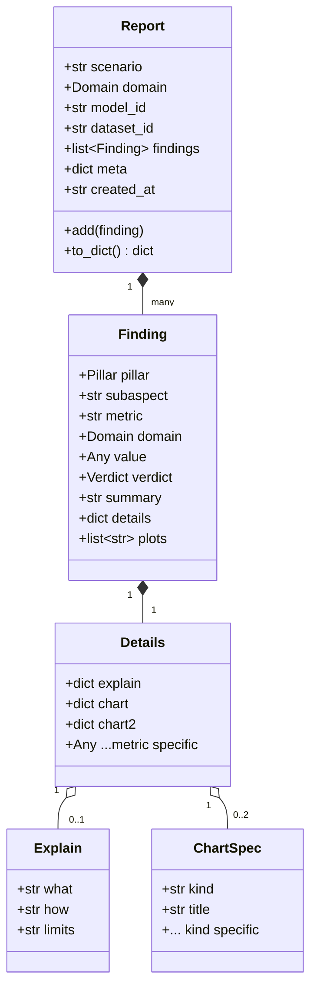
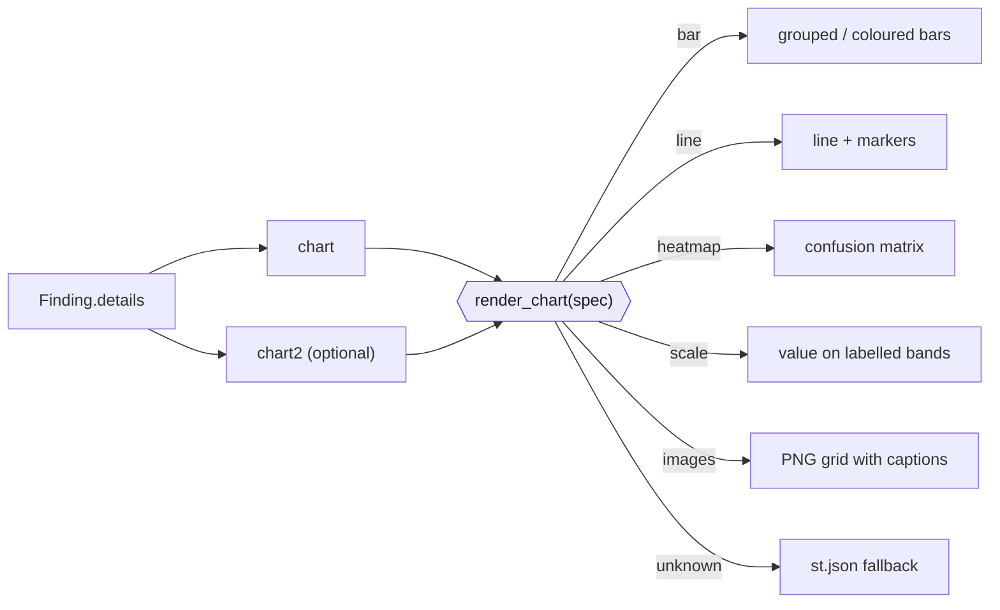
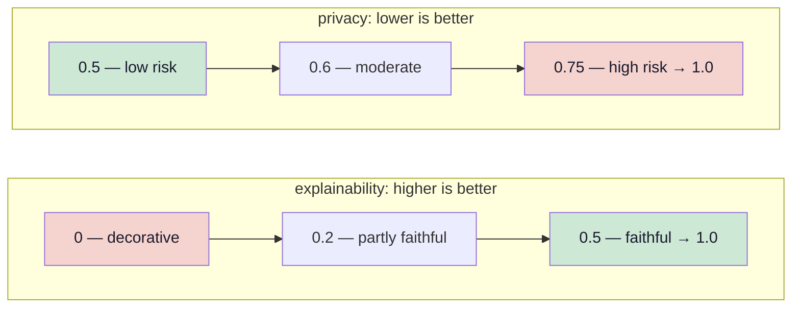
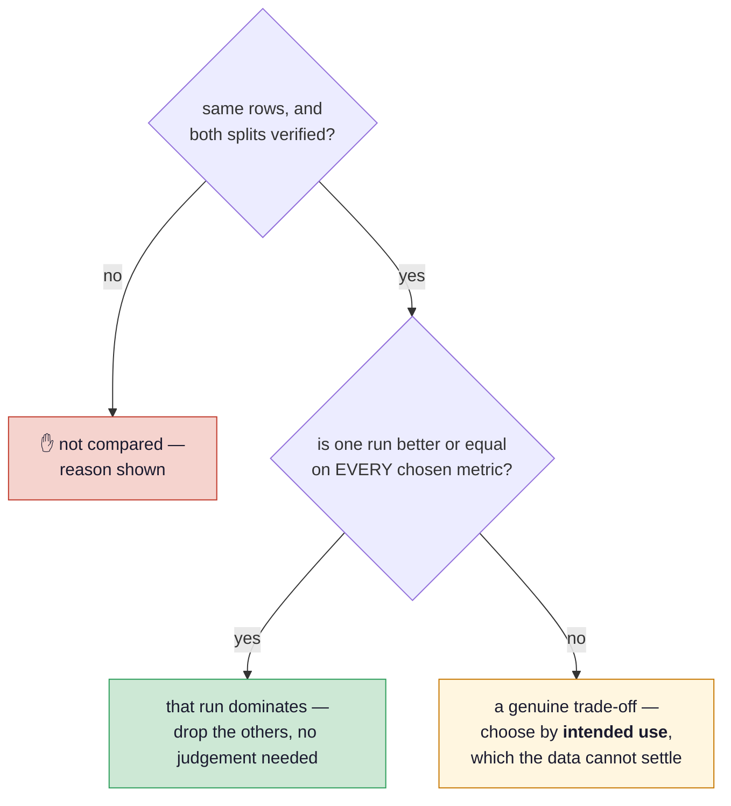
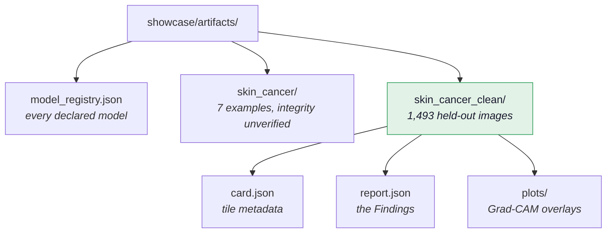

# Data model

One shape flows end to end: a metric returns a `Finding`, the runner collects them into a
`Report`, the exporter serialises it, and the app renders it. Nothing translates between
formats along the way.



## Vocabularies

The literals below are what the engine writes today. Where an addition is planned it says so
inline — nothing here is aspirational unless it is labelled.


`Pillar`
: `integrity` · `performance` · `fairness` · `robustness` · `explainability` · `privacy`

    `safety` joins them with the first generative metric — see
    [The pillars](pillars.md#safety-what-happens-if-someone-acts-on-this). It is not in the
    literal yet on purpose: adding it before anything can fill it would put a permanently
    empty column on every published dashboard, which teaches readers to ignore a pillar
    before it has ever said anything.

`Finding.subaspect`
: Optional, and the grouping level between pillar and metric — `calibration` under
    performance, `adversarial` under robustness, `randomisation` under explainability. At six
    metrics a flat list per pillar was fine; at the [catalogue's](pillars.md) fifty-one it is a
    wall, so the dashboard groups pillar → sub-aspect → metric.

`Verdict`
: `measured` · `insufficient` · `unavailable` · `invalid`

`Domain`
: `image` · `text` · `tabular` · `llm`

!!! tip "There is no `pass`, and that is deliberate"
    The vocabulary says what is *known* about a number, never whether it is good. A pass
    would need a threshold, and a threshold would need justifying: what counts as robust or
    fair enough depends on where the model runs and what being wrong costs, which is the
    reader's decision and not a constant in a metric module.

    Measured on the real runs, the accuracy threshold this replaced did worse than nothing.
    It marked the configuration catching 159 of 163 melanomas a **warning** and the one
    missing 82 of them a **pass**, because under-calling a rare class raises overall
    accuracy. A reader trusting the badges would have picked the worst detector in the set.

    `invalid` is the single hard signal, and it judges the *measurement* rather than the
    model: a contaminated split does not measure generalisation at all, so nothing computed
    on it means what it appears to.

`Report.meta` records `seed`, `sample_size` (what was actually evaluated, not what the YAML
declared) and `device` — the last because results are bit-identical *per device*, not across
devices. It will also record the **access level** the run had over the model
(`labels` … `training_data`), because that decides which metrics could exist at all and is what
lets the comparison view level two runs down to the weakest access they share rather than
reading a missing row as a worse model.

## The `explain` contract

Every metric ships its own explanatory text inside `details["explain"]`. This lives in the
engine, not the app, so a new metric brings its own wording and the app needs no change.

| Key | Answers | Rendered |
|---|---|---|
| `what` | What is measured, and why it matters | inline, always visible |
| `how` | How to read this particular chart | in the "How to read this chart" expander |
| `limits` | What this number does **not** tell you | same expander, under "What it does *not* tell you" |
| `impact` | Who is affected by the number being what it is, in this clinical context | same expander |

`impact` is what replaces a composite score. A reader who cannot be handed "7.4 out of 10"
still needs to know what a 21-point subgroup gap *means* for the people on the wrong side of
it, and that sentence belongs with the metric, in the engine, rather than in a dashboard the
metric knows nothing about.

`limits` is the one that earns its place. It is where each metric names the trap it sets:

> **Robustness** — "Stability is not correctness: a model that is confidently wrong both
> before and after a distortion scores a perfect 1.0 here."

> **Fairness** — "Coverage is not performance — this chart shows who is in the sample, not
> how well the model serves them."

> **Explainability** — "A convincing heatmap is not proof of medically correct reasoning —
> it shows where the model looked, not whether it looked for the right reason."

## Chart specifications

A metric describes a chart as data; `showcase/app.py::render_chart` draws it. Unknown kinds
fall back to `st.json`, so a malformed spec degrades rather than crashes.



| `kind` | Required keys | Used by |
|---|---|---|
| `bar` | `x`, `y` (+ `color`/`colors`, `hover`) | performance, robustness, fairness |
| `line` | `x`, `y` | — |
| `heatmap` | `z` (+ `x`, `y`, `text`, `zmin`, `zmax`) | performance at n > 50 |
| `scale` | `value`, `min`, `max`, `bands` | integrity, explainability, privacy |
| `images` | `paths` (+ `captions`) | explainability |

### Why `scale` replaced the dial gauge

A dial shows a number. A `scale` shows whether it is a *good* number, because the bands are
named and supplied by the metric — so each metric defines its own semantics. For deletion
faithfulness, higher is better; for membership-inference AUC, the green band sits on the left.



`kind: "gauge"` is still accepted as an alias that renders as a scale, so artifacts written
before the change keep rendering.

## Comparing runs

Every evaluation writes a snapshot to `history/`. The comparison view groups them by the
evaluation set's content hash and separates three questions:



Ranking needs to know which direction is an improvement, and **the metric declares that**, in
`details["better"]` (patterns may use `*`):

```python
"better": {"accuracy": "higher", "per_class.*.sensitivity": "higher"}   # performance
"better": {"mia_auc": "lower"}                                          # privacy
```

The app must not infer it from the name: an AUC is normally higher-is-better, but for
membership inference 0.5 is the good end. Anything undeclared is displayed and left unranked —
showing a value is honest, calling it "best" without knowing which way is good is not.

!!! note "What this shows on the current runs"
    Across the three configurations, the baseline leads on six of eight metrics — and loses
    the one that matters most clinically, melanoma sensitivity. **No run dominates any other.**
    A weighted average would have crowned the baseline and shipped a model that misses a third
    of melanomas. That is the argument against aggregate scoring, produced by the tool itself.

## Artifact layout



`model_registry.json` is the one file at the top level. It lists every **model** the scenarios
declare — a checkpoint, identified by its content hash — with its provenance from the trainer's
record and its configurations, whether or not any of them has run. It stores no evaluation
status and no score: whether a configuration is evaluated is decided by whether its folder
below exists. Written by `verifai/export/model_registry.py`. Each configuration carries its
`status` (`active` or `archived`), each model whether any configuration is active, and the file
carries the current version of every metric.

Every `report.json` records, in `meta`, the `metric_versions` and the `checkpoint` (path and
content hash) it was produced with. Set against the registry, that is how the app tells a current
report from one a metric change or a retrain has overtaken. Reports from before 2026-09-24 record
neither, and say so.

The app lists any directory containing **both** `card.json` and `report.json`. `card.json`
carries the tile metadata (`name`, `emoji`, `domain`, `dataset`, `description`, `hf_url`,
`sample`) and comes straight from the scenario's `card:` block.
