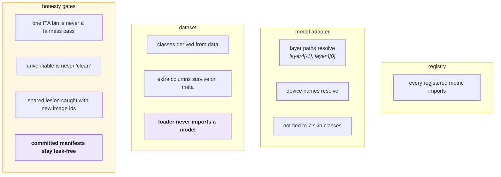
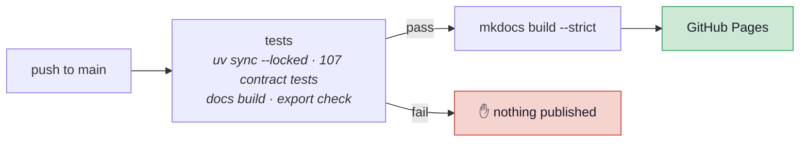

# Development

## Environment

Dependencies are managed with [uv](https://docs.astral.sh/uv/). `pyproject.toml` declares them
in four groups, `uv.lock` pins every version, and `.python-version` pins the interpreter (3.13):

```bash
uv sync          # install all four groups into .venv, exactly as locked
```

`uv run …` always uses that environment, so there is nothing to activate — and nothing to forget.

| Group | Holds | Used by |
|---|---|---|
| `engine` | torch, torchvision, numpy, pillow, pyyaml, matplotlib, huggingface-hub, certifi | evaluation and training |
| `data` | duckdb | `build_splits.py`, `materialize_images.py` |
| `showcase` | streamlit, plotly, pandas, pillow | the Streamlit app |
| `dev` | pytest, mkdocs-material | tests and this site |

Add a dependency with `uv add --group <group> <package>`, which updates both files. The lock was
first written to reproduce the environment every published artifact came from, version for
version; an upgrade is a deliberate `uv lock --upgrade-package <name>`, never a side effect.

!!! warning "Two files are exported from the lock — edit the groups, not the files"
    **`showcase/requirements.txt`** is the `showcase` group, pinned. Streamlit Community Cloud
    installs it, and it resolves the dependency file in the **entrypoint's directory** ahead of
    the repo root — which keeps the root `uv.lock`, with its torch, off the free tier. The root
    `pyproject.toml` declares no project dependencies at all, so even a fallback to it installs
    nothing heavy. After changing the `showcase` group, re-export it; CI fails if you forget:

    ```bash
    uv export --locked --only-group showcase --no-hashes --no-emit-project \
  --format requirements-txt -o showcase/requirements.txt
    ```

    **`requirements-engine.txt`** is the GPU notebook's list and is **unpinned on purpose**: on
    Colab and Kaggle torch comes preinstalled as the platform's CUDA build, and a pinned version
    would make pip replace it. A test keeps its names equal to the `engine` group's.

## Commands

```bash
# evaluate a scenario -> showcase/artifacts/<name>/
uv run python scripts/run_scenario.py scenarios/skin_cancer.yaml

# view the showcase (reads precomputed artifacts only)
uv run streamlit run showcase/app.py

# tests: no network, no checkpoint, a few seconds
uv run pytest -q
.venv/bin/python -m pytest tests/test_engine_contracts.py::test_our_committed_manifests_are_leak_free -q

# these docs
.venv/bin/mkdocs serve        # http://127.0.0.1:8000
.venv/bin/mkdocs build        # -> site/
```

## Tests

`tests/test_engine_contracts.py` covers the seams rather than the numbers — the places that
broke, or could silently break, when the engine was generalised.



The honesty tests are regressions for bugs that actually shipped: a single populated ITA bin
scoring a green fairness `pass`, and an unverifiable split reporting as clean. Both were the
exact failure mode the project claims to prevent.

## Continuous integration

`.github/workflows/ci.yml` runs on every push to **`main`** (this repo's default branch —
a workflow keyed to `main` would silently never fire):



Two deliberate choices:

- **CPU torch wheels, from the lock.** PyPI's torch pulls ~2.5 GB of CUDA onto a runner with no
  GPU, so `pyproject.toml` sends torch and torchvision to PyTorch's CPU index **on Linux only**;
  macOS keeps PyPI's wheels, which carry MPS. The same lock serves both.
- **Pull requests into `dev` and `main` are tested**, with every group installed, so no test is
  skipped for a missing import. The same job builds the docs with `--strict` and checks that
  `showcase/requirements.txt` still matches the lock.
- **Docs depend on tests.** A build describing code that fails its own contracts should not
  publish, so the `docs` job has `needs: test`.

`--strict` fails the build on a broken internal link, so a bad cross-reference breaks CI
rather than shipping a dead link.

!!! note "One-time setup"
    GitHub Pages must be switched to the Actions source: **Settings → Pages → Build and
    deployment → Source: GitHub Actions**. Until that is set, the deploy step fails with a
    permissions error even though the workflow is correct.

The Streamlit dashboard deploys separately, straight from the repo — Streamlit Community
Cloud redeploys on push with no workflow involved, because the app only reads committed files.

## Repository layout

```
verifai/            ENGINE
  core/             findings, runner + registry, split integrity
  models/           domain adapters (image: torchvision classifiers)
  datasets/         manifest-driven loaders
  metrics/          integrity · performance · fairness · robustness
                    explainability · privacy
  export/           Findings -> static artifacts

scripts/            build_splits · materialize_images · train_model
                    run_scenario · run_on_free_gpu.ipynb
scenarios/          one run = one YAML
data/
  manifests/        which images, which split  (in git)
  raw/              the pixels                 (gitignored)
  examples/         7 bundled HAM10000 images
showcase/
  app.py            gallery -> dashboard
  artifacts/<id>/   one folder = one tile
tests/              contract + honesty tests
docs/               this site
```

## Conventions

- **All user-facing text is English** — metric summaries, chart titles, axis labels, app copy.
- **Weights never go in git.** `*.pt` and `artifacts_training/` are ignored; checkpoints
  belong on the Hugging Face Hub.
- **Manifests do go in git.** They are small, and they are the provenance record.
- **Artifacts go in git.** They are the deployment.
- Commit style: explain *why*, and state what was measured rather than asserting it.

## Gotchas

| Symptom | Cause |
|---|---|
| `SplitLeakageError` on a new scenario | test manifest overlaps training — this is working correctly |
| Integrity reports `unavailable`, not `measured` | manifests lack `image_id`/`lesion_id` to compare on — an unanswered question, not a clean bill of health |
| MPS slower than CPU | tiny run; ~206 ms setup dominates below ~30 forward passes |
| `num_workers>0` looks catastrophic | macOS spawn cost; needs `persistent_workers` and enough images to amortise |
| Robustness numbers moved | images re-materialised at a different `--max-size` |
| Chart renders as raw JSON | `kind` is not one of the five `render_chart` knows |
