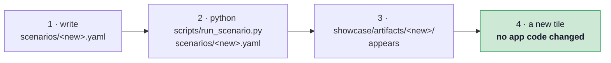
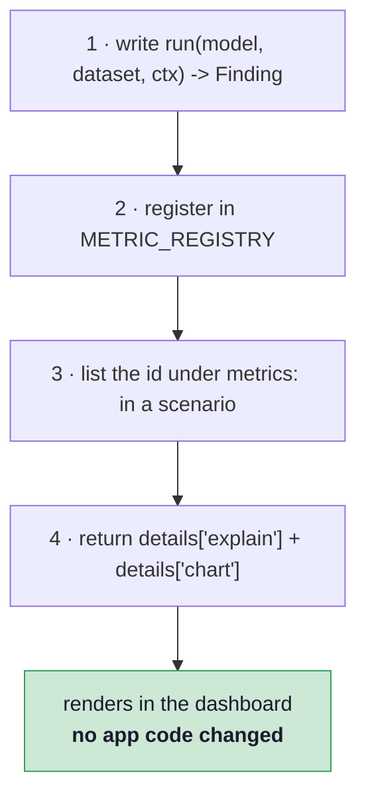

# Extending

Two extension paths, both designed so the Streamlit app never learns about your addition.

## Adding a model

A model is a scenario file. Run it, and a new tile appears.



```yaml
name: my_model
domain: image
seed: 42

model:
  loader: "verifai.models.image:load"
  id: "my-model"
  arch: "resnet18"              # any torchvision classifier factory
  cam_layer: "layer4[-1]"       # Grad-CAM target; defaults per arch
  device: "auto"                # auto | cpu | cuda | mps
  weights_path: "artifacts_training/my_model.pt"
  # ...or repo_id + filename to pull from the Hugging Face Hub
  classes: [...]                # MUST match the checkpoint's output order

dataset:
  loader: "verifai.datasets.loaders:load_image_manifest"
  id: "my-test-set"
  manifest: "data/manifests/my_test.csv"
  images_dir: "data/raw/my_images"

card:                            # copied verbatim into card.json
  name: "My Model"
  emoji: "🧠"
  description: "..."

metrics:
  - "integrity.split_leakage"
  - "performance.classification"
```

!!! warning "`classes` is the checkpoint's order, not alphabetical convenience"
    The list must match the order the model's output layer was trained with. Datasets derive
    their class list from their own labels; models declare theirs. Getting this wrong
    produces confident, plausible, wrong predictions rather than an error.

Supported architectures are anything in `torchvision.models` with an `fc` head (ResNet
family) or a `classifier` head (DenseNet, EfficientNet, MobileNet). `DEFAULT_CAM_LAYER` maps
common families to a sensible Grad-CAM target.

## The contract a metric may rely on today

Worth writing down, because it is narrower than it looks and is what makes a second
domain possible at all. Read off the six metrics as they stand:

| A metric may call | On | Used by |
|---|---|---|
| `len(dataset)`, iteration, `dataset.classes`, `dataset.meta["manifest"]` | dataset | all |
| `dataset.load(sample)` → the payload (today a PIL image) | dataset | all |
| `sample.id`, `sample.label`, `sample.meta` | sample | all |
| `model.classes`, `model.predict_probs(payload)` | model | all |
| `model.decide(probs, meta=None)`, `model.rank(probs, meta=None)` | model | all |
| `model.torch_module`, `model.cam_layer`, `model.to_tensor(payload)` | model | Grad-CAM only |
| the payload being *pixels* | dataset | the ITA fairness metric only |

So **four of six metrics never touch anything image-specific**: they need a payload, a
probability vector and a decision rule. A text or audio adapter that returns
`{class: probability}` from `predict_probs` would run them unchanged.

The last two rows are the genuinely domain-bound part, and the roadmap's first phase turns
that from an implicit assumption into a declared capability, so a metric whose requirement an
adapter cannot meet is reported `unavailable` with a reason instead of crashing. Until then:
if you write a metric that needs more than the first five rows, say so in its docstring.

## Adding a metric



```python
from verifai.core.findings import Finding

def run(model, dataset, ctx) -> Finding:
    n = len(dataset)
    score = ...                       # your measurement

    # Say what is known, never whether it is good. There is no pass and no
    # fail: a quality threshold would have to be justified, and a metric module
    # is the wrong place to decide what "good enough" means.
    verdict = "insufficient"
    if n >= 30:
        verdict = "measured"

    return Finding(
        pillar="performance", metric="my_metric", domain="image",
        value={"score": score, "n": n},
        verdict=verdict,
        summary=f"Score {score:.2f} on {n} images." +
                ("" if n >= 30 else f" Small sample (n={n}) — not a benchmark."),
        details={
            "explain": {
                "what": "What this measures, and why it matters.",
                "how": "How to read this chart.",
                "limits": "What this number does NOT tell you.",
            },
            "chart": {"kind": "bar", "title": "...", "x": [...], "y": [...]},
        },
    )
```

Then one line in `verifai/core/run.py`:

```python
METRIC_REGISTRY = {
    ...,
    "performance.my_metric": "verifai.metrics.performance.my_metric:run",
}
```

### What `ctx` carries

| Key | Contents |
|---|---|
| `scenario` | the whole parsed YAML — read your own config block from here |
| `seed` | the run's seed, for anything stochastic |
| `plot_dir` | where to write PNGs; reference them as `plots/<name>.png` |

Paths in `Finding.plots` and in `images` chart specs are relative to the artifact folder.

## The rules a new metric must follow

These are not style preferences — they are what the project is for.

!!! danger "Never invent a number"
    A metric that cannot be computed returns `None` and explains why, as
    `privacy/mia.py` does when no members set is declared. It does not return a
    placeholder, and it does not quietly skip.

!!! warning "Gate the status on the evidence"
    Stay at `insufficient` until the sample supports a claim. Existing gates: `n>=30` for
    accuracy, `n>=20` for robustness, two populated bins of `>=10` whose intervals separate
    for a fairness gap, 50 per side for membership inference. State `n` in the summary.

!!! note "Unverifiable is not clean"
    If the check could not run, say so. Reporting "no problem found" when nothing was
    examined is the failure mode this project exists to catch — and it has already occurred
    twice in this codebase, both times caught by a test that now guards it.

!!! danger "No score, at any level"
    A metric returns what it measured. It does not roll several numbers into an index, and
    nothing downstream rolls the pillars into one either. The weights would be the value
    judgement the reader came to make, and the components are not commensurable. What may be
    aggregated is *coverage* — how many applicable metrics were measured, and how many came
    back `insufficient` or `unavailable`.

### Planned — the info box a metric must be able to fill

Write `explain` for a reader who has never seen a Responsible-AI report. Plots alone do not
communicate, and neither does a number. Every finding has to answer five questions, in this
order, every time:

| The reader asks | Comes from |
|---|---|
| What was measured? | `explain.what` — *exists today* |
| What came out? | the finding's `summary` — *exists today* |
| Why does it matter? | `explain.impact` — **planned**; who is affected, in this clinical context |
| How do I read this chart? | `explain.how` — *exists today* |
| What does this *not* tell me? | `explain.limits` — *exists today* |

The first three are the ones a non-specialist needs most and are the ones easiest to bury. A
metric that cannot fill all five is not finished — the wording is part of the measurement, not
decoration on top of it.

## Planned — the conformance checklist

**None of this is enforced yet.** It is what the registry will require once
[Phase A](ROADMAP.md#phase-a-the-two-contracts-and-capability-gating) lands; today a metric is
registered as a bare `"module:function"` string and nothing checks it. Written down here
because the [catalogue](pillars.md) is heading for fifty-one metrics, and fifty hand-written
tests would not survive contact with the first refactor. One test over the registry checks all
of them instead, so a new metric will be *done* when every line below is true:

| It will have to | Where | Why |
|---|---|---|
| declare `tasks`, `modalities`, `requires` | its registry entry | so the runner can report `unavailable` **with a reason** instead of crashing on a model that cannot support it |
| declare the **access level** it needs | its registry entry | `labels` · `probs` · `logits` · `gradients` · `weights` · `training_data`. Half the catalogue cannot run against a hosted API, and a metric that silently did not run is indistinguishable from a model with nothing to report |
| record the **method and configuration** that produced its number | the `Finding.value` | an attribution method, an attack, a perturbation budget, a normalisation flag — each changes the result, so each is part of it. Two runs are only comparable when these match |
| declare a `version` | its registry entry | a changed definition must not silently produce false deltas against older snapshots — the comparison view refuses across versions, exactly as it does across evaluation manifests |
| declare a `cost` | its registry entry | forward passes per sample, so `preflight` can estimate a run before it starts rather than after |
| return `details["better"]` | the `Finding` | the comparison view ranks only on declared directions, and never infers one from a name — `mia_auc` is lower-is-better while an AUC normally is not |
| return `details["explain"]` with `what`, `how`, `limits`, `impact` | the `Finding` | the dashboard's wording ships with the metric, not with the app |
| return a chart spec in `details["chart"]` | the `Finding` | a bare number tells a non-specialist nothing. A single scalar gets `kind: "scale"` so the reader sees whether it is a *good* number, not only what it is |
| resolve to a `verifai/core/glossary.py` entry | the glossary | the comparison view reads flattened keys and never sees a finding, so it has no other way to explain the row |
| state `n` in the summary | the `Finding` | a number without its sample size is not a claim |

A second test asserts that no glossary pattern is fully shadowed by an earlier one. The list
is matched in order with `fnmatch`, so `performance.*` placed above
`performance.per_class.*.sensitivity` would silently swallow it — harmless with twenty
patterns, a real hazard with a hundred.

## Adding a chart kind

Prefer reusing `bar`, `line`, `heatmap`, `scale` or `images`. A new kind means editing
`render_chart` in `showcase/app.py`, which is the one place the app and the engine are
coupled — and every existing artifact must keep rendering afterwards.
