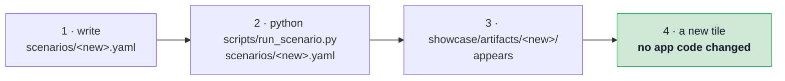
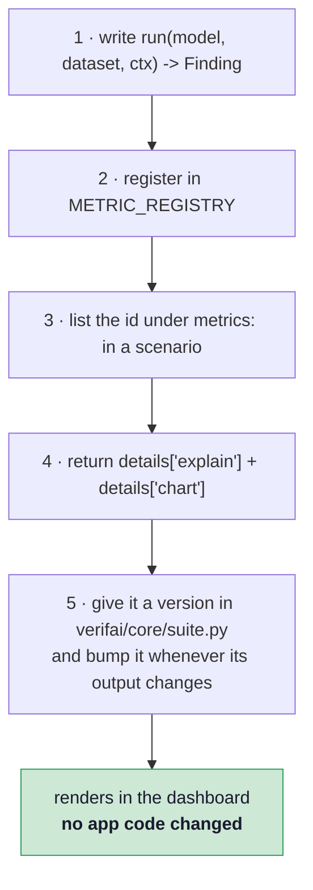

# Extending

Two extension paths, both designed so the Streamlit app never learns about your addition.

## Adding a model

A model is a scenario file. Run it, and a new tile appears. To list it *before* running it —
so it shows as not evaluated rather than not at all — rebuild the model registry:
`python scripts/build_model_registry.py`. `run_scenario.py` does that itself after every run.


```mermaid
flowchart LR
    A["1 · write<br/>scenarios/&lt;new&gt;.yaml"] --> B["2 · python scripts/run_scenario.py<br/>scenarios/&lt;new&gt;.yaml"]
    B --> C["3 · showcase/artifacts/&lt;new&gt;/<br/>appears"]
    C --> D["4 · a new tile<br/><b>no app code changed</b>"]
    style D fill:#CDE8D5,stroke:#2E9E5B,color:#1a1a2e
```

```yaml
name: my_model
label: "My model"                # heads its column in the comparison table
project: "Skin lesion classification"   # which problem; groups models in the overview
status: active                   # active: re-run as metrics change · archived: kept as the record
domain: image
seed: 42

model:
  loader: "verifai.models.image:load"
  id: "my-model"
  arch: "resnet18"              # any torchvision classifier factory
  cam_layer: "layer4[-1]"       # Grad-CAM target; defaults per arch
  device: "auto"                # auto | cpu | cuda | mps
  weights_path: "artifacts_training/my_model.pt"
  # ...or repo_id + filename to pull from the Hugging Face Hub, and
  # revision: "<commit sha>" to pin it — without one the report says unpinned
  classes: [...]                # MUST match the checkpoint's output order

dataset:
  loader: "verifai.datasets.loaders:load_image_manifest"
  id: "my-test-set"
  manifest: "data/manifests/my_test.csv"
  images_dir: "data/raw/my_images"

card:                            # copied verbatim into card.json
  name: "My Model"
  emoji: "🧠"
  description: "..."

metrics:
  - "integrity.split_leakage"
  - "performance.classification"
```

!!! warning "`classes` is the checkpoint's order, not alphabetical convenience"
    The list must match the order the model's output layer was trained with. Datasets derive
    their class list from their own labels; models declare theirs. Getting this wrong
    produces confident, plausible, wrong predictions rather than an error.

Supported architectures are anything in `torchvision.models` with an `fc` head (ResNet
family) or a `classifier` head (DenseNet, EfficientNet, MobileNet). `DEFAULT_CAM_LAYER` maps
common families to a sensible Grad-CAM target.

### A model from the Hugging Face Hub

Do not write the scenario by hand. Let the repository describe itself first:

```bash
uv run python scripts/resolve_model.py hf:owner/repo --dataset data/manifests/ham10000_test.csv \
    -o scenarios/<new>.yaml
```

The resolver reads the repository's metadata at one pinned commit — never the weights — and
writes a scenario marked `draft: true`. A `transformers` model (one with a `config.json`) gets
the `hf_image` loader, its class order from `id2label`, its preprocessing from its own processor,
and its name, licence and training data from its model card. Whatever the repository cannot say
is a `TODO: …` naming what to declare: typically the configuration's `label` and `project`, the
evaluation set, and one `dataset.label_map` entry per data label that is not an exact match.
Answer each, keep the answers as comments, delete `draft: true`, then run it as above.
`run_scenario` refuses a draft or a leftover TODO, and the loader refuses a scenario whose
classes or architecture contradict the repository. A ViT runs on every pillar except Grad-CAM,
which reports *not computable*. Why it works this way:
[ADR 0003](adr/0003-a-model-that-describes-itself.md); a worked case:
`scenarios/vit_large_skin_cancer_ham10000.yaml`.

## The contract a metric may rely on today

Worth writing down, because it is narrower than it looks and is what makes a second
domain possible at all. Read off the metrics as they stand:

| A metric may call | On | Used by |
|---|---|---|
| `len(dataset)`, iteration, `dataset.classes`, `dataset.meta["manifest"]` | dataset | all |
| `dataset.load(sample)` → the payload (today a PIL image) | dataset | all |
| `sample.id`, `sample.label`, `sample.meta` | sample | all |
| `model.classes`, `model.predict_probs(payload)` | model | all |
| `model.predict_probs_batch(payloads)` — optional; call it through `predict_many` | model | performance, robustness |
| `model.decide(probs, meta=None)`, `model.rank(probs, meta=None)` | model | all |
| `model.torch_module`, `model.cam_layer`, `model.to_tensor(payload)` | model | Grad-CAM only |
| the payload being *pixels* | dataset | the ITA fairness metric only |
| the scenario (`ctx["scenario"]`) and the manifests — never the model's outputs | scenario | the first four integrity checks |
| `model.metadata["preprocessing"]`, `model.reference_preprocessing` — never the model's outputs | model | the preprocessing check |

So **four of the six original metrics never touch anything image-specific**, and the five
integrity checks do not touch the model's outputs at all: they need a payload, a
probability vector and a decision rule. A text or audio adapter that returns
`{class: probability}` from `predict_probs` would run them unchanged.

The rows that need the network itself or pixels are the genuinely domain-bound part. They are
a declared capability, not an assumption: a metric registers the access level and the kind of
data it needs, and the runner reports it `unavailable` with the reason when a model cannot meet
it, rather than calling it and crashing ([ADR 0001](adr/0001-capability-gating.md)).

## What a new metric can reuse

Most of a new metric is already written. Before writing a helper, check these:

| Need | Use | Where |
|---|---|---|
| scores for many images | `predict_many(model, imgs)` — batches when the adapter can, one at a time when it cannot | `verifai/metrics/_common.py` |
| the model's decision for one case | `model.decide(probs, meta)` and `model.rank(probs, meta)` — never `argmax`, so a scenario's decision weights apply | the model adapter |
| an interval on a proportion | `wilson(successes, n)` — sound at 0, at 1 and at small `n`, where the normal approximation is not | `verifai/metrics/_stats.py` |
| an interval on an AUC | `auc_ci(auc, n_pos, n_neg)` — Hanley–McNeil | `_stats.py` |
| an interval on a mean | `mean_ci(values)` — for paired differences, as Grad-CAM uses | `_stats.py` |
| PPV where the model is deployed | `ppv_at_prevalence(sens, spec, prevalence)` — Bayes at a *stated* prevalence | `_stats.py` |
| a number quoted with its interval | `fmt(value, ci)` → `0.638 [0.56–0.71]` | `_stats.py` |
| a class id in a sentence | `class_name("melanocytic_Nevi")` → `melanocytic nevi` | `_common.py` |
| what the number is compared with | a reference function in `BY_FINDING` — an ideal, chance, or a control measured in the same run; the runner attaches it to every finding, and only a reference that clears is marked *established* | `verifai/metrics/_baseline.py` |
| a chart | `details["chart"]` with `kind` `bar` · `line` · `heatmap` · `scale` · `images`; a new kind means touching the app, so reuse one | `showcase/render.py::render_chart` |
| a name and a reading in the comparison | an entry in `GLOSSARY` and in `METRIC_NAMES` | `verifai/core/glossary.py` |
| a version | one line in `METRIC_VERSIONS`, bumped whenever what the metric reports changes | `verifai/core/suite.py` |
| sample metadata | `sample.meta["sex"]`, `["age"]`, `["localization"]`, `["lesion_id"]` — whatever columns the manifest carries | the dataset |
| image corruptions | `_noise`, `_blur`, `_bright`, `_jpeg` — the four the robustness metric applies; noise draws from the generator it is given | `_common.py` |

### Ready per tier

The [catalogue](pillars.md) sorts the planned metrics into tiers by what they need. Against what
exists today:

| Tier | Milestone | What exists | What is still to build |
|---|---|---|---|
| **1** — probabilities only | M6 | everything above: probabilities, labels, metadata, intervals | a bootstrap interval for calibration error (step F3); sub-aspects, versions in snapshots and the conformance test (F1, F2) |
| **2** — attacks, explanation quality | M7 | gradients through `model.torch_module` for the attacks; Grad-CAM's deletion test to generalise | **the Quantus adapter**: one module that wraps Quantus unmodified (it is LGPL-3.0); the attribution method in the comparability key |
| **3** — with the data on hand | M7 | a ViT, sex and age columns, the training members of the models trained here | the attribution method for transformers (`transformer_attribution`) |

The schedule, and the four tier-3 metrics that wait for data:
[the catalogue by milestone](ROADMAP.md#the-catalogue-by-milestone).

## Adding a metric


```mermaid
flowchart TB
    A["1 · write run(model, dataset, ctx) -> Finding"]
    B["2 · register in METRIC_REGISTRY"]
    C["3 · list the id under metrics: in a scenario"]
    D["4 · return details['explain'] + details['chart']"]
    V["5 · give it a version in verifai/core/suite.py<br/>and bump it whenever its output changes"]
    A --> B --> C --> D --> V
    V --> E["renders in the dashboard<br/><b>no app code changed</b>"]
    style E fill:#CDE8D5,stroke:#2E9E5B,color:#1a1a2e
```

```python
from verifai.core.findings import Finding

def run(model, dataset, ctx) -> Finding:
    n = len(dataset)
    score = ...                       # your measurement

    # Say what is known, never whether it is good. There is no pass and no
    # fail: a quality threshold would have to be justified, and a metric module
    # is the wrong place to decide what "good enough" means.
    verdict = "insufficient"
    if n >= 30:
        verdict = "measured"

    return Finding(
        pillar="performance", metric="my_metric", domain="image",
        value={"score": score, "n": n},
        verdict=verdict,
        summary=f"Score {score:.2f} on {n} images." +
                ("" if n >= 30 else f" Small sample (n={n}) — not a benchmark."),
        details={
            "explain": {
                "what": "What this measures, and why it matters.",
                "how": "How to read this chart.",
                "limits": "What this number does NOT tell you.",
            },
            "chart": {"kind": "bar", "title": "...", "x": [...], "y": [...]},
        },
    )
```

Then one entry in `verifai/core/run.py`, saying what the metric needs before it can run:

```python
METRIC_REGISTRY = {
    ...,
    "performance.my_metric": MetricSpec(
        "verifai.metrics.performance.my_metric:run",
        pillar="performance", finding="my_metric",   # the Finding it returns
        tasks=("classification",),                   # which tasks it belongs to
        modalities=None,                             # None = any payload; ("pixels",) for images
        requires="probs"),                           # the lowest access level it needs
}
```

The runner checks `requires` against the model's access level **before** calling the metric.
When the model falls short — Grad-CAM on a model that can only be queried — the metric is never
called, and the report gets an `unavailable` finding under its name saying why. A metric whose
`tasks` or `modalities` do not match the scenario is refused before anything runs. A bare
`"module:function"` string is still accepted and taken at its most permissive (any task, any
payload, `labels`), which is how every metric ran before the contracts existed.

### What `ctx` carries

| Key | Contents |
|---|---|
| `scenario` | the whole parsed YAML — read your own config block from here |
| `seed` | the run's seed, for anything stochastic |
| `plot_dir` | where to write PNGs; reference them as `plots/<name>.png` |

Paths in `Finding.plots` and in `images` chart specs are relative to the artifact folder.

## The rules a new metric must follow

These are not style preferences — they are what the project is for.

!!! danger "Never invent a number"
    A metric that cannot be computed returns `None` and explains why, as
    `privacy/mia.py` does when no members set is declared. It does not return a
    placeholder, and it does not quietly skip.

!!! warning "Gate the status on the evidence"
    Stay at `insufficient` until the sample supports a claim. Existing gates: `n>=30` for
    accuracy, `n>=20` for robustness, two populated bins of `>=10` whose intervals separate
    for a fairness gap, 50 per side for membership inference. State `n` in the summary.

!!! note "Unverifiable is not clean"
    If the check could not run, say so. Reporting "no problem found" when nothing was
    examined is the failure mode this project exists to catch — and it has already occurred
    twice in this codebase, both times caught by a test that now guards it.

!!! danger "No score, at any level"
    A metric returns what it measured. It does not roll several numbers into an index, and
    nothing downstream rolls the pillars into one either. The weights would be the value
    judgement the reader came to make, and the components are not commensurable. What may be
    aggregated is *coverage* — how many applicable metrics were measured, and how many came
    back `insufficient` or `unavailable`.

### Planned — the info box a metric must be able to fill

Write `explain` for a reader who has never seen a Responsible-AI report. Plots alone do not
communicate, and neither does a number. Every finding has to answer five questions, in this
order, every time:

| The reader asks | Comes from |
|---|---|
| What was measured? | `explain.what` — *exists today* |
| What came out? | the finding's `summary` — *exists today* |
| Why does it matter? | `explain.impact` — **planned**; who is affected, in this clinical context |
| How do I read this chart? | `explain.how` — *exists today* |
| What does this *not* tell me? | `explain.limits` — *exists today* |

The first three are the ones a non-specialist needs most and are the ones easiest to bury. A
metric that cannot fill all five is not finished — the wording is part of the measurement, not
decoration on top of it.

## The conformance checklist — partly enforced

The first two rows are enforced since
[Phase A](ROADMAP.md#phase-a-the-two-contracts-and-capability-gating) (2026-09-25): every
registry entry is a `MetricSpec`, and a test fails otherwise. `version` lives in
`verifai/core/suite.py`, the reference, `better`, `explain`, glossary and name rows are tested;
`cost` and the method record are not yet. Written down here
because the [catalogue](pillars.md) is heading for fifty-seven metrics, and fifty hand-written
tests would not survive contact with the first refactor. One test over the registry checks all
of them instead, so a new metric will be *done* when every line below is true:

| It will have to | Where | Why |
|---|---|---|
| declare `tasks`, `modalities`, `requires` — **enforced** | its `MetricSpec` | so the runner can report `unavailable` **with a reason** instead of crashing on a model that cannot support it |
| declare the **access level** it needs — **enforced** | `MetricSpec.requires` | `labels` · `probs` · `logits` · `gradients` · `weights` · `training_data`. Half the catalogue cannot run against a hosted API, and a metric that silently did not run is indistinguishable from a model with nothing to report |
| record the **method and configuration** that produced its number | the `Finding.value` | an attribution method, an attack, a perturbation budget, a normalisation flag — each changes the result, so each is part of it. Two runs are only comparable when these match |
| declare a `version` | its registry entry | a changed definition must not silently produce false deltas against older snapshots — the comparison view refuses across versions, exactly as it does across evaluation manifests |
| declare a `cost` | its registry entry | forward passes per sample, so `preflight` can estimate a run before it starts rather than after |
| compute its **reference** — `details["baseline"]` | a function in `verifai/metrics/_baseline.py`, listed in `BY_FINDING` | the report's first section lists only what clears its reference; a metric with no function publishes `None` and can establish nothing. The runner attaches it, so no metric can forget it or claim what its own numbers do not carry |
| return `details["better"]` | the `Finding` | the comparison view ranks only on declared directions, and never infers one from a name — `mia_auc` is lower-is-better while an AUC normally is not |
| return `details["explain"]` with `what`, `how`, `limits`, `impact` | the `Finding` | the dashboard's wording ships with the metric, not with the app |
| return a chart spec in `details["chart"]` | the `Finding` | a bare number tells a non-specialist nothing. A single scalar gets `kind: "scale"` so the reader sees whether it is a *good* number, not only what it is |
| resolve to a `verifai/core/glossary.py` entry | the glossary | the comparison view reads flattened keys and never sees a finding, so it has no other way to explain the row |
| have a human name in `METRIC_NAMES` | the glossary | the report's section heading; without one the reader sees the finding's identifier, `split_leakage` |
| state `n` in the summary | the `Finding` | a number without its sample size is not a claim |

A second test asserts that no glossary pattern is fully shadowed by an earlier one. The list
is matched in order with `fnmatch`, so `performance.*` placed above
`performance.per_class.*.sensitivity` would silently swallow it — harmless with twenty
patterns, a real hazard with a hundred.

## Adding a chart kind

Prefer reusing `bar`, `line`, `heatmap`, `scale` or `images`. A new kind means editing
`render_chart` in `showcase/app.py`, which is the one place the app and the engine are
coupled — and every existing artifact must keep rendering afterwards.
