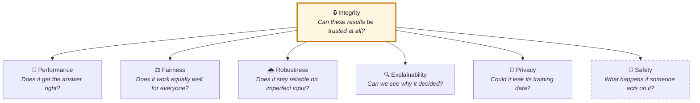
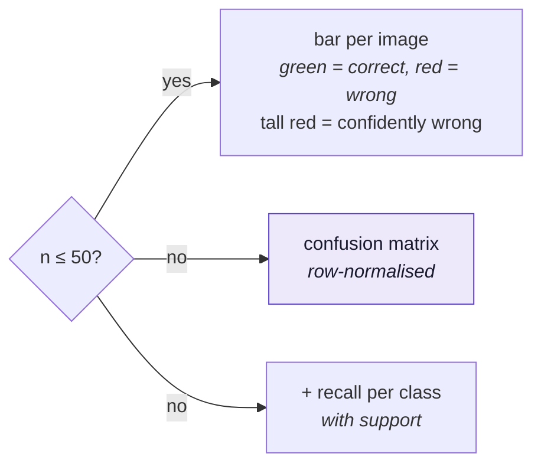
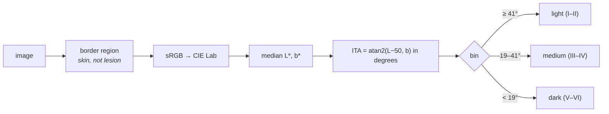
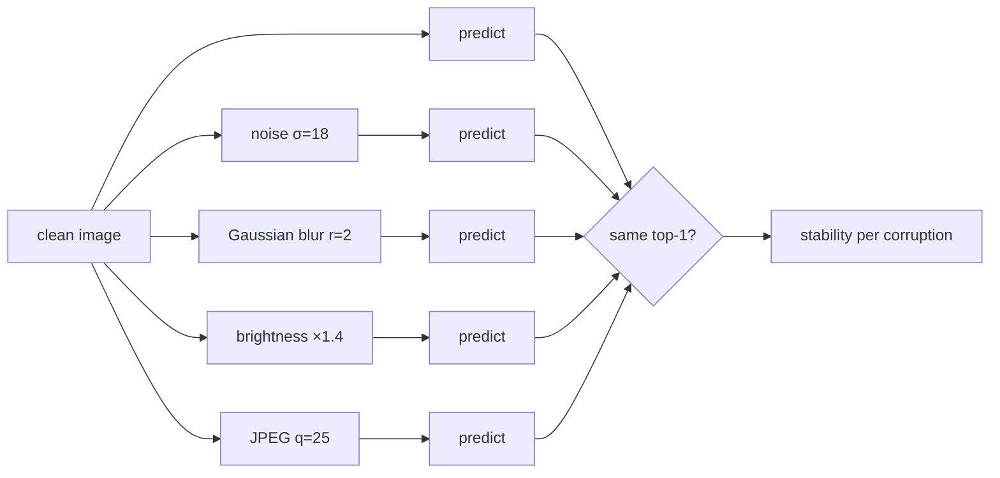
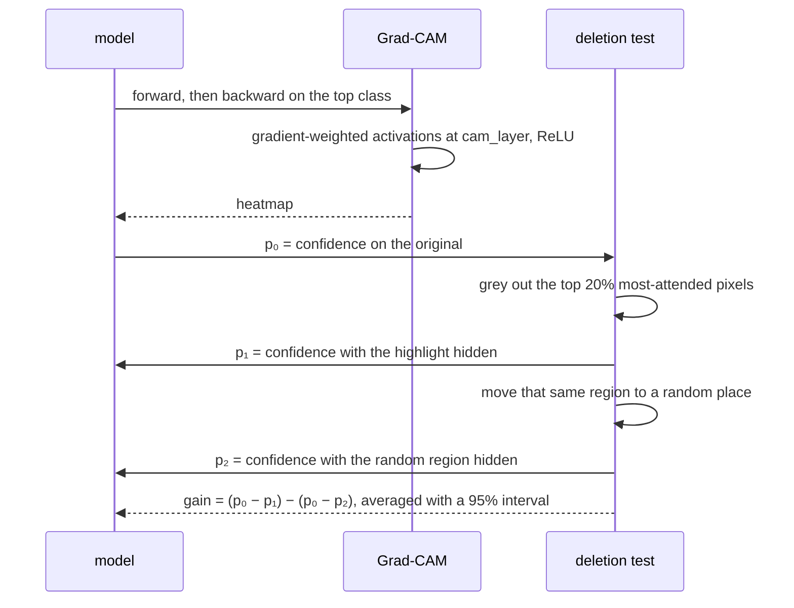
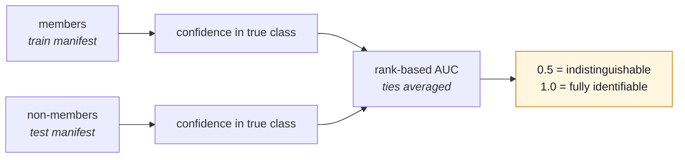

# The pillars

!!! tip "Unfamiliar terms?"
    Sensitivity, PPV, confidence intervals, ITA and the rest are defined in plain
    language with worked examples in the [Glossary](glossary.md).

Each pillar answers one plain question. The dashboard shows them in this order because
**integrity comes first** — every other number is conditional on it.



Four of these are the standard Responsible-AI taxonomy — explainable, ethical, secure and
privacy-preserving AI. Three are this project's own, and each asks something the other
four cannot:

- **Integrity** — a fairness gap measured on a contaminated split is not a fairness
  result. This pillar is the precondition for reading any of the others.
- **Performance, with calibration** — a sensitivity figure without its operating point is
  not a performance result. This repo has its own worked example: a configuration
  reporting 0.964 melanoma sensitivity that flags 82% of everything it sees.
- **Safety** — *performance asks whether the output is correct; safety asks what happens
  if someone acts on it.* For a classifier the two collapse together, which is why six
  pillars sufficed until now. For a generative system they do not, and nothing in the
  other six pillars notices a model that told someone to stay home.

!!! tip "How to read this page"
    **Running today** means implemented, registered, and producing findings in the published
    artifacts — six metrics. **Planned** means designed and argued for, and not yet written.
    Every table row carries its own status, and the [roadmap](ROADMAP.md) holds the order.
    The distinction is kept visible on purpose: a catalogue that reads as though it all exists
    would be the same kind of overclaim this project was built to catch.

---

## Running today — six metrics

Everything in this section is implemented, registered, and producing findings in the published
artifacts. One metric per pillar. Each states its own evidence gate, and none of them scores the
model against a threshold — the vocabulary is `measured` · `insufficient` · `unavailable` ·
`invalid`, which says what is *known*, not whether it is good.

!!! note "Criteria are coming back, but not into the metrics"
    Refusing thresholds entirely is a blunt instrument: it leaves a reader holding "flip rate
    14.5%" with no way to know what good looks like. The
    [findings layer](ROADMAP.md#phase-g-the-findings-layer-measurement-judgement-and-the-line-between-them)
    separates the two — a metric publishes what it **measured**, and a versioned policy file
    owns whether that is **acceptable**, with a required rationale, a named owner, and a
    different answer under a medical profile than under a research one. Metrics stay
    thresholdless. Judgements become attributable instead of absent.

### Integrity — `split_leakage`

Compares the evaluation manifest against everything the model trained on, by `lesion_id`
as well as `image_id`. Covered in full in [Split integrity](integrity.md).

Reports `measured` when nothing is shared, `invalid` on **any** overlap — the measurement
no longer means what it appears to — and `unavailable` when the manifests carry no
identifier to compare on, which is **not** a clean bill of health but an unanswered
question.

### Performance — `top1_accuracy`

Share of images whose most confident class is correct, plus per-class sensitivity,
specificity and PPV with Wilson intervals, and top-3 differential accuracy. The
representation switches with sample size, because one bar per image is useless at scale:



!!! danger "Why the per-class view is not optional"
    This model scores **79.6% accuracy** and **63.8% recall on melanoma**. The averaged
    number is dominated by the 1,009 nevi in the test set. A rare, dangerous class can fail
    badly without moving the headline at all.

Evidence gate: `insufficient` below **n = 30**.

### Fairness — `skin_tone_ita`

HAM10000 carries no skin-type labels, so skin tone is estimated from the image itself. The
Individual Typology Angle is computed from the healthy skin *around* the lesion — the outer
frame of a dermatoscopic crop — using the median to resist hair, rulers and vignetting.



Two things are reported: **coverage** (who is in the sample) and, only when the evidence
supports it, **subgroup accuracy** and the gap between groups — claimed only when the
groups' intervals separate.

Evidence gate: a gap requires **at least two populated bins with ≥ 10 images each**.

!!! warning "A regression worth remembering"
    The gate originally accepted a single populated bin. One group yields a gap of 0.0,
    which then read as a clean result — on a dataset whose defining fairness problem is
    that it barely contains dark skin. A test now asserts that a single bin never reads as
    a measured gap.

### Robustness — `corruption_stability`

Applies four distortions that should not change a diagnosis, and measures how often the
top-1 class survives.



Evidence gate: `insufficient` below **n = 20**.

!!! note "Stability is not correctness"
    A model that is confidently wrong both before and after a distortion scores a perfect
    1.0 here. Read it next to performance, never alone.

### Explainability — `gradcam_faithfulness`

Grad-CAM highlights the regions that drove the decision. Faithfulness then checks whether
those highlights are honest, by greying out the most-attended region and measuring how far
the predicted class's probability drops — **and doing the same with a region of the same size
and shape moved to a random place in the same image.** The claim is the difference.



Every test image is scored; only the first `gradcam_max_images` (default 7) are drawn as
overlays, because pictures are what make an artifact heavy. Until metric version 2
(2026-09-25) the same cap limited the *measurement* too, so the published faithfulness was a
mean over the first seven filenames of a sorted manifest — six of them nevi.

Why a control, and not a threshold: greying out pixels produces images the model never saw,
which can lower its confidence for reasons of their own [[42]](references.md#ref-42). A random
region of the same size shares that effect, so what the highlight loses *beyond* it is what the
explanation can take credit for. The bands this replaced — "decorative" below 0.2, "faithful"
above 0.5 — were cut-offs nobody could justify. The planned `randomisation` and `complexity`
metrics still matter: beating a random region shows the model relies on the highlighted area,
not that the explanation is attached to the model's parameters at all.

### Privacy — `membership_inference_auc`

Asks whether an attacker could tell that a specific patient was in the training set, using
the model's confidence in the true class as the signal.



No risk threshold — 0.60 would have to be justified and cannot be. What is factual is
whether the **interval** clears chance: entirely above 0.5 means membership is
demonstrably distinguishable; straddling 0.5 means no leakage has been shown. That
sentence goes in the summary, where it can be read, rather than into a badge that
compresses it to a colour. Refuses to report below 50 images per side, and refuses
entirely when no members set is declared.

!!! warning "An average-case AUC is the wrong summary for a privacy attack"
    What matters is not whether an attacker can identify a *typical* record, but whether they
    can identify *a few* records with confidence — that is the realistic threat, and an AUC
    averaged over everything hides it. The planned privacy metrics therefore report the
    true-positive rate at a low fixed false-positive rate alongside the AUC [[41]](references.md#ref-41). The shipped
    metric does not yet, and this is the first thing to fix in it.

!!! note "One attack, not all attacks"
    This is the cheap confidence-only attack. Shadow models or per-class calibration can
    do better, so a low score is evidence of low risk rather than a guarantee — and for a
    checkpoint whose training data we do not hold, the stronger attack is not merely
    unimplemented but impossible.


---

---

## Planned — the full catalogue

**None of the metrics below exist yet**, apart from the six above, which are repeated here
inside their pillar so the shape of each pillar is visible in one place. The `Status` column on
every row says which is which; the [roadmap](ROADMAP.md) says in what order the rest gets built.

- **Shipped** — the six from the previous section: implemented and producing findings today.
- **Tier 1** — needs nothing that does not already exist; can be built today.
- **Tier 2** — needs the declared adapter capabilities (roadmap Phase A).
- **Tier 3** — needs more data, ground-truth masks, or a model we trained ourselves.
- **Tier 4** — needs the text domain. **Tier 5** — needs `task: generation`.
- **port** — *already implemented* in an earlier VERIFAI repository ([33] the master's-project
  prototype, [[34]](references.md#ref-34) the 2.0 backend). These are a translation job, not a research job, and the
  tier still says what has to exist here before the port can land.

A metric whose requirement the model or dataset cannot meet reports `unavailable` with the
reason, never a silent absence and never an invented number.

### 🔒 Integrity — can any of this be believed?

| Metric | Sub-aspect | What it establishes | Status |
|---|---|---|---|
| `split_leakage` | row overlap | shared `image_id` / `lesion_id` between the evaluation manifest and everything the model trained on | **shipped** |
| `provenance` | declared origin | what is *known* about a checkpoint's training data — `unavailable`, never "clean", when it is undeclared | tier 1 |
| `label_space` | compatibility | model classes against dataset classes; a mismatch requires an explicit `label_map`, and is never guessed | tier 1 |
| `preprocessing_fingerprint` | compatibility | the transform actually used, recorded and compared against what the checkpoint declares | tier 1 |
| `corpus_ancestry` | corpus overlap | the model's declared datasets against the evaluation corpus, via an ancestry table (HAM10000 ⊂ ISIC 2019). The only leakage check possible for a model whose row ids we do not hold | tier 2 |
| `near_duplicates` | row overlap | perceptual hashing (images) or shingling (text) across splits — catches the second photograph of one lesion that identifier matching misses | tier 2 |
| `benchmark_contamination` | corpus overlap | was the evaluation benchmark inside the training corpus? n-gram and canary overlap where the corpus is known; perplexity on the benchmark against a paraphrase where it is not [[30]](references.md#ref-30) | tier 5 |

### 🎯 Performance — is the output correct?

| Metric | Sub-aspect | What it establishes | Status |
|---|---|---|---|
| `top1_accuracy` | discrimination | top-1 and balanced accuracy, per-class sensitivity / specificity / PPV with Wilson intervals, top-3 differential accuracy | **shipped** |
| `calibration` | calibration | do the probabilities mean what they say: reliability curve, ECE, MCE, Brier score, calibration intercept and slope [[15]](references.md#ref-15) [[16]](references.md#ref-16) | tier 1 |
| `discrimination_auc` | discrimination | per-class ROC-AUC *and* PR-AUC with intervals — PR-AUC because ROC flatters a model on an imbalanced class | tier 1 |
| `operating_points` | decision quality | the sensitivity/specificity frontier, Youden's J, and net benefit across a range of harm ratios [[17]](references.md#ref-17). It reports the **curve**, never a chosen point: which harm ratio applies is the reader's judgement, not the metric's | tier 1 |
| `prevalence_ppv` | decision quality | PPV at a *stated deployment* prevalence rather than the test set's, because the same model has a different PPV in a screening clinic and a referral clinic | tier 1 |
| `selective_prediction` | uncertainty | accuracy against coverage when the model is allowed to abstain, plus the predictive-entropy distribution — the shape that matters for triage [[18]](references.md#ref-18) | tier 1 |
| `groundedness` | generative | are the claims in an answer traceable to a cited source | tier 5 |
| `hallucination_rate` | generative | unsupported clinical claims per answer | tier 5 |
| `answer_consistency` | generative | the same question resampled — self-consistency as a cheap uncertainty proxy | tier 5 |
| `reference_overlap` | generative | BLEU, ROUGE and perplexity against a reference answer [[34]](references.md#ref-34). Included because it is standard and cheap, and labelled weak because overlap with one reference answer is a poor proxy for clinical correctness — it is the baseline the groundedness metrics have to beat | tier 5 · **port** [[34]](references.md#ref-34) |

### ⚖️ Fairness — for whom does it work?

| Metric | Sub-aspect | What it establishes | Status |
|---|---|---|---|
| `skin_tone_ita` | data | ITA-binned skin-tone coverage, and subgroup accuracy where the evidence supports it. A dermatology-specific pixel proxy, reported as one [[13]](references.md#ref-13) | **shipped** |
| `group` | group | demographic parity, equalised odds, equal opportunity and predictive parity differences, plus per-group sensitivity / specificity / PPV with intervals [[19]](references.md#ref-19). A gap is claimed only when two groups' intervals separate | tier 1 |
| `data_representation` | data | group support in training against evaluation against the stated deployment population — said up front rather than discovered in a footnote | tier 1 |
| `calibration_by_group` | group | calibration within each group. The metric that makes the impossibility concrete: when base rates genuinely differ, equal calibration and equal odds cannot both hold [[21]](references.md#ref-21) | tier 2 |
| `individual` | individual | consistency — the same case with a sensitive attribute changed, and how often the decision flips [[20]](references.md#ref-20) | tier 3 |
| `intersectional` | group | gaps across combinations (sex × age band), with most cells honestly `insufficient`, which is itself the finding | tier 3 |
| `bias_probes` | generative | a prompt-corpus suite rather than a labelled test set: adversarial bias, toxicity, regard, demographic bias, hate speech and holistic bias, each measured by a classifier over generated continuations [[40]](references.md#ref-40) | tier 5 · **port** [[34]](references.md#ref-34) |
| `vignette_parity` | generative | matched clinical vignettes differing only in a demographic: differences in advice quality, hedging and refusal rate | tier 5 |

!!! warning "Demographic parity is often the wrong question in medicine"
    Equal positive rates across groups is a fairness definition that assumes equal base
    rates. Where prevalence genuinely differs, forcing parity makes the model worse for
    everybody. This is why the pillar reports several definitions side by side and their
    tensions, rather than one number called *fairness*.

### 🌧️ Robustness — does it hold up?

| Metric                 | Sub-aspect  | What it establishes                                                                                                                                                       | Status                 |
|------------------------|-------------|---------------------------------------------------------------------------------------------------------------------------------------------------------------------------|------------------------|
| `corruption_stability` | natural     | the share of predictions that survive noise, blur, brightness and JPEG compression                                                                                        | **shipped**            |
| `corruption_severity`  | natural     | the same sweep across severities — a curve rather than one point, because a single severity is an arbitrary choice [[22]](references.md#ref-22)                                                   | tier 2                 |
| `adversarial`          | adversarial | FGSM, PGD and DeepFool measured against an additive-uniform-noise baseline, swept across a perturbation budget, with the threat model reported as part of the number [[23]](references.md#ref-23) | tier 2 · **port** [[43]](references.md#ref-43) |
| `acquisition_shift`    | natural     | performance grouped by scanner, site or device where the manifest records it — the shift that actually ends deployments                                                   | tier 3                 |
| `text_perturbation`    | natural     | typos, casing, whitespace, clinical abbreviation expansion, negation handling [[24]](references.md#ref-24)                                                                                        | tier 4 · **port** [[33]](references.md#ref-33) |
| `prompt_sensitivity`   | generative  | paraphrase, option order and output format                                                                                                                                | tier 5                 |
| `sycophancy`           | generative  | does the answer change when the user pushes back                                                                                                                          | tier 5                 |
| `jailbreak`            | adversarial | resistance to instruction override                                                                                                                                        | tier 5 · **port** [[34]](references.md#ref-34) |

!!! danger "A threat model is part of the number"
    An attack success rate without white-box versus black-box, the norm, the perturbation
    budget and the iteration count is not a measurement. Each adversarial metric reports
    all four in its `value`, and adversarial robustness is never merged with corruption
    stability into a single "robustness" figure — they answer different questions, and a
    reader shown one number will assume the wrong one.

### 🔍 Explainability — is the explanation attached to the model at all?

| Metric                  | Sub-aspect   | What it establishes                                                                                                                                                                                            | Status                 |
|-------------------------|--------------|----------------------------------------------------------------------------------------------------------------------------------------------------------------------------------------------------------------|------------------------|
| `gradcam_faithfulness`  | faithfulness | Grad-CAM overlays [[7]](references.md#ref-7), plus a deletion test: mask the highlighted region and measure the drop in confidence [[8]](references.md#ref-8)                                                                                                | **shipped**            |
| `faithfulness`          | faithfulness | deletion **and** insertion, generalised to any modality through a masking function (pixels, tokens, audio frames). Deletion alone is gameable [[42]](references.md#ref-42)                                                             | tier 2                 |
| `complexity`            | complexity   | attribution sparseness and entropy — an explanation that highlights everything explains nothing                                                                                                                | tier 2 · **port** [[27]](references.md#ref-27) |
| `randomisation`         | sanity       | randomise the model's parameters layer by layer. An attribution that barely changes is an edge detector, not an explanation [[25]](references.md#ref-25). Needs `weights`, not merely `gradients`                                      | tier 2 · **port** [[27]](references.md#ref-27) |
| `stability`             | robustness   | max-sensitivity: does a tiny change to the input rewrite the explanation [[26]](references.md#ref-26)                                                                                                                                  | tier 2 · **port** [[27]](references.md#ref-27) |
| `agreement`             | sanity       | do two attribution methods agree? Disagreement is information about the explanation, not about the model                                                                                                       | tier 3                 |
| `axiomatic`             | sanity       | does the attribution satisfy the properties its own method claims — completeness, non-sensitivity, input invariance. A method failing its own axioms is misconfigured, and this is the only check that notices | tier 2 · [[27]](references.md#ref-27)          |
| `localisation`          | faithfulness | does attribution land inside the annotated finding. `unavailable` without ground-truth masks                                                                                                                   | tier 3                 |
| `citation_support`      | generative   | are an answer's claims traceable to the retrieved sources                                                                                                                                                      | tier 5                 |
| `cot_faithfulness`      | generative   | does the stated reasoning *cause* the answer — tested by intervening on it, not by reading it                                                                                                                  | tier 5                 |
| `verbalised_confidence` | generative   | is stated confidence calibrated against actual correctness                                                                                                                                                     | tier 5                 |

### 🔐 Privacy — what does it leak?

| Metric                     | Sub-aspect   | What it establishes                                                                                                                                                                                                             | Status                 |
|----------------------------|--------------|---------------------------------------------------------------------------------------------------------------------------------------------------------------------------------------------------------------------------------|------------------------|
| `membership_inference_auc` | membership   | could an attacker tell that a specific patient was in the training set, using confidence alone [[10]](references.md#ref-10). Should also report TPR at a low fixed FPR [[41]](references.md#ref-41) [[44]](references.md#ref-44)                                                                        | **shipped**            |
| `mia_per_group`            | membership   | leakage is not uniform — rare classes and small groups leak more. The privacy/fairness intersection that almost nobody reports                                                                                                  | tier 3                 |
| `mia_shadow`               | membership   | the stronger attack — and **permanently `unavailable` for a third-party checkpoint**, because building shadow models requires the training distribution [[37]](references.md#ref-37). That limit is the finding, not a gap                              | tier 3 · **port** [[33]](references.md#ref-33) |
| `memorisation`             | memorisation | canary exposure where we control training; verbatim recall where we do not [[28]](references.md#ref-28)                                                                                                                                                 | tier 3                 |
| `attribute_inference`      | inference    | can a sensitive attribute be recovered from the model's outputs or embeddings                                                                                                                                                   | tier 3                 |
| `mia_neighbourhood`        | membership   | the generative membership attack: compare a sample's likelihood against perturbed neighbours of it. Reported with its interval, because the published finding is that most such attacks barely beat chance on large models [[38]](references.md#ref-38) | tier 5 · **port** [[34]](references.md#ref-34) |
| `extraction`               | memorisation | training data and PII regurgitated under prompting [[29]](references.md#ref-29)                                                                                                                                                                         | tier 5                 |

### 🛟 Safety — what happens if someone acts on this?

Generative only. For `task: classification` this pillar reports **not applicable** by
declaration: a label's consequences are the operating-point question, which performance
and net benefit already answer in full.

| Metric | What it establishes | Status |
|---|---|---|
| `scope_compliance` | stays inside its stated indication, and does not claim diagnostic authority it lacks | tier 5 |
| `escalation` | defers to a clinician on red-flag presentations | tier 5 |
| `harm_rate` | actively harmful advice, graded against a published rubric | tier 5 |
| `refusal_appropriateness` | **both directions** — refusing an answerable, safe question is a failure too, and over-refusal is a real cost to real users | tier 5 |
| `uncertainty_communication` | hedges when it should, and does not hedge when it should not | tier 5 |

!!! note "A judge is a model being evaluated too"
    Several generative metrics need a model to grade an answer. Any judge-based finding
    records the judge's identity and version, the exact prompt, and its agreement with
    human labels on a sample — and without that agreement number the verdict stays
    `insufficient`. Otherwise the framework would be doing exactly what it exists to
    catch: reporting a confident number whose provenance nobody checked.

---

---

## How much of the model do you have?

**Built in [Phase A](ROADMAP.md#phase-a-the-two-contracts-and-capability-gating)
(2026-09-25)**: `verifai/models/base.py` holds the ladder, every model declares its level, every
metric declares the one it needs, and each report records both. Every scenario in this repository
today is a local checkpoint, so in the published reports the gate has never had to close; the
tests exercise it with a model that returns only class scores. It becomes visible the moment a
model arrives that can only be queried.

Half the catalogue cannot run against a model you can only send requests to. That is not a
limitation of this framework — gradients do not exist on the other side of an HTTP endpoint —
but it has to be **declared**, because a metric that silently does not run is indistinguishable
from a model with nothing to report.

Access is a ladder from least to most. **Each level includes every level above it**: if you can
take gradients you can necessarily read probabilities, and if you can read probabilities you can
certainly read the predicted label.

| Level | What the model gives you | A model at exactly this level |
|---|---|---|
| `labels` | the predicted class, nothing else | a vendor endpoint that returns only `"melanoma"` |
| `probs` | a score for every class | the HF Inference API, or any hosted classifier returning a score vector |
| `logits` | raw pre-softmax outputs | a served model exposing raw outputs, e.g. your own wrapper around weights you may not read |
| `gradients` | backward passes through the model | **a local `nn.Module`** — every scenario in this repository today |
| `weights` | permission to *modify* the parameters | the same local module, when a metric may re-initialise layers and reload |
| `training_data` | the manifests it was trained on | a model trained here, where `<name>_training.json` records the split |

A metric declares the **lowest** level it needs. The runner compares that against the adapter's
level and reports `unavailable` with the reason when it falls short — *"this model is reachable
only through an API, so gradients do not exist for it"* — rather than omitting the row.

### Worked examples, from this repository

| Model | Level | What that buys, and what it costs |
|---|---|---|
| `skin_cancer_isic` — trained here | `training_data` | everything. Grad-CAM, Quantus, white-box attacks, shadow MIA, canary exposure, and a verifiable split check |
| `skin-lesion-resnet18` — the original HF checkpoint | `weights` | all the model-internal metrics run, but its training set is only *inferred* (the `marmal88/skin_cancer` audit), not declared by its author. Shadow MIA and canary exposure are out; `integrity.provenance` reports what is known and refuses to call it clean |
| a hypothetical `hf:owner/model` you download | `weights` | the same, and `integrity.corpus_ancestry` becomes the only leakage check available |
| the same model behind a hosted API | `probs` | performance, calibration, fairness and confidence-based MIA all still run. Grad-CAM, Quantus, FGSM/PGD and the randomisation check are **impossible**, and say so |

### `weights` is a rung above `gradients`, and that is not pedantry

The randomisation sanity check (`explainability.randomisation`, Quantus's MPRT) **re-initialises
the model's layers** to see whether the explanation changes. Being able to call `.backward()` is
not enough; the metric has to be allowed to damage the model and then restore it. A frozen,
shared or read-only-served module supports gradients and not this.

### The same split exists in every pillar

Your earlier notes worked this out for robustness before the rest of it existed [[34]](references.md#ref-34). It
generalises:

| Pillar | White-box (`gradients` and up) | Black-box equivalent (`probs` or `labels`) |
|---|---|---|
| robustness | FGSM, PGD, DeepFool | Square, Boundary, NES, transferable MIFGSM |
| privacy | shadow MIA (`training_data`), canary exposure (`training_data`) | confidence MIA (`probs`), label-only MIA (`labels`) |
| explainability | Integrated Gradients, Saliency, Grad-CAM | occlusion, LIME, kernel SHAP |
| performance · fairness · calibration | — | all of it runs on `probs` alone |
| integrity | — | needs the manifests, not the model at all |

!!! danger "A metric can run at both levels and still not be comparable"
    `explainability.complexity` needs an **attribution**, not gradients — so on a black-box
    model it runs happily over occlusion attributions instead of Integrated Gradients. The row
    is populated either way, and the two numbers are not the same measurement. That is worse
    than a gap, because a gap is visible. Every such metric therefore records *which method
    produced the array it scored*, and that record travels into the comparison.


---

## What would implement these

**Planned, with the audit already done.** Nothing here is a dependency of this repository
today; the `engine` dependency group is still torch, torchvision, pillow, numpy, matplotlib,
huggingface-hub, pyyaml and certifi. What the table below records is which of these *could* be adopted,
verified against the real stack rather than assumed.

The catalogue is not starting from nothing — but a toolkit named in a plan is a claim with a
shelf life, so this table carries its own evidence. Every row was checked against this repo's
actual stack (Python 3.13.5, numpy 2.5.2, torch 2.14.0): *installs here* is the result of
`pip install --dry-run` in the project venv, *maintained* is months since the last commit, and
every toolkit name links to its repository while the **Source** column links into the
bibliography — so the source is never a footnote away.

!!! info "Verified 2026-09-18"
    Re-check before relying on a row. Of the nine installable toolkits on the sixteen-month-old
    shortlist this table was built from [[34]](references.md#ref-34), **two had already stopped working** and one link
    had died — and nothing in the older document would have told you.

| Toolkit | Implements | Version · date | Maintained | Installs here | Licence | Source |
|---|---|---|---|---|---|---|
| **[Quantus](https://github.com/understandable-machine-intelligence-lab/Quantus)** | XAI evaluation — faithfulness, complexity, randomisation, stability, localisation, axiomatic | 0.6.0 · 2025-07-21 | active | ✅ +13 pkgs | **LGPL-3.0+** | [[27]](references.md#ref-27) |
| **[TorchAttack](https://github.com/spencerwooo/torchattack)** | `robustness.adversarial` (image) | 1.7.2 · 2025-12-22 | 9 mo | ✅ **+0 pkgs** | MIT | [[43]](references.md#ref-43) |
| **[ART](https://github.com/Trusted-AI/adversarial-robustness-toolbox)** | black-box MIA, and TPR at low FPR | 1.20.1 · 2025-07-07 | 9 mo | ✅ +6 (shared with Quantus) | MIT | [[35]](references.md#ref-35) [[44]](references.md#ref-44) |
| **[TextAttack](https://github.com/QData/TextAttack)** | `robustness.text_perturbation` (tier 4) | 0.3.11 · 2026-08-14 | 1 mo | ✅ but the heaviest tree here | MIT | [[24]](references.md#ref-24) |
| **[MIMIR](https://github.com/iamgroot42/mimir)** | `privacy.mia_neighbourhood` (generative) | git only | 14 mo | clone — not on PyPI | MIT | [[38]](references.md#ref-38) |
| **[ROBBIE](https://github.com/facebookresearch/ResponsibleNLP)** | `fairness.bias_probes` (generative) | git only | 5 mo | clone | MIT code · **CC BY-SA 4.0 data** | [[40]](references.md#ref-40) |
| **[AutoDAN](https://github.com/SheltonLiu-N/AutoDAN)** · **[GCG](https://github.com/llm-attacks/llm-attacks)** | `robustness.jailbreak` (tier 5) | git only | 20 mo · 2 y | clone — research code | MIT | [[46]](references.md#ref-46) [[47]](references.md#ref-47) |
| **[ML Privacy Meter](https://github.com/privacytrustlab/ml_privacy_meter)** | population and shadow MIA | 1.0.1 · 2023-07-28 | 17 mo | ⚠️ **git only** — the PyPI release declares zero dependencies | MIT | [[37]](references.md#ref-37) |
| ~~[foolbox](https://github.com/bethgelab/foolbox)~~ | superseded | 3.3.4 · 2024-03-04 | 9 mo | ✅ +5 | MIT | [[36]](references.md#ref-36) |
| ~~[ferret](https://github.com/g8a9/ferret)~~ | text XAI | 0.4.2 · 2024-01-08 | 23 mo | ❌ **does not install** | MIT | [[45]](references.md#ref-45) |
| ~~[fairMLHealth](https://github.com/KenSciResearch/fairMLHealth)~~ | group fairness | 1.0.2 · 2021-09-15 | **3 y** | ❌ **does not build** | MIT | [[39]](references.md#ref-39) |

**What the strikethroughs cost, and what replaces them.**

- **ferret** pins `numpy<2.0` along with `scikit-image<0.22`, `opencv-python<5` and `shap<0.45`.
  On Python 3.13 there is no numpy-1 wheel, so pip tries to compile numpy from source and dies.
  The pins are caret-style, so it cannot be relaxed without forking, and there have been no
  commits for 23 months. **Nothing replaces it** — Quantus has no NLP support either, so text
  explainability is written by hand. That is now two independent reasons the text domain cannot
  lean on a library.
- **fairMLHealth** fails during build-dependency installation; last release 2021, last commit
  2022. `fairness.group` moves back to a tier-1 **build** row: a panel of standard definitions
  over manifest columns is a few hundred lines when `_stats.py` already supplies the intervals.
- **foolbox** works, and is simply beaten. TorchAttack is newer, and it is the only toolkit here
  that adds *nothing* to the dependency tree. Worth knowing that the older shortlist recommended
  TorchAttack while the prototype's own code imports foolbox [[33]](references.md#ref-33) — the recommendation was never
  acted on.

**Licences that constrain what may be published**, alongside the dataset terms the project
already tracks: **Quantus is LGPL-3.0-or-later**, so it is used unmodified behind an adapter and
never forked; the **HolisticBias dataset is CC BY-SA 4.0**, so publishing scores is fine while
publishing derived prompt material carries ShareAlike onward. The FairFaceBias row from the old
notes needs its own caveat — the `nateraw/vit-age-classifier` model declares **no licence at
all**, FairFace itself is CC BY 4.0, UTKFace is non-commercial research only, and MORPH requires
registered access.

!!! danger "A metric declares the data it needs, not just the capability it needs"
    Half of these do not run against "the test set" at all — they need a *specific corpus* (a
    prompt suite, a members/non-members pair, segmentation masks). The earlier backend already
    declared it per metric, alongside the aspect, sub-aspect, modality and task:

    ```json
    {"aspect": "privacy", "sub_aspect": "privacy_risk", "field": "nlp", "type": "generative",
     "metrics": [{"label": "Membership Inference Attack", "value": "nlp_generative_mia_metric",
                  "description": "...", "dataset": "member: PubMed, non-member: AG News"}]}
    ```

    A registry entry here has to carry the same thing, or preflight cannot tell a reader that
    a selected metric has nothing to run on until the run has already started.

!!! warning "White-box metrics do not work against an API model"
    Recorded in the earlier notes and worth repeating, because it is the constraint that
    shapes the whole adapter contract: a hosted API exposes neither gradients, nor reliable
    logits, nor token-level control. Gradient-based attacks and gradient-based attributions
    are therefore *impossible* against it, not merely unimplemented. The split is black-box
    metrics for API models, white-box metrics for local weights — which is exactly what the
    access ladder above exists to express.

---

## Where this catalogue came from

The pillar names changed between repositories. The mapping, so results from the earlier work
can be read against this one:

| VERIFAI 2.0 [[34]](references.md#ref-34) `aspect` / `sub_aspect` | Here | Note |
|---|---|---|
| `ethics` / `fairness` | **fairness** | same content; "ethics" was the umbrella |
| `security` / `robustness` | **robustness** | the 2.0 tree filed *all* robustness under security. Here, natural corruption and adversarial attack are two sub-aspects of one pillar, which keeps them adjacent and stops either being read as the other |
| `privacy` / `privacy_risk` | **privacy** | same |
| `explainability` / `xai_quality` | **explainability** | same |
| `general` / `performance` | **performance** | same |
| — | **integrity** | new here. Neither earlier repository checked whether the test set was leaked, which is what made this one necessary |
| — | **safety** | new here |

The earlier tree also encoded two axes this one keeps as declarations rather than
directories: `type` (`discriminative` / `generative`) is the **task**, and `field`
(`computer_vision` / `nlp` / `tabular`) is the **modality**. A path like
`privacy/privacy_risk/discriminative/computer_vision/mia_threshold_calibrated.py` says all
four at once. That is a clearer statement of the taxonomy than a flat registry, and it is why
a registry entry here declares `tasks` and `modalities` explicitly.


---

## What you will never find here

A single number that adds the pillars up. Not a responsibility score, not a weighted RAI
index, not a star rating. The weights would be the value judgement the reader came to
make, and the components are not commensurable — an AUC, a calibration error and an attack
success rate under some perturbation budget answer to different threat models.

What a report *does* aggregate is **coverage**: how many applicable metrics were measured,
how many came back `insufficient` or `unavailable`, and why. That is a completeness
statement, and it is the only honest kind.
