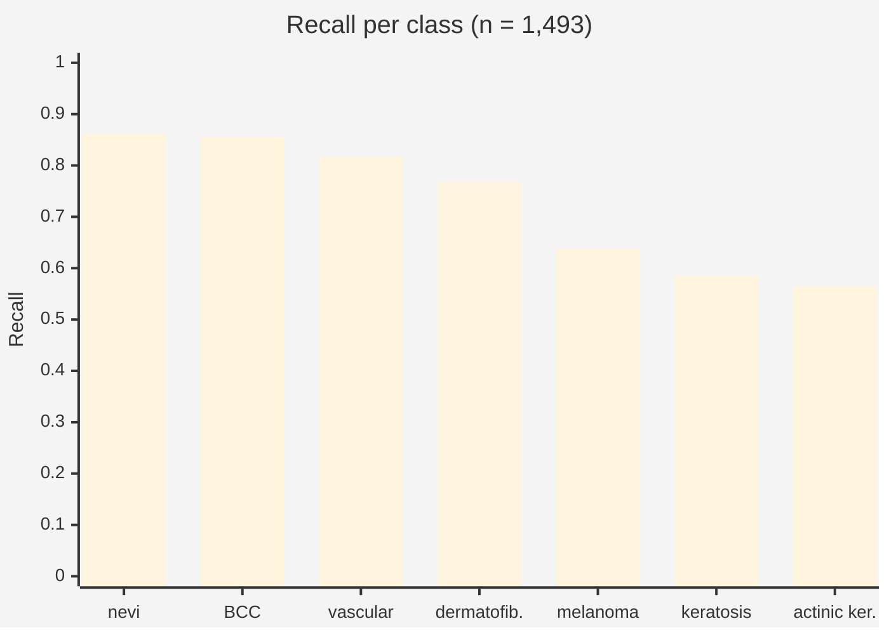

# Current results

!!! tip "Reading these numbers"
    Every metric here is defined in plain language in the [Glossary](glossary.md).

`skin_cancer_clean` — ResNet18 trained on a lesion-grouped split of HAM10000 and evaluated
on **1,493 images the model provably never saw**. First run in this project where every
verdict gate is active, so the first whose verdicts claim anything.

## Summary

| Pillar | Verdict | Result |
|---|---|---|
| Integrity | :material-check: **pass** | 0 shared lesions, 0 shared images across 1,493 test images |
| Performance | :material-check: **pass** | 79.6% top-1, 72.8% balanced |
| Privacy | :material-check: **pass** | membership-inference AUC 0.558 (0.5 = ideal) |
| Robustness | :material-alert: **warn** | 71.7% of predictions survive corruption |
| Fairness | :material-close: **fail** | 21.3-point accuracy gap across ITA skin-tone bins |

## What the headline number hides



| Class | Sensitivity | 95% CI | Specificity | PPV | Support |
|---|---:|:--:|---:|---:|---:|
| melanocytic_Nevi | 0.862 | [0.84, 0.88] | 0.909 | 0.952 | 1,009 |
| basal_cell_carcinoma | 0.855 | [0.76, 0.92] | 0.972 | 0.619 | 76 |
| vascular_lesions | 0.818 | [0.61, 0.93] | 0.997 | 0.818 | 22 |
| dermatofibroma | 0.769 | [0.50, 0.92] | 0.991 | 0.435 | 13 |
| **melanoma** | **0.638** | **[0.56, 0.71]** | 0.920 | **0.495** | 163 |
| benign_keratosis-like_lesions | 0.586 | [0.51, 0.66] | 0.958 | 0.622 | 157 |
| actinic_keratoses | 0.566 | [0.43, 0.69] | 0.972 | 0.422 | 53 |

Overall: top-1 **0.796** [0.775, 0.816], balanced **0.728**, and top-3 differential accuracy
**0.976** [0.967, 0.983].

!!! tip "Two things only visible once intervals and PPV are reported"
    **The differential is strong even where the top-1 call is not.** The correct diagnosis is
    in the model's top three for 97.6% of images. As a tool that proposes a ranked differential
    to a clinician — which is how dermatologists actually work — this is a far better system
    than 0.796 suggests. Reporting only top-1 understates it.

    **PPV is where melanoma really hurts.** When this model says *melanoma*, it is right about
    half the time (0.495). Sensitivity and PPV fail in opposite directions and a single accuracy
    figure hides both.

    And `dermatofibroma` at 0.769 has an interval of **[0.50, 0.92]** on 13 images — spanning
    half the possible range. Without the interval it reads as a mid-table result; with it, it
    reads as *unknown*.

!!! danger "80% accuracy, and it misses one melanoma in three"
    The clinically most important class is the second worst performer. The headline is
    dominated by the 1,009 nevi — 68% of the test set. This is the entire argument for
    per-class reporting, and for the balanced accuracy (72.8%) that sits seven points below
    the plain figure.

## Fairness

| ITA bin | Accuracy | Images |
|---|---:|---:|
| light (I–II) | 78.5% | 1,325 |
| medium (III–IV) | 96.3% | 108 |
| dark (V–VI) | 75.0% | 60 |

| ITA bin | Accuracy | 95% CI | Images |
|---|---:|:--:|---:|
| light (I–II) | 0.785 | [0.76, 0.81] | 1,325 |
| medium (III–IV) | 0.963 | [0.91, 0.99] | 108 |
| dark (V–VI) | 0.750 | [0.63, 0.84] | 60 |

The 21.3-point gap exceeds the 15-point `fail` threshold, and the intervals for the two extreme
groups do **not** overlap, so the difference is supported rather than noise.

!!! warning "But it is not the gap you would assume"
    The supported gap runs between **medium (0.963) and dark (0.750)** — driven by the small
    medium bin scoring unusually *high*, not by dark skin collapsing. The comparison most people
    expect, **light vs dark**, has overlapping intervals ([0.76, 0.81] against [0.63, 0.84]) and
    is therefore **not** a demonstrated difference on this data.

    89% of the test set falls in one bin, which is HAM10000's documented skew. ITA is also
    estimated from pixels rather than clinically assessed. Reporting the gap without its
    intervals would have supported a confident and probably wrong story.

## Robustness

| Corruption | Predictions unchanged | 95% CI |
|---|---:|:--:|
| brightness ×1.4 | 77.6% | [75.4, 79.7] |
| JPEG q=25 | 73.8% | [71.5, 76.0] |
| Gaussian blur r=2 | 71.7% | [69.4, 74.0] |
| noise σ=18 | 63.8% | [61.3, 66.2] |

Mean 71.7%, below the 85% `pass` threshold. Roughly one prediction in three flips under
noise that does not change the diagnosis.

## Privacy

Membership-inference AUC **0.5577** [0.529, 0.587] from 750 training and 750 held-out images.
The verdict is taken on the interval's upper bound, not the point estimate — an AUC of 0.59
whose interval reached 0.68 would not have been shown to be low risk. Mean
confidence in the true class was **0.873** on training images against **0.777** on unseen
ones — a real but small separation, landing in the "low risk" band.

## Explainability

Mean deletion faithfulness **0.45** over 7 Grad-CAM overlays: masking the highlighted region
costs the predicted class 45 percentage points of confidence on average, which puts it in
the "partly faithful" band. Reported as `info` — there is no defensible universal threshold
for "faithful enough", and 7 overlays is an illustration rather than a measurement.

## Experiment 1 — a cost-sensitive decision rule

**No retraining.** Identical weights; only the rule that reads the probabilities changed.
`argmax` maximises expected accuracy, which on imbalanced data means under-calling rare
classes. Scaling melanoma's probability by *w* lets it win against a nevus it would otherwise
lose to. The weight was chosen by sweeping on the **validation** manifest — tuning it on test
would be fitting the decision rule to the test set, a quieter form of leakage that the
integrity check would not catch.

| Run | Melanoma sensitivity | Melanoma PPV | Nevi sensitivity | Top-1 | Balanced | Top-3 |
|---|---:|---:|---:|---:|---:|---:|
| baseline (argmax) | 0.638 [0.56, 0.71] | 0.495 | 0.862 | **0.796** | 0.728 | 0.976 |
| melanoma ×5 | 0.804 [0.74, 0.86] | 0.379 | 0.784 | 0.754 | 0.721 | 0.979 |
| melanoma ×50 | **0.945** [0.90, 0.97] | 0.264 | 0.640 | 0.656 | 0.673 | 0.974 |

**Melanoma sensitivity rose from 0.638 to 0.945 — from missing one melanoma in three to
missing one in eighteen — without touching the model.** The cost is explicit: PPV falls from
0.495 to 0.264, so three in four melanoma flags become false alarms, and nevi sensitivity
drops from 0.862 to 0.640.

!!! danger "The result that justifies this whole pillar redesign"
    Top-1 accuracy **falls** from 0.796 to 0.656, and the performance verdict goes from
    `pass` to `warn`. An evaluation that measured only accuracy would have **rejected** the
    change that made the model dramatically better at catching cancer.

    This is not a hypothetical. It is why the clinical metrics had to be built before the
    first experiment, and it is the concrete argument against a single headline score.

Note also that top-3 accuracy is nearly unmoved (0.976 → 0.974): reordering the top-1 barely
disturbs which three diagnoses are in contention. As a ranked differential, all three
configurations are equally good — they differ only in what they *commit to*.

**Which one is correct?** None of them, until an intended use is declared. For a rule-out tool
("this is not cancer, go home"), 0.638 sensitivity is indefensible and ×50 is arguably still
too low. For a tool that reorders a dermatologist's worklist, the baseline's precision may be
worth more than the recall. Same model, same test set, opposite conclusions — which is exactly
why this project refuses to emit one number.

!!! note "Honest caveat on transfer"
    The weight was tuned for 0.85 melanoma sensitivity on validation and delivered 0.945 on
    test — better than targeted, and the intervals do not overlap (val [0.79, 0.90] against
    test [0.90, 0.97]). The operating point transferred, but validation and test evidently
    differ somewhat in melanoma difficulty, so a tuned threshold should not be assumed to
    carry over exactly.

## Experiment 2 — focal loss and oversampling (a negative result)

Two standard remedies for class imbalance, each changing exactly one thing against the
baseline, both trained on the same manifests and evaluated on the same frozen test set.
Oversampling and class weighting are competing answers to the same problem, so the
oversampling variant turns class weighting **off** rather than stacking them.

| Configuration | Melanoma sensitivity | Melanoma PPV | Top-1 | Balanced | Top-3 |
|---|---:|---:|---:|---:|---:|
| baseline (CE + class weights) | 0.638 [0.56, 0.71] | 0.495 | 0.796 | 0.728 | 0.976 |
| focal loss γ=2 + weights | 0.497 [0.42, 0.57] | **0.540** | 0.784 | 0.698 | 0.976 |
| balanced oversampling, no weights | 0.656 [0.58, 0.72] | 0.448 | 0.785 | 0.685 | 0.976 |
| *baseline + melanoma ×5 (rule only)* | *0.804 [0.74, 0.86]* | *0.379* | *0.754* | *0.721* | *0.979* |
| *baseline + melanoma ×50 (rule only)* | ***0.945** [0.90, 0.97]* | *0.264* | *0.656* | *0.673* | *0.974* |

**Neither training intervention produced a demonstrated improvement.** Focal loss *lowered*
melanoma sensitivity by 14 points and oversampling raised it by 1.8 — and in both cases the
intervals overlap the baseline's, so neither difference is established. Validation balanced
accuracy was 0.724 / 0.724 / 0.717: from the aggregate alone, nothing happened at all.

!!! note "The comparison that makes this worth reporting"
    A **free change to the decision rule** — no retraining, no new data — moved melanoma
    sensitivity from 0.638 to 0.945. Two days of standard imbalance engineering moved it by an
    amount indistinguishable from noise.

    Focal loss did do something, just not the intended thing: it made the model *more*
    conservative, buying the best melanoma PPV of any configuration (0.540) at the cost of
    sensitivity. That is a legitimate trade, but it is the opposite of what it was reached for.

**Top-3 accuracy is 0.974–0.979 across all five configurations.** None of these interventions
changed what the model *knows* — the correct diagnosis sits in its top three just as often
either way. They only change where it draws the line for its single committed answer. That is
precisely why a decision rule outperformed retraining here, and it suggests the next real gain
has to come from more information (more minority images, external data), not from reshaping
the same loss surface.

**No configuration dominates any other** across the eight compared metrics — five of five
survive as genuine trade-offs, each best at something.

## Experiment 3 — a 3x larger, more diverse training set

The experiment the previous section asked for. Step 2 ended by arguing that the next real gain
"has to come from more information (more minority images, external data), not from reshaping the
same loss surface." This tests that directly: ISIC 2019 as training data, **3.1x the images and
5.4x the melanoma**, with every validation and test lesion held back so the test set does not
move. One variable changes — the training corpus. Same architecture, epochs, learning rate,
class weighting, and the same 1,508 validation images.

| | baseline (HAM10000) | ISIC 2019 |
|---|---:|---:|
| training images | 7,014 | **21,770** |
| melanoma in training | 774 | **4,183** |
| validation balanced accuracy | 0.7236 | 0.7244 |

### What did not change

| Metric | baseline | ISIC 2019 | Established? |
|---|---:|---:|---|
| Top-1 accuracy | 0.796 [0.78, 0.82] | 0.806 [0.79, 0.83] | no — intervals overlap |
| Top-3 accuracy | 0.976 [0.97, 0.98] | 0.977 [0.97, 0.98] | no |
| Balanced accuracy | 0.728 | 0.713 | — |
| Melanoma sensitivity | 0.638 [0.56, 0.71] | 0.620 [0.54, 0.69] | no |
| BCC sensitivity | 0.855 [0.76, 0.92] | 0.750 [0.64, 0.83] | no |
| Actinic keratoses sensitivity | 0.566 [0.43, 0.69] | 0.358 [0.24, 0.49] | no |
| Membership-inference AUC | 0.558 [0.53, 0.59] | 0.539 [0.51, 0.57] | no |

**Not one of those differences is established.** Every interval overlaps, so by this project's
own rule none of them is a claim — including the +1.0 point of top-1 accuracy, which is the sort
of number a paper would report as an improvement.

Melanoma sensitivity, the metric this whole line of work is about, moved **-1.8 points** on 5.4x
the melanoma images.

### What did change

Robustness, and it is the only demonstrated gain in the project so far:

| Corruption | baseline | ISIC 2019 | Established? |
|---|---:|---:|---|
| Gaussian noise | 0.638 [0.613, 0.662] | 0.722 [0.699, 0.744] | **yes, +8.4 points** |
| Brightness | 0.776 [0.754, 0.797] | 0.822 [0.802, 0.840] | **yes, +4.6 points** |
| Blur | 0.717 [0.694, 0.740] | 0.741 [0.719, 0.763] | no |
| JPEG | 0.738 [0.715, 0.760] | 0.776 [0.754, 0.796] | no |

That is what the extra data actually bought, and it is explicable: ISIC 2019 aggregates several
contributing archives, so the corpus spans more cameras, magnifications and lighting than
HAM10000 alone. The model became harder to perturb without becoming more accurate.

### And what got worse

| Subgroup (ITA-estimated) | baseline | ISIC 2019 |
|---|---:|---:|
| light (I–II), n=1,325 | 0.785 | 0.806 |
| medium (III–IV), n=108 | 0.963 | 0.926 |
| **dark (V–VI), n=60** | **0.750** | **0.600** |
| largest gap | 0.213 | **0.326** |

The gap is separated in both runs, so each is a real finding rather than noise. Accuracy on the
darkest bin fell 15 points while accuracy on the lightest bin rose — the aggregate improved by
concentrating its gains where the data already was. On n=60 the dark-skin estimate is
individually fragile, which is exactly why the pillar reports the bin count next to it; the
direction is still the opposite of what more data is assumed to do.

!!! note "Why this is the most useful result yet"
    Three interventions have now been measured against the same frozen test set. Focal loss and
    oversampling did nothing. Tripling the training set did nothing to accuracy or melanoma
    sensitivity. A **free change to the decision rule** — no retraining, no new data — moved
    melanoma sensitivity from 0.638 to 0.945.

    Top-3 accuracy is 0.974–0.979 across all six configurations, HAM10000 and ISIC alike. Three
    times the data did not change what the model *knows*. The bottleneck was never the number of
    images, and it is not the loss function either: it is where the model commits, which is a
    property of the decision rule and costs nothing to change.

### Two caveats that belong with the numbers

**The training and test distributions are no longer the same.** ISIC 2019 is a mixture of
archives; the test set is pure HAM10000. Part of the missing accuracy gain is likely that the
model now optimises for a distribution wider than the one it is scored on. Testing that needs an
external test set, not a larger training one — which makes the last bullet of roadmap step 5 the
interesting one.

**Actinic keratoses is not quite the same class in both vocabularies.** ISIC splits what
HAM10000 lumps: 197 images HAM calls `actinic_keratoses` are `SCC` to ISIC, and dropping SCC
removed 129 of them from training. The model therefore learned a narrower AK than the test set
asks it to predict, and AK shows the largest nominal drop of any class (-20.8 points, the closest
of any metric to separating). That is a label-definition artefact, not a data-volume effect.

## Experiment 4 — tuning the new model, and where experiment 3 was wrong

Experiment 3 compared a *tuned* old model against an *untuned* new one, and concluded that 3x the
training data bought no accuracy. At `argmax` that is true. It was also the wrong place to look.

`scripts/tune_decision.py` sweeps the melanoma weight on **validation** for both models. Below
`w=5` the two frontiers are identical. Above it they separate:

| matched validation PPV | old model | ISIC model | |
|---|---:|---:|---|
| 0.37 | 0.744 | 0.744 | same |
| 0.32 | 0.784 | 0.869 | +8.5, overlap |
| **0.26** | **0.852 [0.79, 0.90]** | **0.949 [0.91, 0.97]** | **+9.7, separated** |
| **0.24** | **0.881 [0.82, 0.92]** | **0.972 [0.94, 0.99]** | **+9.1, separated** |

More melanoma examples did not make the model more accurate. They made it **hold up better when
pushed**. Upweighting melanoma on the old model starts surfacing noise; on the ISIC model it
surfaces melanomas. The extra data moved the frontier — in the screening regime only, which is
precisely the regime this task cares about, and exactly where `argmax` cannot see.

### The one honest look at test

`w=30` is the ISIC analogue of the old model's `w=50`: it matches its **validation** PPV (0.263 vs
0.260), which is the only fair way to line two operating points up. Chosen on validation, then
evaluated once:

| Configuration | Melanoma sensitivity | Caught | **Missed** | PPV | False alarms | Top-1 |
|---|---:|---:|---:|---:|---:|---:|
| old, argmax | 0.638 [0.56, 0.71] | 104 | 59 | 0.495 | 106 | 0.796 |
| old, melanoma x50 | 0.945 [0.90, 0.97] | 154 | 9 | 0.264 | 430 | 0.656 |
| ISIC, argmax | 0.620 [0.54, 0.69] | 101 | 62 | 0.502 | 100 | 0.806 |
| **ISIC, melanoma x30** | **0.976 [0.94, 0.99]** | **159** | **4** | 0.259 | 456 | 0.657 |

**The best melanoma detector here misses 4 of 163.** But the +9.7 point validation advantage came
out as **+3.1 on test, with overlapping intervals** — so against the old model's `w=50` it is *not*
an established improvement.

!!! warning "That shrinkage is the lesson, not a disappointment"
    The weight was *selected* on validation, so validation necessarily flatters the point it
    selected. Test is the number that counts, and it is seen once. Had we swept on test and
    reported the best cell, we would have published +9.7 and it would have been fiction — a
    quieter form of the leakage this project exists to catch, and one the integrity check cannot
    detect because no image is shared.

**The test set is also now the binding constraint.** With 163 melanomas, a sensitivity near 0.97
carries an interval of roughly +/-0.03, so differences smaller than about 5 points cannot be
resolved on this data at all. Establishing a 3-point gain is not a modelling problem, it is a
sample-size problem — which is another argument for an external test set rather than a larger
training one.

### What this means for choosing a model

Nothing here is a diagnostic claim. At `w=30` the PPV is 0.259: roughly three of every four
melanoma flags are wrong, 456 false alarms to catch those 159. For **screening** — where a false
alarm costs a biopsy and a miss can cost a life — that is often the right trade. For anything
resembling diagnosis it plainly is not. The model cannot make that call; it can only report both
numbers honestly, which is the whole point of the framework.

## Experiment 5 — ResNet50: capacity is not the ceiling either

Resolution is not available as a lever here. The frozen test images are stored at 320x240, so
training above ~240 on the short side would only interpolate, and re-materializing them at higher
resolution would change the pixels seven published runs were scored on. That leaves capacity, so:
ResNet50 in place of ResNet18, **2.2x the parameters** (25.6M vs 11.7M), with every other setting
held fixed — same corpus, epochs, batch size, learning rate, image size, class weighting, seed.

| | ResNet18 | ResNet50 |
|---|---:|---:|
| parameters | 11.7M | 25.6M |
| training time (12 epochs, MPS) | 13.5 min | 37 min |
| **validation** balanced accuracy | 0.724 | **0.744** |
| test top-1 | 0.806 [0.79, 0.83] | 0.801 [0.78, 0.82] |
| **test top-3** | **0.9766 [0.968, 0.983]** | **0.9752 [0.966, 0.982]** |

The 2-point validation gain did not survive to test. Top-1 is unchanged, and top-3 came out
**0.0014 lower** with overlapping intervals.

**Top-3 accuracy is now 0.975-0.977 across all eight configurations** — two training corpora, two
architectures, two loss functions, a sampling scheme and three decision rules. Nothing tried so
far has changed what the model *knows*. Doubling the parameters was the cleanest test of the
capacity hypothesis available, and it came back negative.

Tuned on validation, the two frontiers differ by at most 0.04 in either direction with no
consistent sign (ResNet50 slightly ahead in the mid range, slightly behind at the extremes) — noise,
not a moved curve.

### What that leaves

Four levers have now been measured against the same frozen test set:

| Lever | Result |
|---|---|
| Loss function (focal, oversampling) | no effect |
| Training data volume (3.1x) | robustness +8.4 pts; accuracy unchanged; tuned frontier moved |
| **Decision rule** | **+30.7 pts melanoma sensitivity — the only large win** |
| Model capacity (2.2x parameters) | no effect |
| Resolution | foreclosed by the 320px test corpus |

A stable top-3 under all of that is a statement about the **information in the inputs**, not about
the models. And there is information in this dataset that no configuration has used: `age`, `sex`
and `localization` are carried on every manifest row — 98%, 98% and 90% populated in training,
100% in test — and feed **no model at all**. They exist only as fairness grouping keys.

A dermatologist uses site and age. An image-only classifier cannot. That is the next untested
lever, it costs no new data, and unlike capacity it adds signal rather than parameters.

## Training run

12 epochs, 4.6 minutes on MPS, batch size 32, lr 1e-4, class-weighted cross-entropy.

| Epoch | Train loss | Val accuracy | Val balanced |
|---:|---:|---:|---:|
| 1 | 1.081 | 0.670 | 0.652 |
| 4 | 0.462 | 0.737 | 0.708 |
| 8 | 0.303 | 0.755 | 0.707 |
| 11 | 0.188 | **0.807** | 0.698 |
| 12 | 0.213 | 0.792 | **0.724** ← kept |

!!! note "Why epoch 12 and not epoch 11"
    Epoch 11 had the best plain accuracy. Selection runs on **balanced** accuracy, because on
    a set that is 67% nevi, plain accuracy rewards a model for ignoring the rare classes.

## Reproducing

```bash
python scripts/materialize_images.py --max-size 320
python scripts/train_model.py scenarios/skin_cancer_clean.yaml
python scripts/run_scenario.py scenarios/skin_cancer_clean.yaml
```

Seed 42 throughout; the split manifests are committed. Results are bit-identical per device
but not across devices — `report.json` records `meta.device` for that reason.
