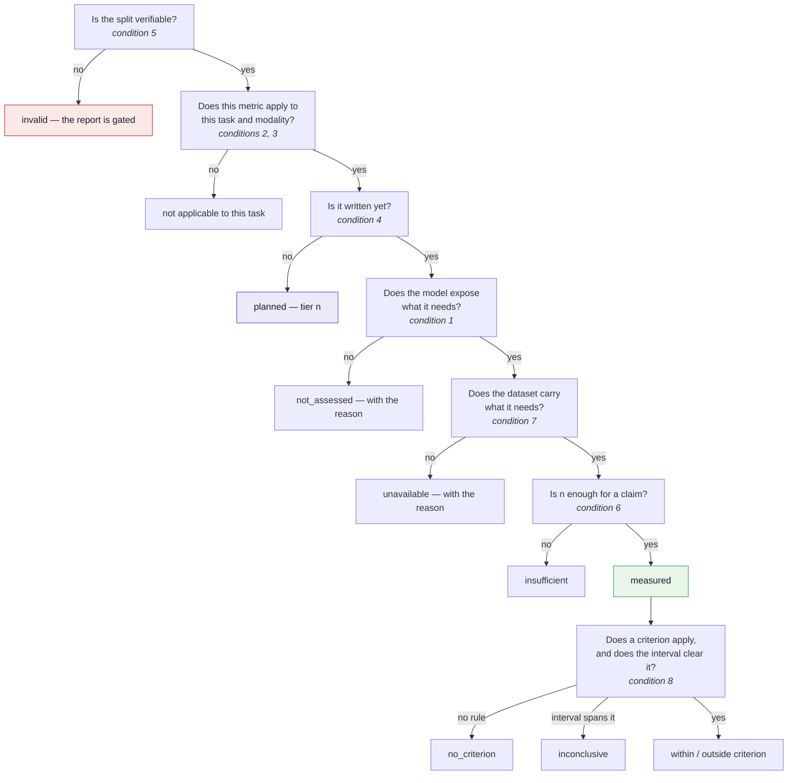
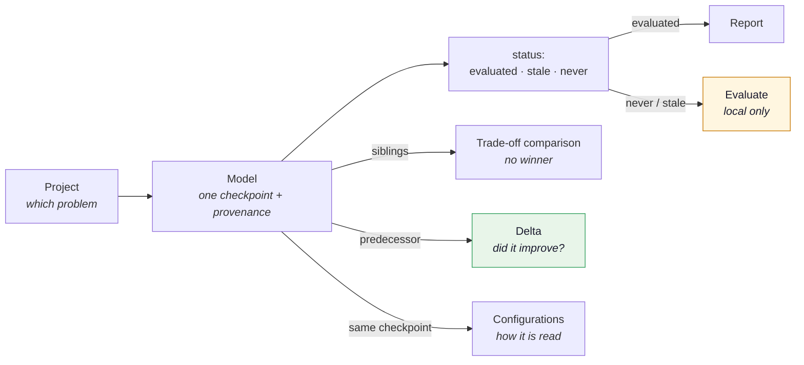

# UI/UX design — the component map

!!! abstract "Planning, not a specification"
    This page inventories the interface: what `showcase/app.py` renders **today**, what the
    rest of this plan will require it to render, and where each piece goes. It is the interface
    counterpart to [Direction](direction.md) — that page argues what the tool is *for*, this one
    says what has to be on screen for it to be that.

    [Phase E](ROADMAP.md#phase-e-the-interface) of the roadmap is four bullets. The other
    thirty-odd components are scattered across Phases A, B, D, F, G and I, the
    [no-composite-score section](ROADMAP.md#what-takes-its-place), and
    [A worked example](case-view.md). Collecting them is the point of this page.

    Written 2026-09-19. Nothing below is built beyond what the *Today* column says.

---

## The premise: availability is computed, not fixed

The single most important thing about this interface is the thing it does not yet have to do.
Today every scenario in this repository is a local checkpoint, so every report renders the same
six pillars with the same six metrics. That is a coincidence of the current data, not a property
of the design.

The moment a model arrives from a Hugging Face link
([Phase A](ROADMAP.md#phase-a-the-two-contracts-and-capability-gating)), **the set of sections a
report contains becomes a computed set**. Eight separate conditions decide whether any given
metric produces a row:

| # | Condition | Decides | Declared by | Defined in | Status |
|---|---|---|---|---|---|
| 1 | **Access level** — `labels` · `probs` · `logits` · `gradients` · `weights` · `training_data` | whether the number **can exist at all** | the model adapter | [The pillars](pillars.md#how-much-of-the-model-do-you-have) | planned — Phase A |
| 2 | **Task** — `classification` · `generation` | whether the metric **applies** | the scenario | [Phase A](ROADMAP.md#phase-a-the-two-contracts-and-capability-gating) | planned |
| 3 | **Modality** — `pixels` · `tokens` · `audio` · `rows` | whether the metric **applies** | the adapter's `dataset.load()` | [Phase A](ROADMAP.md#phase-a-the-two-contracts-and-capability-gating) | planned |
| 4 | **Tier** — shipped · 1–5 · port | whether the metric **is written yet** | the catalogue | [The pillars](pillars.md#planned-the-full-catalogue) | is the build order |
| 5 | **Integrity gate** — a contaminated split raises before any metric runs | whether **anything else** may be reported | the runner | [Split integrity](integrity.md) | **built** |
| 6 | **Sample-size gates** — `n >= 30`, `min(populated) >= 10`, intervals separating | whether a **claim** is supported | the metric | `performance/classification.py`, `fairness/skin_tone_ita.py` | **built** |
| 7 | **Data availability** — a train/holdout split, label-space overlap, metadata columns present | whether the metric **can run on this dataset** | the dataset | `privacy/mia.py`, [Phase B](ROADMAP.md#phase-b-what-you-can-and-cannot-verify-about-someone-elses-model) | partly |
| 8 | **`ci_gate`** — a criterion decides only when the interval clears it | whether a **judgement** may be made | the policy file | [Phase G](ROADMAP.md#phase-g-the-findings-layer-measurement-judgement-and-the-line-between-them) | planned |

Conditions 1–4 decide what is on the page. 5–7 decide what a section may claim. 8 decides
whether a criterion is allowed to speak. They fire in that order:



Three consequences for the interface, none of them obvious from the roadmap as written:

**The pillar row is not six fixed columns.** It is the applicable set for *this* run, and the
seventh pillar — [safety](pillars.md#safety-what-happens-if-someone-acts-on-this) — is
`unavailable` for `task: classification` **by declaration rather than by omission**. The app
must distinguish *not applicable to this task* from *not evaluated in this run*; today it
renders both as `–` with the help text "Not evaluated in this run.", which would be false for
every artifact currently published.

**"Planned" and "not assessed" are the same component.** An authored absence (*tier 4 — needs
the text domain*) and a computed one (*this model is reachable only through an API, so gradients
do not exist for it*) are both the app saying **this is not here, and here is why**. Building
two visual languages for absence would teach a reader that one kind of gap matters and the other
does not. One component, two sources.

**Coverage cannot be built before Phase A.** "13 of 19 **applicable** metrics measured" requires
knowing the applicable set, which is precisely what conditions 1–3 supply. Until then the
denominator would be invented, which is the one thing the
[coverage map](ROADMAP.md#what-takes-its-place) exists not to do.

!!! danger "The case that is worse than a gap"
    `explainability.complexity` needs an *attribution*, not gradients. On a white-box model it
    scores Integrated Gradients; on a black-box model it scores occlusion attributions. **The row
    is populated either way and the two numbers are not the same measurement.**

    A gap is visible; this is not. Every such metric records which method produced the array it
    scored, and that record has to be on screen next to the number — not only inside the
    comparability key. See [Phase G](ROADMAP.md#comparing-models-that-were-not-evaluated-under-the-same-suite),
    failure mode 2.

---

## The second premise: the app browses artifacts, the user has models

The interface has **no concept of a model.** It discovers `artifacts/<id>/` folders and calls
each one a model on the tile. That works while every model has been evaluated exactly once, and
breaks the moment the real question is asked:

> *Here are my models. I want to evaluate one of them — see which are already evaluated, and
> compare against the previous version where I improved something.*

Every noun in that sentence is a thing the app cannot currently represent. An artifact is an
**output**; a model is an **input**. The gallery lists outputs and labels them inputs.

### What the scenarios actually contain

Two facts, read off `scenarios/*.yaml` rather than assumed:

**`model.id` is not a model identity.** It collides in one direction and splits in the other:

| | |
|---|---|
| `skin-lesion-resnet18-clean` | names **three different checkpoints** — `skin_cancer_clean.pt`, `skin_cancer_focal.pt`, `skin_cancer_oversample.pt` |
| `skin_cancer_isic.pt` | **one checkpoint**, appearing under five different `model.id`s across the internal and external scenarios |

So the mapping between `model.id` and a trained artefact is many-to-many in both directions.
`model.id` is a **run label**, and the only thing that identifies a model is the checkpoint
itself.

**Eight of twenty-three scenarios are the same checkpoint read differently** — identical weights,
different `decision_weights`:

| Checkpoint | Evaluation set | Scenarios that differ only in how probabilities are read |
|---|---|---|
| `skin_cancer_clean.pt` | `ham10000_test.csv` | baseline · `melanoma ×5` · `melanoma ×50` |
| `skin_cancer_isic.pt` | `derm7pt_test.csv` | baseline · `melanoma ×30` · absent-class masked |
| `skin_cancer_isic.pt` | `ham10000_test.csv` | baseline · `melanoma ×30` |

The whole repository is therefore **15 trained checkpoints · 23 configurations · 24 artifacts**,
and the gallery shows only the last number.

That matters beyond tidiness. [Results](results.md) records that the decision rule is where the
leverage is — sensitivity 0.638 → 0.976 with no retraining, against four training-side changes
that each moved it by an amount indistinguishable from noise. **The axis carrying the project's
largest effect is the one the current gallery hides most thoroughly**, buried inside a lineage
card's dropdown.

### Three relationships, three different affordances

`card.lineage` conflates all three today. `ResNet18 · clean split` contains three distinct
checkpoints *and* three decision rules in one card, which is why the gallery is hard to read.
They are not the same kind of thing and they do not want the same control:

| Relationship | Example here | The question it answers | The affordance |
|---|---|---|---|
| **Configuration** — one checkpoint, read differently | `melanoma ×5` vs `×50` | how should the output be read? | switch the rule; free, no retraining |
| **Variation** — sibling approaches | focal loss vs oversampling vs ResNet50 | which approach is better? | trade-off comparison, **no winner** |
| **Succession** — a version meant to replace another | v1 → v2 | did I improve it? | **delta**, objective, needs no criterion |

!!! warning "The word *version* is doing two jobs"
    Almost nothing in this repository is succession. Focal loss, oversampling, ResNet50 and the
    larger corpus are **siblings**, not successors — none was built to replace another. Treating
    them as a version history would invent a linear story the experiments do not have, and would
    imply the last one is the best.

    The distinction has teeth because the comparison differs:
    [Direction](direction.md#the-judgement-that-needs-no-threshold-at-all) notes that comparing a
    model to *its own previous version* needs no authored criterion at all, while comparing
    siblings is a trade-off that the data explicitly **cannot** settle. Succession is declared by
    the author, never inferred from a timestamp.

### The entity model

Four levels, where the app has two:

| Level | Is | Count today | Identity |
|---|---|---|---|
| **Project** | the problem: task, label space, evaluation-set family | 1 | declared |
| **Model** | a trained checkpoint with its provenance | 15 | **checkpoint content hash** |
| **Configuration** | a model plus how it is read: decision rule, evaluation set, metric set | 23 | the scenario |
| **Evaluation** | an executed configuration | 24 artifacts / 44 snapshots | manifest content hash |

**Identity must be the checkpoint's content hash**, for the same reason the evaluation manifest
carries one: a name can be reused and a file can be regenerated. The evidence above shows
`model.id` already failing at exactly this. Without it, *"which version is this?"* is
unanswerable and a delta view can silently compare a model against itself.

### Where the registry comes from, and what the public deploy may do

The constraint decides the design: `.pt` files are gitignored, the public deploy has no
checkpoints and no torch. So the registry cannot be discovered from disk.

- The model list is a **committed declaration** — provenance, training manifest, architecture,
  checkpoint hash — and never the file itself.
- **Evaluation status is derived** from which artifacts exist, exactly as the catalogue is today.
- **Running an evaluation is local-only**, behind the torch gate that
  [Phase E](ROADMAP.md#phase-e-the-interface) already specifies. The public deploy shows the
  registry read-only and says so.

An unevaluated model is therefore not a blank tile. It is the
[absence component](#placeholders-have-to-be-gated) again — *what would be here, and why it is
not* — with "evaluation runs locally" as the reason. Three kinds of absence, one visual language.

### What this changes elsewhere

This is not an extra page. It moves the root object, and six planned components change shape:

**Comparability enforcement moves to selection time.** *"Compare against the previous version"*
is only valid when both were scored on the same manifest — comparability is the content hash,
not the model's identity. So when a model with a predecessor is selected for evaluation, the
studio **pre-selects the predecessor's evaluation manifest**, making the delta possible by
construction; choosing a different one warns that the comparison will not be available,
**before** the run rather than after. This is the cheapest possible moment to enforce an engine
invariant, and it is the strongest single argument for building the registry.

**`card.group` and `card.lineage` stop being authored.** Group becomes the project and lineage
splits into model and configuration, both derived. The invariant holds unchanged: presentation
narrows what is *shown* and never widens what may be *compared*.

**Archive becomes supersession.** A flat `card.status: archived` is the wrong shape once models
have predecessors. A `supersedes:` pointer gives the archive behaviour *and* the delta view's
edge from one declaration, and it records **which** version replaced this one rather than only
that something did.

**The delta view gets a home** — on the model page, not in the comparison view. It is a property
of one model's history, not a cross-run query.

**Cost estimation moves onto the primary path.** *"I do not want to compute them all"* means the
selection screen must show what a run costs **before** it starts — the `cost` declaration from
[Phase A](ROADMAP.md#phase-a-the-two-contracts-and-capability-gating) times *n* times the metric
set. Planned as part of preflight; now load-bearing.

**Coverage gains a portfolio axis.** Alongside *"how much of this model was measured"* sits
*"how many of my models have been measured at all"* — still a completeness statement, never a
rating, and subject to the same rule.

**A third status appears: stale.** *"Already evaluated"* has three answers, not two — evaluated
under the current suite, evaluated under an older one, never evaluated. The metric `version`
field from [Extending](extending.md#planned-the-conformance-checklist) makes the middle case
computable, and without it a reader will read an old evaluation as a current one.

### Navigation



---

## Two settled decisions

These were open when this page was written and were decided on 2026-09-19. They constrain
everything below, so they come first.

### The primary reader is the non-specialist who will spend twenty minutes

Not the examiner with five minutes, and not the author.

The decisive argument is structural rather than aesthetic. **A reader with five minutes wants
one number.** Naming them primary puts quiet pressure on every future layout decision toward a
composite score — the one thing [this project refuses outright](ROADMAP.md#no-composite-score).
Choosing the twenty-minute reader removes that pressure at its source instead of resisting it
component by component.

Three supporting reasons:

- It is **already a commitment, stated twice** in `CLAUDE.md` — *"the dashboard is aimed at
  readers who have never seen a Responsible-AI report"*. This decision costs nothing in
  consistency; it honours a choice the interface has not yet implemented.
- **The thesis requires it.** [Direction](direction.md#the-tool-is-not-a-metric-library) says the
  libraries answer *"what is the number?"* and this answers *"should anyone believe it?"*
  Believability cannot be skimmed. A skimmer can only be sold a verdict, which is exactly what
  this tool declines to give.
- **The skimmer is served for free** by the first screen. They are a *depth*, not a separate
  design target.

The author is served by a **different page**. The comparison view stays dense and keeps raw
flattened keys behind its toggle — someone who knows what `ppv_test_prevalence` means should not
scroll past its definition. `views/compare.py` is not simplified in the primary reader's name.

The eventual real user — someone evaluating their own model
([Phase D](ROADMAP.md#phase-d-the-two-entry-tracks-one-command)) — is this same reader plus the
studio pages, so the choice is on the path rather than a detour.

!!! tip "The mechanism, and the rule it produces"
    **Progressive disclosure by depth on the page, never by click.**

    This turns a persona into something testable, and it immediately condemns the current
    build: thirteen collapsed expanders per report means the wording the engine ships — the part
    written with the most care — is invisible by default. Scrolling is depth; an expander is a
    decision the reader has to make before they know what is inside.

    **Acceptance criterion:** the first screen answers *"what did this evaluation establish?"*
    with no scrolling and no clicking.

    **Tie-break:** on Overview and Report the non-specialist wins. On Compare the author wins.

The honest cost: a page built for twenty minutes can read as dense at five. The first-screen
rule is the mitigation and it is checkable, which makes this a managed risk rather than a hope.

### Findings are ordered by strength of evidence, never by how good the number is

> **The ordering must be symmetric in good and bad news.** A model *provably fine* on fairness
> ranks exactly as high as one *provably unfair*. An ordering that only ever promotes bad news
> is a rating wearing a different hat.

| Tier | Contains | Renders as |
|---|---|---|
| **0 — gate** | integrity `invalid` / `unavailable` | a banner above everything; never a strip entry |
| **1 — established** | `measured` **and** the interval clears a stated reference (`control` / `chance` / `criterion`) | the findings strip |
| **2 — computed** | `measured`, but no reference exists or the interval spans it | the pillar sections only |
| **3 — absent** | `insufficient` · `not_assessed` · `unavailable`, each with its reason | the coverage map |

Within a tier, **fixed pillar order** — integrity, performance, fairness, robustness,
explainability, privacy, safety. Stable, carries no judgement, and it keeps rows from moving
when two reports are read side by side.

This gives a clean division of labour that caps the strip however far the catalogue grows: **the
strip says what was established; the [coverage map](ROADMAP.md#what-takes-its-place) says what
was not, and why.**

#### What it produces on the real artifacts

`skin_cancer_isic`, n=1,493. All six findings carry `measured` today, so the current page treats
them as equals:

| Tier | Finding | Why it lands there |
|---|---|---|
| 1 | Clean split — none of 1,493 test images shares a lesion with the 23,278 trained on | definitive |
| 1 | **33-point accuracy gap** — dark 0.60 (n=60) against medium 0.93 (n=108) | *"their 95% intervals do not overlap"* |
| 1 | **Membership is distinguishable** — MIA AUC 0.5388 [0.51–0.57] | *"the interval lies entirely above 0.5 (chance)"* |
| 2 | top-1 0.806 [0.79–0.83] · stability 76% · faithfulness 0.3 | real numbers with no reference to clear |

The two findings currently buried four screens down rise to the top — **and nobody had to decide
that 33 points is bad.** The ordering does epistemic work, not evaluative work. That is the test
it has to pass.

`skin_cancer`, n=7. The strip comes back **empty** and the banner carries the page: *"Split
integrity could not be verified. No claim in this report is supported at n=7."* Which is the
true headline for that run, and one the current page never states.

#### Two things this forces

**The engine needs `details["baseline"]` before the strip can be built.** Tier 1 is not
machine-readable today — `measured` means three different things across six metrics:

| Metric | What `measured` currently means | Where |
|---|---|---|
| `performance.classification` | `n >= 30` | `classification.py:122` |
| `fairness.skin_tone` | the subgroup intervals separate | `skin_tone_ita.py:117` |
| `privacy.mia` | nothing — it is unconditional; the separation claim lives only in prose | `mia.py:122` |

The app must not recover this by parsing summary text. The fix is
[Phase G](ROADMAP.md#phase-g-the-findings-layer-measurement-judgement-and-the-line-between-them)'s
baseline object — `{kind, value, cleared}` — roughly ten lines per metric, written by whoever
understands that statistic, exactly as the roadmap already prescribes for aggregates. It is
**pulled forward ahead of the rest of Phase G**, because the strip needs it and Phase G needs it
regardless.

!!! bug "The ordering surfaces a real defect"
    `explainability/gradcam.py:127` hardcodes `verdict="measured"` — no sample-size gate and no
    baseline. On the 7-image fixture explainability is therefore the **only** pillar reporting
    `measured`, and it reports a *higher* faithfulness (0.669) than the 1,493-image run (0.3).

    Under this ordering it would be promoted to the top of an otherwise-empty strip: a fake
    headline on the run that exists to demonstrate honesty at small n. The ordering did not
    create this; it made it visible.

    Two separate problems, and only one of them belongs to the interface. The hardcoded verdict
    is fixed with the baseline field ([step 4](#build-order)). *Which* seven images are scored —
    the first seven of a sorted manifest, six of them nevi on the full run — is a sampling
    question tracked in the [roadmap](ROADMAP.md#the-open-scientific-work).

#### The honest counterargument

"Established" still implies importance, and a *supported 1-point gap* outranks an *unsupported
30-point gap*. That is correct for a tool whose claim is about evidence rather than effect size,
but it is a real editorial choice, so two mitigations are not optional: the **effect size is
visible in the strip entry itself**, and the ordering is **stated on screen in one line** —
*"Ordered by strength of evidence, not by how good the numbers are."* The comparison view
already explains its own refusals; this is the same habit.

---

## What exists today

Seventeen components, all in one 917-line `showcase/app.py`, across three views.

| # | Component | Today | Fate |
|---|---|---|---|
| 1 | Route state — `session_state` + `st.rerun()` | no URLs, no browser back | **replaced** by `st.navigation` / `st.Page` |
| 2 | `← Back to overview` | the only way back | **replaced** by a breadcrumb |
| 3 | Gallery title + pillar caption | derived from `PILLARS` | keep → Overview |
| 4 | `What am I looking at?` expander | the only onboarding surface | keep |
| 5 | Group sections (`card.group`) | five sections | keep |
| 6 | `_tile` | emoji, name, domain · dataset, description, button | keep, gains a headline number |
| 7 | `_lineage_card` | collapses configurations, leads with **Compare** | keep |
| 8 | Report header | domain · model · dataset, optional HF link | **absorbed** into the provenance strip |
| 9 | SAMPLE banner | `card.sample` | keep the mechanism — the fixture it was built for was removed 2026-09-24 |
| 10 | At-a-glance pillar row | six `st.metric`, verdict emoji as the value | keep the slot, rebuild |
| 11 | `What do the icons mean?` | verdict vocabulary | keep |
| 12 | Pillar section header + question | `PILLAR_QUESTION` | keep |
| 13 | Finding block | `what` inline, summary in `st.info`, `how`+`limits` in an expander | **replaced** by the info box |
| 14 | Metric explanation cards | `core/glossary.py`, in an expander | keep |
| 15 | `render_chart` | `bar` 70 · `scale` 43 · `heatmap` 22 · `images` 10 · `line` **0** | keep, gains baseline markers |
| 16 | Comparison view | grouping rules, blocked runs, repeat collapse, multiselect, dominance verdict, table, legend, trade-off scatter, bar | keep all, re-laid out |
| 17 | Incomparable-groups footer | `st.error` | keep |

### Measured in the browser, 2026-09-19

Facts about the current build, not impressions:

- A report is **8.5 screens tall** (7,617 px at a 900 px viewport) with **13 collapsed
  expanders** and no in-page navigation. The at-a-glance row looks like a table of contents and
  is not clickable.
- **On a full run the at-a-glance row carries no information.** On `Balanced oversampling` all
  six pillars render an identical `📊 Measured`. The row occupying the most valuable space on
  the page says only that things were run.
- The strongest finding in that report — a **25-point accuracy gap** between dark (0.72, n=60)
  and medium (0.96, n=108) skin, intervals separated — is body text **four screens down**.
  Nothing above it indicates the report contains a finding at all.
- On the 7-image run the hierarchy inverts wrongly: `split_leakage · Not computable`, which
  makes every other number provisional, renders at the same visual weight as the five pillars
  beside it.
- The comparison table is **17 runs wide**; five columns fit, and the `best` column — the one
  the reader came for — is behind horizontal scroll.
- The trade-off scatter overplots at 17 points, and the collision is worst exactly at the
  interesting corner.
- `📊` is used for three different jobs on one page: pillar status, metric status, and the
  result box. In one of the three it means nothing.

---

## What the plan requires

Thirty-four further components. The **Gate** column names the condition above that decides
whether the component renders at all.

### Shell and navigation

| # | Component | Source | Gate |
|---|---|---|---|
| 18 | `st.navigation` / `st.Page`, real URLs, working back button | [Phase E](ROADMAP.md#phase-e-the-interface) | — |
| 19 | Module split — `catalog.py`, `render.py`, `views/{overview,report,compare}.py` | [Phase E](ROADMAP.md#phase-e-the-interface) | — |
| 20 | **Archive** (`card.status`) + disclosure of comparable runs it hides | [Phase E](ROADMAP.md#phase-e-the-interface) | — |
| 21 | **Absence component** — one renderer for authored *and* computed gaps | this page | 1–4, 7 |

### Report — identity and provenance

| # | Component | Source | Gate |
|---|---|---|---|
| 22 | **Access-level badge** | [Phase A](ROADMAP.md#phase-a-the-two-contracts-and-capability-gating) · [pillars](pillars.md#how-much-of-the-model-do-you-have) | 1 |
| 23 | **Task and modality** in the header | [Phase A](ROADMAP.md#phase-a-the-two-contracts-and-capability-gating) | 2, 3 |
| 24 | **Preprocessing fingerprint** | [Phase B](ROADMAP.md#phase-b-what-you-can-and-cannot-verify-about-someone-elses-model) | 7 |
| 25 | **Intended-use profile** + diff against the default | [Phase G](ROADMAP.md#phase-g-the-findings-layer-measurement-judgement-and-the-line-between-them) | 8 |
| 26 | **Evaluation card export** — Markdown/PDF, no composite number | [what takes its place](ROADMAP.md#what-takes-its-place) | — |

### Report — the integrity gate

| # | Component | Source | Gate |
|---|---|---|---|
| 27 | **Provenance panel** — `integrity.provenance`, never "clean" when undeclared | [Phase B](ROADMAP.md#phase-b-what-you-can-and-cannot-verify-about-someone-elses-model) | 7 |
| 28 | **Corpus-ancestry check** | [Phase B](ROADMAP.md#phase-b-what-you-can-and-cannot-verify-about-someone-elses-model) | 1 |
| 29 | **Label-space compatibility** + which classes go unscored | [Phase B](ROADMAP.md#phase-b-what-you-can-and-cannot-verify-about-someone-elses-model) | 7 |
| 30 | **Gating layout** — `invalid` blocks the page rather than occupying one sixth of a row | [Direction](direction.md#the-line) | 5 |

### Report — findings

| # | Component | Source | Gate |
|---|---|---|---|
| 31 | **Coverage map** — measured / inconclusive / not assessed, and why | [what takes its place](ROADMAP.md#what-takes-its-place) | 1–4, 7 |
| 32 | **Seven-pillar row**, clickable, carrying headline numbers | [Phase I](ROADMAP.md#safety-the-seventh-pillar) | 2 |
| 33 | **"Not applicable to this task"** distinct from "not evaluated" | [Phase I](ROADMAP.md#safety-the-seventh-pillar) | 2 |
| 34 | **Status vocabulary** — seven statuses replacing four | [Phase G](ROADMAP.md#phase-g-the-findings-layer-measurement-judgement-and-the-line-between-them) | 6, 8 |
| 35 | **`status_reason` always visible** — an abstention without a reason is a bug | [Phase G](ROADMAP.md#phase-g-the-findings-layer-measurement-judgement-and-the-line-between-them) | — |
| 36 | **Five-question info box**, open, identical every time | [Extending](extending.md#planned-the-info-box-a-metric-must-be-able-to-fill) | — |
| 37 | **`explain.impact`** — who is affected, in this clinical context | [what takes its place](ROADMAP.md#what-takes-its-place) | — |
| 38 | **Criterion card** — threshold, `rationale`, `source`, `references` | [Phase G](ROADMAP.md#phase-g-the-findings-layer-measurement-judgement-and-the-line-between-them) | 8 |
| 39 | **Baseline marker** — `control` / `chance` / `criterion`, at visibly different weight | [Phase G](ROADMAP.md#phase-g-the-findings-layer-measurement-judgement-and-the-line-between-them) | — |
| 40 | **Gap in the indicator's own unit** — never normalised onto a shared scale | [Phase G](ROADMAP.md#phase-g-the-findings-layer-measurement-judgement-and-the-line-between-them) | — |
| 41 | **Method and configuration on screen** — which attribution, attack, budget produced this | [pillars](pillars.md#the-same-split-exists-in-every-pillar) | 1 |
| 42 | **Every metric renders something** — `scale` by default for a bare scalar | [Phase E](ROADMAP.md#phase-e-the-interface) | — |
| 43 | **Declared tensions** — what cannot be simultaneously optimised | [what takes its place](ROADMAP.md#what-takes-its-place) | — |

### Compare

| # | Component | Source | Gate |
|---|---|---|---|
| 44 | **Access-level statement at the group top** + per-run badges | [Phase G](ROADMAP.md#comparing-models-that-were-not-evaluated-under-the-same-suite) | 1 |
| 45 | **"Measured for this model only; not used in the comparison"** | [Phase G](ROADMAP.md#comparing-models-that-were-not-evaluated-under-the-same-suite) | 1 |
| 46 | **Delta against the previous version** — objective, needs no criterion | [Direction](direction.md#the-judgement-that-needs-no-threshold-at-all) | — |
| 47 | Table transposed — runs as rows, human terms always shown | measured above | — |

### Catalogue

| # | Component | Source | Gate |
|---|---|---|---|
| 48 | **Metric catalogue page** — the taxonomy as data, with tier and access per metric | [Phase F](ROADMAP.md#phase-f-the-metric-catalogue-the-taxonomy-becomes-data) | 4 |
| 49 | **Policy / rule catalogue page** — every criterion, its rationale and its owner | [Phase G](ROADMAP.md#phase-g-the-findings-layer-measurement-judgement-and-the-line-between-them) · [Direction](direction.md#what-sonarqube-does-and-what-actually-transfers) | 8 |

### Case depth

| # | Component | Source | Gate |
|---|---|---|---|
| 50 | **"N cases failed → show them"** under a finding | [A worked example](case-view.md#screen-1-the-finding-with-the-info-box) | 7 |
| 51 | **Failure-cluster view** — what a set of failures shares | [A worked example](case-view.md#screen-2-the-failure-cluster) | 7 |
| 52 | **Case view** — one case, every metric | [A worked example](case-view.md#screen-3-one-case) | 7 |
| 53 | **The same case under another configuration** | [A worked example](case-view.md#screen-3-one-case) | 7 |

### Studio — local only

| # | Component | Source | Gate |
|---|---|---|---|
| 54 | **Resolve screen** — a link becomes a draft `model:` block for review, never an auto-run | [Phase C](ROADMAP.md#phase-c-resolving-a-model-and-the-adapter-catalogue) · [D](ROADMAP.md#phase-d-the-two-entry-tracks-one-command) | — |
| 55 | **Preflight report** — provenance, label space, integrity, no metric run, plus a cost estimate | [Phase D](ROADMAP.md#phase-d-the-two-entry-tracks-one-command) | — |
| 56 | **Run screen** → link to the new report | [Phase D](ROADMAP.md#phase-d-the-two-entry-tracks-one-command) | — |

### Model registry and selection

The entity model above, as components. These are the ones that move the root object, so they are
listed last and sequenced early.

| # | Component | Source | Gate |
|---|---|---|---|
| 58 | **Checkpoint content hash** as model identity | [second premise](#the-second-premise-the-app-browses-artifacts-the-user-has-models) | — |
| 59 | **Model registry** — committed declarations, never checkpoints on disk | second premise | — |
| 60 | **Project level** in the Overview | second premise | 2, 3 |
| 61 | **Model page** — provenance, configurations, siblings, predecessors, evaluations | second premise | — |
| 62 | **Evaluation status** — evaluated · **stale** · never | second premise · [Extending](extending.md#planned-the-conformance-checklist) | 4 |
| 63 | **Supersession** (`supersedes:`) replacing the flat archive flag | second premise · [Phase E](ROADMAP.md#phase-e-the-interface) | — |
| 64 | **Configuration switcher** — one checkpoint, several decision rules | [Results](results.md) | — |
| 65 | **Sibling trade-off entry point** — explicitly *no winner* | [Phase G](ROADMAP.md#phase-g-the-findings-layer-measurement-judgement-and-the-line-between-them) | — |
| 66 | **Delta against the predecessor**, on the model page | [Direction](direction.md#the-judgement-that-needs-no-threshold-at-all) | — |
| 67 | **"Evaluate this model"** handoff into the studio | [Phase D](ROADMAP.md#phase-d-the-two-entry-tracks-one-command) | — |
| 68 | **Comparability pre-check at selection time** — predecessor's manifest pre-selected | second premise | — |
| 69 | **Cost estimate before the run** | [Phase A](ROADMAP.md#phase-a-the-two-contracts-and-capability-gating) · [D](ROADMAP.md#phase-d-the-two-entry-tracks-one-command) | — |
| 70 | **Portfolio coverage** — how many models have been evaluated at all | [what takes its place](ROADMAP.md#what-takes-its-place) | 1–4 |

### New render kinds

| # | Component | Source | Gate |
|---|---|---|---|
| 57 | **Token occlusion highlighting** for text | [Phase H](ROADMAP.md#phase-h-domains-chest-x-ray-then-text) | 3 |

---

## Where each piece goes

```
showcase/
  app.py            # st.navigation only; public names re-exported (tests import them)
  catalog.py        # load_catalog · load_snapshots · run_label · comparability_key
  render.py         # render_chart · info box · badges · absence()
  planned.py        # the registry of not-yet-built components
  registry.py       # 58 59 62 63 — models as declared data, status derived
  views/
    overview.py     #  3  4  5  6  7 | 20 60 70
    model.py        # 61 64 65 66 — the page the user lands on for "my models"
    report.py       #  8  9 10 11 12 13 14 15 | 22-43 50
    compare.py      # 16 17 | 44-47
    catalogue.py    # 48 49
    cluster.py      # 51
    case.py         # 52 53
    studio.py       # 54 55 56 67 68 69   (torch importable AND VERIFAI_STUDIO != 0)
```

The report page, top to bottom. This is the slot map a placeholder fills:

| Band | Components |
|---|---|
| breadcrumb · export | 26 |
| **identity** — name, task, access, profile | 23 · 22 · 25 |
| model · revision · dataset · preprocessing | 24 |
| **integrity gate** — blocks the rest when `invalid` | split leakage *(built)* · 27 · 28 · 29 · 30 |
| **coverage map** | 31 |
| **at a glance** — seven pillars, clickable | 32 · 33 |
| **per pillar → per finding** | 34 · 35 · 36 · 37 · 15/42 · 39 · 38 · 40 · 41 · 14 · 50 |
| **declared tensions** | 43 |

---

## Placeholders have to be gated

A placeholder is a claim about the future rendered in the present. An empty *Criterion* card or
a greyed *Coverage map* on the public deploy advertises a capability that does not exist — the
same failure the `sample: true` banner exists to prevent, and the one
[Direction](direction.md#the-tool-is-not-a-metric-library) says the whole project is against.

So the skeleton is data, and it is off by default.

`showcase/planned.py`, shaped like `core/glossary.py` — pure data, no heavy imports, so the
torch-free showcase keeps importing it:

```python
PLANNED = {
    "coverage_map": {
        "title": "Coverage map",
        "shows": "how many applicable metrics were measured, how many came back "
                 "inconclusive or not assessed, and why",
        "phase": "ROADMAP.md#what-takes-its-place",
        "blocked_by": "conditions 1-3: nothing knows the applicable set until "
                      "Phase A declares tasks, modalities and access",
    },
    ...
}
```

Four rules:

1. `render.absence(...)` draws **both** kinds of gap — the authored one from `PLANNED` and the
   computed one from a capability gate — in one visual language: what would be here, and why it
   is not.
2. Authored placeholders render **only when `VERIFAI_SKELETON=1`**. The public deploy shows
   nothing; a development run shows the whole skeleton with every hole labelled. Computed
   absences always render, because those are findings.
3. A test asserts every `PLANNED` entry's `phase` anchor exists in the roadmap, and that every
   entry is either placed in a view or explicitly listed as unplaced. That is what makes this a
   plan the repository can *follow* rather than a list it drifts from.
4. Filling one means deleting its `PLANNED` entry and adding the real component. The test
   catches the leftover.

---

## Build order

!!! note "Steps 0–3, 5a and 6 are done and on `dev`; what remains moved into the milestones"
    Steps **4** and **5b** — the baseline field and the findings strip — are milestone
    [M2](ROADMAP.md#milestones). Step **7**'s studio pages are filled by
    [M4](ROADMAP.md#milestones), and **8+** by the phases after it. This table is kept as the
    record of how the interface was built.

Revised 2026-09-24. The **registry and model page now come first** and the baseline field moves
to sit immediately before the findings strip, which is its only consumer. That keeps this branch
interface work for as long as possible: the registry and model page need no engine change at all,
and they are the thing that was actually asked for — *here are my models, which of them are
evaluated, and how does one compare to its predecessor*.

| Step | What lands | Touches the engine? | Visible publicly? |
|---|---|---|---|
| ~~**0**~~ | ~~Repoint the two tests that assert on `showcase/app.py`'s **source text**~~ — **done 2026-09-19**: they now scan the whole package, so a split cannot silently stop checking the code that draws | no | no |
| ~~**1**~~ | ~~Package split · `st.navigation` · URLs · `planned.py` · `absence()`~~ — **done 2026-09-19**, see below | no | navigation only |
| ~~**2**~~ | ~~**Registry** **58 59 62**~~ — **done 2026-09-24**, see below | an exporter, no model code | not yet — step 3 reads it |
| ~~**3**~~ | ~~**Projects and the model page**~~ — **done 2026-09-24**, see below | no | yes — the largest change |
| **4** | **`details["baseline"]`** on all six metrics, plus the Grad-CAM verdict stops being hardcoded | **yes** | numbers unchanged, statuses sharper |
| ~~**5a**~~ | ~~Report re-laid out to the slot map~~ — **done 2026-09-24**, see below | no | yes |
| **5b** | The findings strip on the tiering from step 4 — its slot is placed and waiting | no | yes |
| ~~**6**~~ | ~~Compare: transpose **47**, placeholders for **44**/**45**~~ — **done 2026-09-24**, see below | no | yes |
| **7** | Studio **54**–**56** **67 68 69** as placeholders behind the torch gate | no | no |
| **8+** | Each engine phase fills its own placeholders: A → **22 23 31 32 33 69**, B → **24 27 28 29**, F → **48**, G → **25 34 38 39 40 44 45 49**, case-view → **50**–**53** | yes | incremental |

**Why the registry comes before the report.** Step 3 changes what a tile *is*. Building the
report page first means building its header, its breadcrumb and its delta affordance against a
root object that is about to be replaced, and then rebuilding them. The report is also the step
that benefits most from the registry existing, because *"compare with the previous version"* is
a link from the report header once models have predecessors, and a dead end before that.

**Why the baseline field moved down.** It was step 2 while the report came right after it. The
registry and model page do not read a finding's tier, so nothing gained by doing it first, and
it put engine work at the front of an interface branch.

**What step 4 does *not* include.** Grad-CAM scores the first seven images of a sorted manifest —
on the 1,493-image run, six of the seven are nevi — and whether that sample should be stratified,
enlarged, or measured against a random-attribution control is a question about the
*measurement*, not the interface. It is tracked with the rest of the open scientific work in the
[roadmap](ROADMAP.md#the-open-scientific-work). Step 4 only stops the metric from reporting
`measured` regardless of its sample, because a status the app displays is part of the interface,
and a wrong one makes the page say something untrue.

### What step 1 landed

`showcase/app.py` went from 917 lines to routing and re-exports. The code now lives in
`catalog.py` (data and the verdict vocabulary), `render.py` (charts, explanation cards, the
placeholder), `routing.py`, `planned.py` and `views/{overview,report,compare,planned_pages}.py`.
All seventeen existing components moved unchanged; the public names are still importable from
`showcase.app`, and the contract suite went from 82 tests to 85.

The sidebar now lists **Overview · Report · Compare runs**. In skeleton mode it grows two
further sections — *Reference (planned)* and *Run (planned, local only)* — because a navigation
entry leading to an empty page is a promise the app cannot keep.

!!! note "A limit worth recording: parameterised URLs, measured on Streamlit 1.63"
    A **pasted** link carries its parameter: `/report?run=skin_cancer_focal` renders that run,
    so a report is shareable and bookmarkable. An **in-app click** does not: `st.switch_page`
    clears the query string, and it could not be put back — writing it before the render, after
    the render, and on a forced rerun were each undone by the same clear. The page is right
    either way; only the address bar is short.

    Recorded rather than worked around, because the workaround that would fix it is an extra
    rerun on every navigation, and a report with eight Plotly figures should not pay that for
    the address bar. Revisit when Streamlit's navigation gains parameterised pages.

    Related: the default page must **not** declare a `url_path`. Streamlit serves it at `/` and
    404s on the explicit path, so naming one breaks the very link a reader is most likely to
    type.

### What step 2 landed

`verifai/export/model_registry.py` reads the scenarios and writes
`showcase/artifacts/model_registry.json`: **15 models, 23 configurations, 1 project**. The
showcase reads that file through `showcase/registry.py` and derives each model's status from
which artifact folders exist; it still parses no YAML.

- **Identity is the checkpoint's content hash** (58), hashed like the evaluation manifest. All
  fourteen local checkpoints hash; the one Hub model is `@unpinned`, which the page will say
  rather than hide.
- **The trainer is the scenario named after the checkpoint.** Several configurations carry a
  copied `training:` block while evaluating another scenario's weights — `skin_cancer_cost_highsens`
  trains nothing — so the presence of a block cannot decide it.
- **Provenance comes from the trainer's own record** (`<name>_training.json`), which is why it
  reports that `curve_ft_n100` trained on 120 images: the manifest is named for its target, not
  its size. Validation scores are deliberately left out — without an interval, on a model page,
  they would read as the model's result.
- **Every scenario declares `project:`** (60).
- **Stale is still not computable.** A report does not record the checkpoint hash it was scored
  against, so "this evaluation predates a retrain" cannot be detected yet. The fix is one field
  in `report.json`'s meta, written by the runner; it is the next engine change this plan needs.


### What step 3 landed

The front page is now **project → model → configuration**, where it was twenty-four evaluation
tiles.

- **Overview** — one card per project, with how many of its models are evaluated, partly
  evaluated or not evaluated (**70**, portfolio coverage — counts, never a colour). Reports no
  registered model claims are listed below as *Other evaluations*: today the demo fixture.
- **Project page** (**60**) — one row per model with its provenance line and its status. The
  investigations are a **filter**, not sections: the ISIC checkpoint has configurations in both
  the internal and the external set, so no model belongs to exactly one. Names sort numerically,
  so the learning curve reads n=100, 500, 2,000, 7,014.
- **Model page** (**61 64 65**) — identity (path and content hash, or *Hub, unpinned*), the
  trainer's record, and the configurations **grouped by the images they were scored on**: the
  model's own test set first, `argmax` before any weighted rule. The heading teaches the
  comparability rule on its own — only configurations under one heading compare directly.
- **Compare, scoped to a model** — the same `scope_ids` as the lineage filter, so it inherits
  the disclosure of hidden runs scored on the same images. A filter can outlive the click that
  set it (the sidebar reopens Compare with it applied), so it is always stated and one click from
  **Show all runs**.
- **Breadcrumbs** on every drill-down page; the sidebar lists only where a reader can start.
- **Renamed on review:** the group *"Skin lesion — HAM10000 (verified split)"* was a top-level
  heading before projects existed; as a filter inside *Skin lesion classification* it shortened to
  "Skin lesion", which said nothing. It is now *"Internal test — HAM10000 (verified split)"*, in
  the nine scenarios and their `card.json`.
- **The demo fixture is gone.** `_sample_skin_resnet` had placeholder numbers under a warning
  banner, kept "until the first real run lands" — which it did, twenty-three runs ago. On the
  overview it confused more than it warned. The `sample: true` banner stays for the next one.
- Along the way: excluded runs in Compare were named by raw model id with no date, and read as
  though the charted configuration had been thrown out. They were earlier, unverified snapshots
  of it; they are now named, dated, and marked as superseded by a later verified run.

Not built, and deliberately so: **63** (supersession) has nothing to show until a scenario
declares `supersedes:`, and **66** (the delta view) depends on it. **Stale** stays a placeholder
until a report records its checkpoint hash.

### What step 5a landed

The report layout, without the one part that needs the engine. Step 4 and the findings strip
(5b) come after, likely on their own branch, because every existing report has to be re-run or
backfilled before a tier can be shown.

- **The first screen says what was found.** *At a glance* is every pillar's result in the
  engine's own words, in fixed pillar order, each pillar a link to its section and each section a
  link back. At 1280×900 the Focal-loss report shows the 31-point skin-tone gap — *"their 95%
  intervals do not overlap"* — without scrolling; before, it was four screens down. Fixed order,
  not ranked: ranking by strength of evidence is the strip's job.
- **The integrity gate holds the page** (**30**). An unverified split puts a banner above
  everything — *read everything below as provisional* — in the integrity finding's own words; a
  contaminated one says the numbers are shown for the record only. A report with no integrity
  finding at all is treated as unverified, never as clean.
- **The five-question info box, open** (**36**): what was measured, what came out, *why it
  matters* (a placeholder until a metric ships `explain.impact`), how to read the chart, the
  chart, what it does not tell you. Expanders went from 13 to 6, and the six left are the
  reference definitions.
- **Identity in words.** The title is the configuration's label, as on the model page and in
  the comparison table; beneath it the scenario's own description, then *"a configuration of
  Focal loss (γ=2) · decision rule: argmax · scored on ham10000_test.csv (1,493 images)"* in
  place of `skin-lesion-resnet18-clean` and `ham10000-clean-test`.

**The cost, measured:** with every explanation open the page grew from 8.5 to 11.3 screens.
The glance list and the back-links are what make that navigable. If it still reads as long,
the next lever is setting *how to read* beside its chart rather than above it — narrower charts,
roughly two screens back.

**Visible now, fixed in step 4:** on the 7-image run, Explainability is the one pillar reading
*Measured* — the hardcoded Grad-CAM verdict, which the old six-icon row made easy to miss and
the glance list does not.

### What step 6 landed

The comparison page, rebuilt around the fact that runs are what grows.

- **Runs as rows** (**47**). With seventeen runs as columns, five fitted and the `best` column
  sat off the right edge. Now each run is a row with its name pinned, each column a metric the
  reader chose, and the leader of every *ranked* column is bold and tinted in place. A column
  whose metric declares no direction gets no arrow and no leader — nothing is inferred from a
  name.
- **Columns named as readers know them.** *Sensitivity (recall) · melanoma*, not
  `performance.per_class.melanoma.sensitivity`: the glossary's term plus whatever the pattern's
  wildcard matched, so melanoma's sensitivity and a mole's do not share a header. The raw key and
  the definition are in each header's tooltip — the author, who wins on this page, loses nothing.
  The picker and the charts use the same names.
- **Dominance moved into the table.** *"Beaten on every selected metric by"* is a column, where it
  was a stack of captions under the table.
- **The trade-off scatter shows the trade-off.** Only the runs no other run beats on both axes
  are labelled, joined by a line; the rest are grey, named on hover. On melanoma sensitivity
  against precision that is eight of seventeen — from *Focal loss* to *ISIC · melanoma ×30* —
  where before all seventeen labels collided. Four frontier runs still sit within 0.05 of each
  other; that density is the data.
- **One name per configuration, on every page.** The table named 18 of 23 configurations
  differently from their model page, because `run_label` preferred the label a snapshot recorded
  at run time — *"Skin-Lesion ResNet18 (clean split)"* here, *"HAM10000 corpus (clean split)"*
  there. The label the scenario declares today now wins; the recorded one names only a run whose
  scenario is gone.
- **44 and 45** share one placeholder per group: which runs could be opened and which only
  queried, and which findings were measured for one model only.

!!! warning "Two things that will bite"
    `showcase/app.py` executes top to bottom on import, and the contract tests depend on it
    (`sys.path.insert(...)` then `import app`). Two of them additionally assert on the file's
    **raw source text**, which a module split silently breaks — hence step 0.

    `showcase/requirements.txt` stays torch-free. `planned.py` and `registry.py` are pure data
    and `studio.py` must be imported lazily, the same discipline `core/glossary.py` already
    follows.

### Migration

Twenty-four artifacts and twenty-three scenarios were written before any of this. The same rule
the retired verdict vocabulary already follows applies: **read the old shape, do not rewrite
it.**

- `card.group` / `card.lineage` keep rendering where no project or model is declared, exactly as
  `normalise_verdict` still maps `pass`/`warn`/`fail`.
- A model with no declared checkpoint hash falls back to its `weights_path`, and a model with
  neither is shown as **unidentified** rather than being given a synthetic id — an invented
  identity would let the delta view compare a model against itself.
- `supersedes:` is absent everywhere today, which is correct: nothing in this repository is a
  successor. The delta view simply has nothing to offer until the first one is declared.

---

## Still open

- **Does the gallery stay a card wall?** The alternative is one ranked table with three or four
  numbers visible per run: much denser, much less inviting. The registry makes this sharper
  rather than settling it — fifteen models read differently from twenty-four artifacts.
- **Is the case view or the coverage map the better next build?** Both answer *"what am I
  actually looking at"*. Coverage is cheaper and blocked on Phase A; the case view is expensive
  and blocked on `per_example` surviving the [scaling gap](ROADMAP.md#known-scaling-gaps).
- **Who declares a project?** The entity model needs one above the model, and today it would be
  derived from the evaluation set — which conflates *the problem* with *the data used to check
  it*. That works for one project and probably not for thirty.
- **Does succession need a policy?** `supersedes:` is an author's declaration. Nothing stops a
  model being declared the successor of one it is worse than, and the delta view would report
  that faithfully — which is arguably the correct behaviour, and arguably a loophole.
